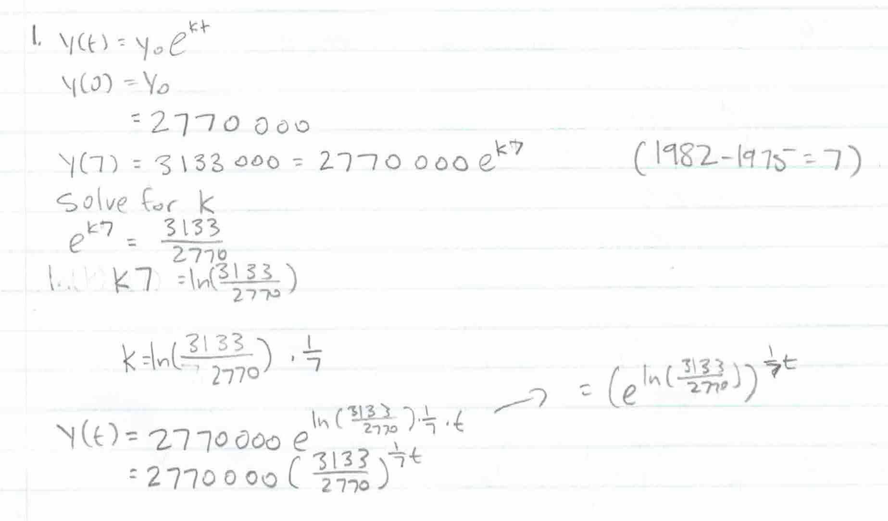
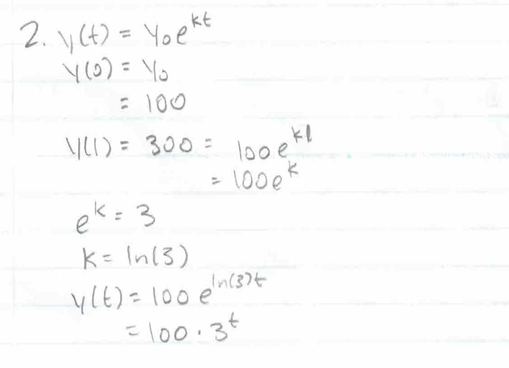
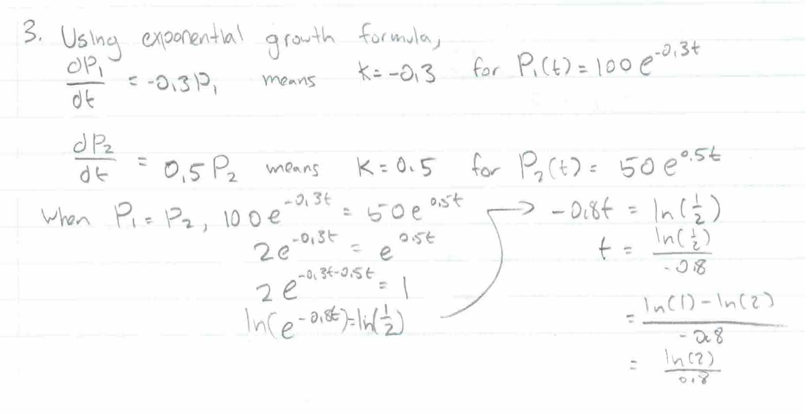
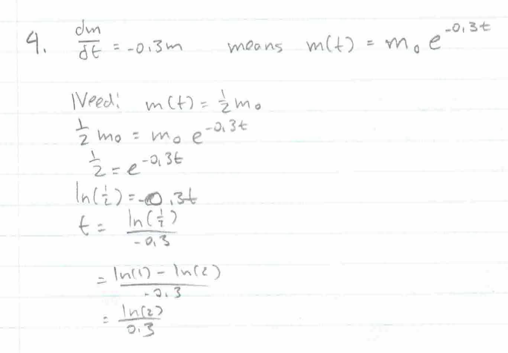
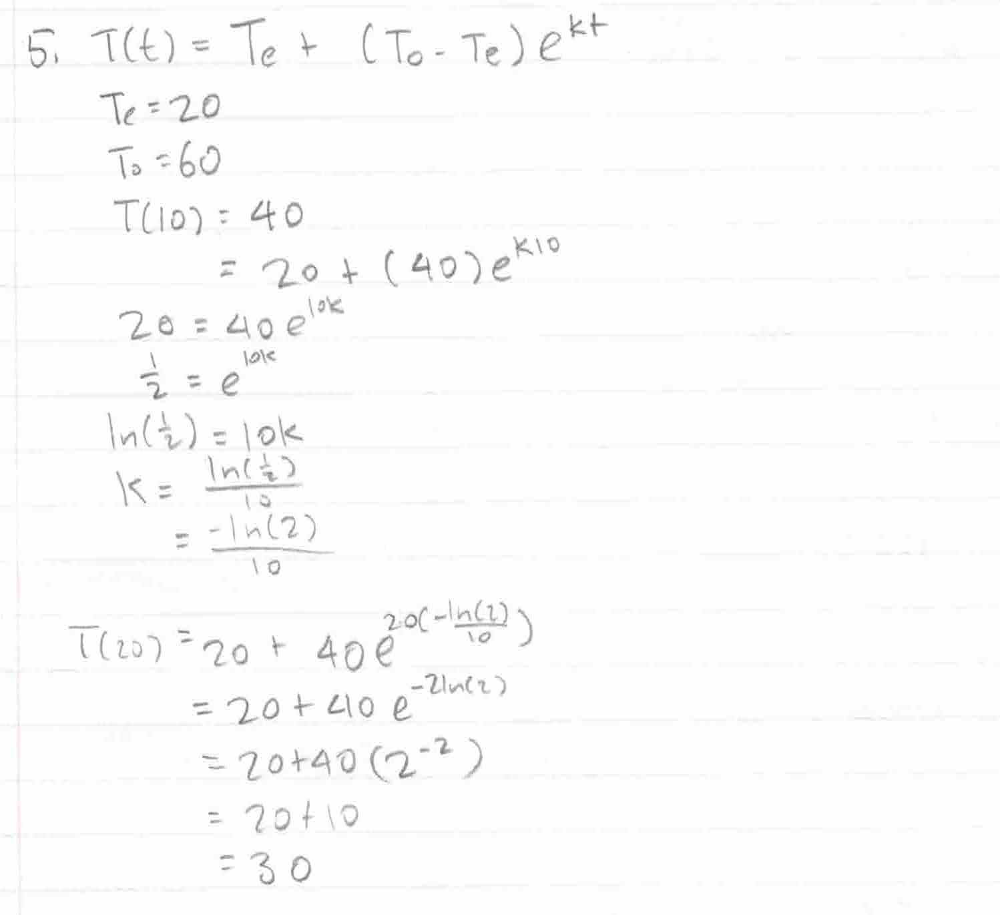
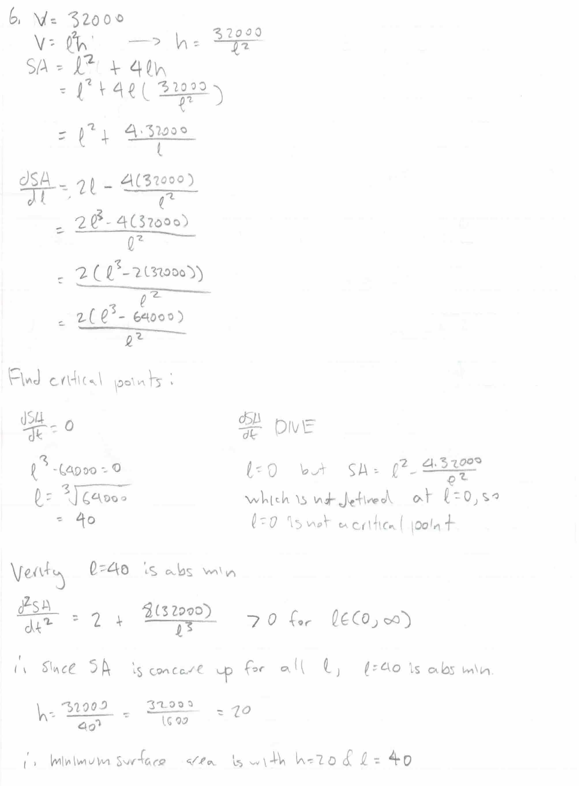
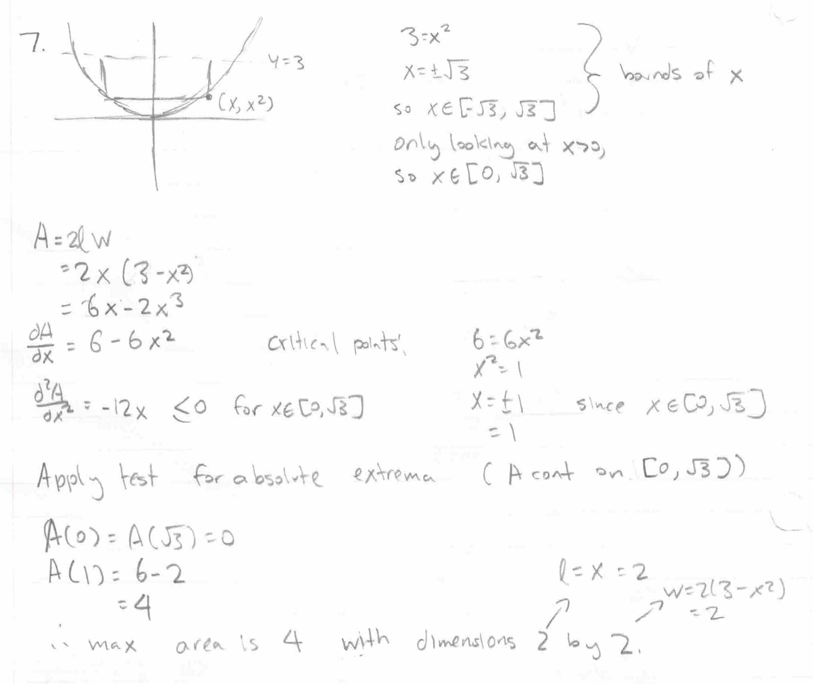

.. _2022_mata30_fall_tut_10:

Tutorial Week 10
================

.. toctree::
   :hidden:

.. raw:: html

   

Exponential Modelling
---------------------

Q1: The population of Toronto was 2 770 000 in 1975 and 3 133 000 in 1982. Use an exponential growth model to estimate the population in 2021.
~~~~~~~~~~~~~~~~~~~~~~~~~~~~~~~~~~~~~~~~~~~~~~~~~~~~~~~~~~~~~~~~~~~~~~~~~~~~~~~~~~~~~~~~~~~~~~~~~~~~~~~~~~~~~~~~~~~~~~~~~~~~~~~~~~~~~~~~~~~~~~

Q2: A bacteria culture starts off with 100 bacteria and has grown to 300 bacteria after an hour. Find a formula for the population after t hours (assuming the growth rate is proportional to the size).
~~~~~~~~~~~~~~~~~~~~~~~~~~~~~~~~~~~~~~~~~~~~~~~~~~~~~~~~~~~~~~~~~~~~~~~~~~~~~~~~~~~~~~~~~~~~~~~~~~~~~~~~~~~~~~~~~~~~~~~~~~~~~~~~~~~~~~~~~~~~~~~~~~~~~~~~~~~~~~~~~~~~~~~~~~~~~~~~~~~~~~~~~~~~~~~~~~~~~~~~

Q3: Let :math:`P_1` and :math:`P_2` denote the population of two types of bacteria. If :math:`P_1(0) = 100`, :math:`P_2(0) = 50`, and :math:`\frac{dP_1}{dt} = -0.3P_1` and :math:`\frac{dP_2}{dt} = 0.5P_2`, when are their populations equal? 
~~~~~~~~~~~~~~~~~~~~~~~~~~~~~~~~~~~~~~~~~~~~~~~~~~~~~~~~~~~~~~~~~~~~~~~~~~~~~~~~~~~~~~~~~~~~~~~~~~~~~~~~~~~~~~~~~~~~~~~~~~~~~~~~~~~~~~~~~~~~~~~~~~~~~~~~~~~~~~~~~~~~~~~~~~~~~~~~~~~~~~~~~~~~~~~~~~~~~~~~~~~~~~~~~~~~~~~~~~~~~~~~~~~~~~~~~~~~~~~

Q4: A radioactive material's mass can be modelled by :math:`\frac{dm}{dt} = -0.3m`. What is its half-life?
~~~~~~~~~~~~~~~~~~~~~~~~~~~~~~~~~~~~~~~~~~~~~~~~~~~~~~~~~~~~~~~~~~~~~~~~~~~~~~~~~~~~~~~~~~~~~~~~~~~~~~~~~~

Newton's Law of Cooling
-----------------------

Q5: A 60°C object is placed in a 20°C room. After 10 minutes, the temperature of the object is 40°C. What is the temperature of the object after 20 minutes?
~~~~~~~~~~~~~~~~~~~~~~~~~~~~~~~~~~~~~~~~~~~~~~~~~~~~~~~~~~~~~~~~~~~~~~~~~~~~~~~~~~~~~~~~~~~~~~~~~~~~~~~~~~~~~~~~~~~~~~~~~~~~~~~~~~~~~~~~~~~~~~~~~~~~~~~~~~~~

   
Optimization
------------

Q6: A box with a square base and an open top has a volume of :math:`32000\text{ cm}^3`. What dimensions of the box minimizes the materials used to make the box?
~~~~~~~~~~~~~~~~~~~~~~~~~~~~~~~~~~~~~~~~~~~~~~~~~~~~~~~~~~~~~~~~~~~~~~~~~~~~~~~~~~~~~~~~~~~~~~~~~~~~~~~~~~~~~~~~~~~~~~~~~~~~~~~~~~~~~~~~~~~~~~~~~~~~~~~~~~~~~~~~

Q7: Find the dimensions of the largest rectangle that fits in between :math:`x^2` and :math:`y=3`.
~~~~~~~~~~~~~~~~~~~~~~~~~~~~~~~~~~~~~~~~~~~~~~~~~~~~~~~~~~~~~~~~~~~~~~~~~~~~~~~~~~~~~~~~~~~~~~~~~~

