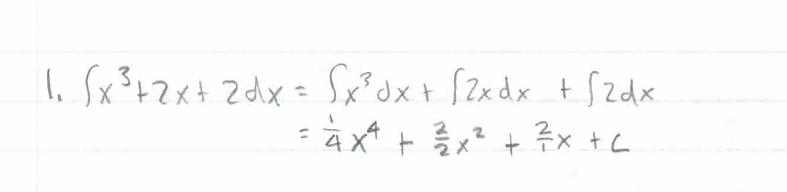
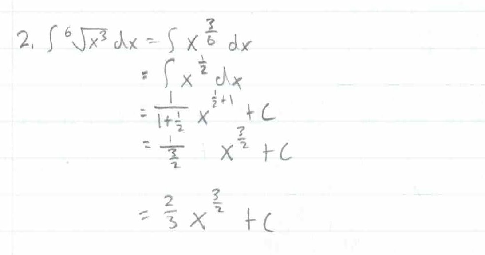
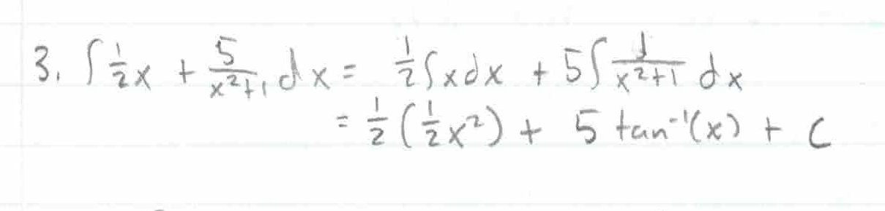
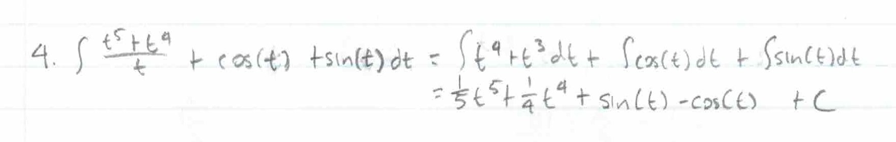
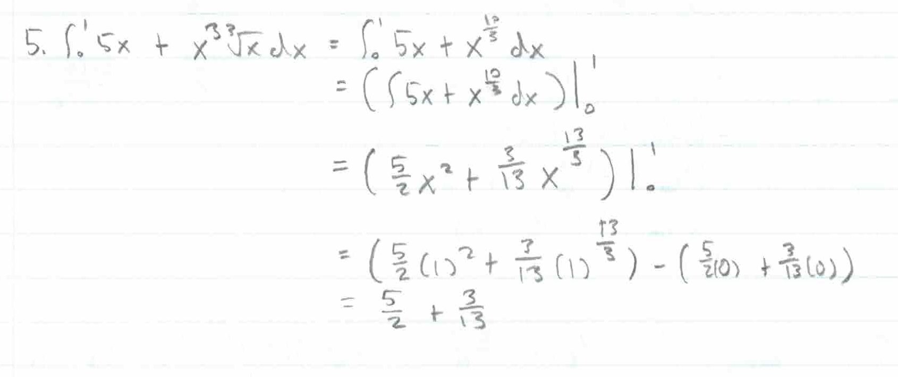
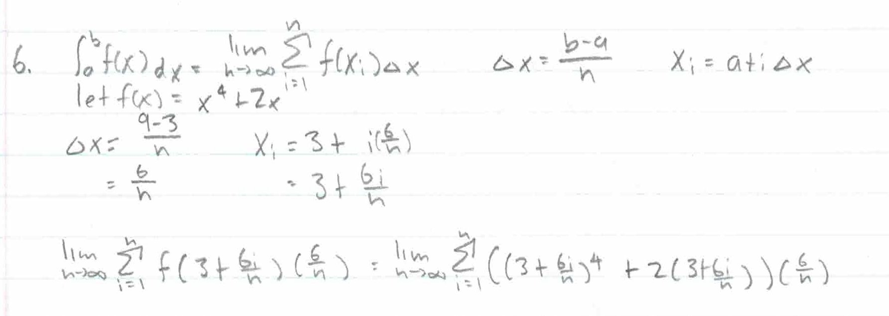
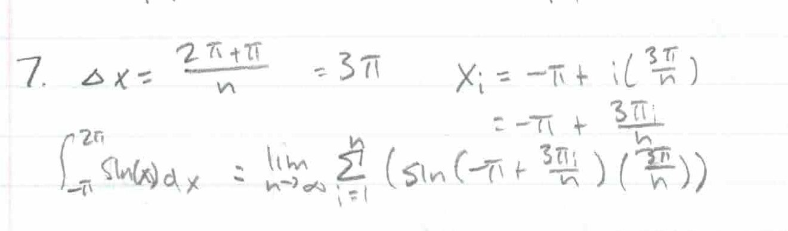
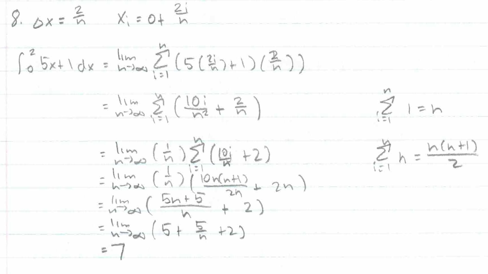
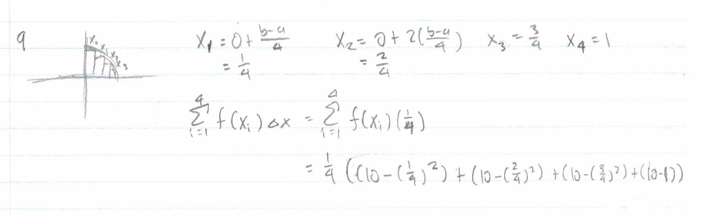
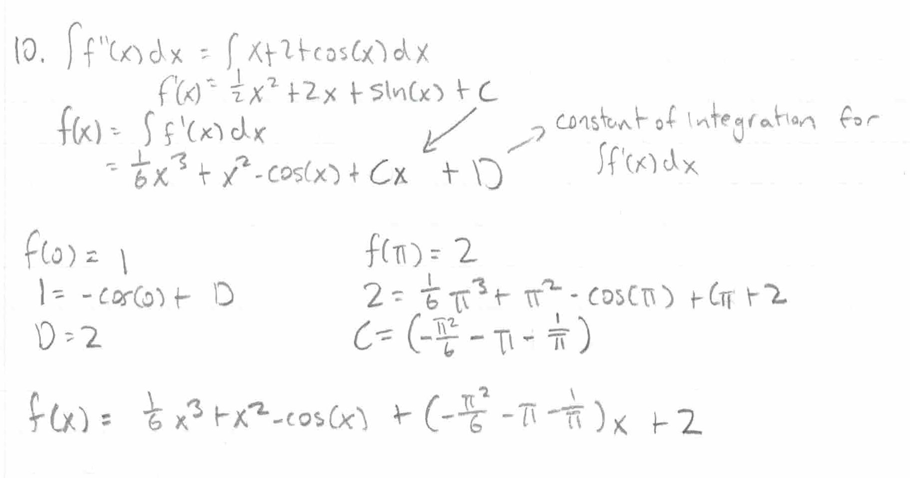

.. _2022_mata30_fall_tut_11:

Tutorial Week 11
================

.. toctree::
   :hidden:

.. raw:: html

   

Computing Integrals
-------------------

Q1: Compute :math:`\int x^3 + 2x + 2\, dx`.
~~~~~~~~~~~~~~~~~~~~~~~~~~~~~~~~~~~~~~~~~~~

Q2: Compute :math:`\int \sqrt[6]{x^3} \, dx`.
~~~~~~~~~~~~~~~~~~~~~~~~~~~~~~~~~~~~~~~~~~~~~

Q3: Compute :math:`\int \frac{1}{2}x + \frac{5}{x^2 + 1} \, dx`.
~~~~~~~~~~~~~~~~~~~~~~~~~~~~~~~~~~~~~~~~~~~~~~~~~~~~~~~~~~~~~~~~

Q4: Compute :math:`\int \frac{t^5 + t^4}{t} + cos(t) + sin(t) \, dt`.
~~~~~~~~~~~~~~~~~~~~~~~~~~~~~~~~~~~~~~~~~~~~~~~~~~~~~~~~~~~~~~~~~~~~~

Q5: Compute :math:`\int_{0}^{1} 5x + x^2\sqrt[3]{x} \, dx`.
~~~~~~~~~~~~~~~~~~~~~~~~~~~~~~~~~~~~~~~~~~~~~~~~~~~~~~~~~~~

Riemann Sums
------------

Q6: Write :math:`\int_{3}^{9} (x^4 + 2x) \, dx` as the limit of a Riemann sum.
~~~~~~~~~~~~~~~~~~~~~~~~~~~~~~~~~~~~~~~~~~~~~~~~~~~~~~~~~~~~~~~~~~~~~~~~~~~~~~

Q7: Write :math:`\int_{-\pi}^{2\pi} sin(x) \, dx` as the limit of a Riemann sum.
~~~~~~~~~~~~~~~~~~~~~~~~~~~~~~~~~~~~~~~~~~~~~~~~~~~~~~~~~~~~~~~~~~~~~~~~~~~~~~~~

Q8: Evaluate :math:`\int_{0}^{2} {5x + 1} \, dx` using Riemann sums.
~~~~~~~~~~~~~~~~~~~~~~~~~~~~~~~~~~~~~~~~~~~~~~~~~~~~~~~~~~~~~~~~~~~~

Approximating Integrals using Riemann Sums
------------------------------------------

Q9: Approximate :math:`\int_{0}^{1} 10 - x^2 \, dx` using the right Riemann sum over four rectangles.
~~~~~~~~~~~~~~~~~~~~~~~~~~~~~~~~~~~~~~~~~~~~~~~~~~~~~~~~~~~~~~~~~~~~~~~~~~~~~~~~~~~~~~~~~~~~~~~~~~~~~

Q10: If :math:`f''(x) = x + 2 + cos(x)`, :math:`f(0) = 1`, and :math:`f(\pi) = 2`, find :math:`f(x)`.
~~~~~~~~~~~~~~~~~~~~~~~~~~~~~~~~~~~~~~~~~~~~~~~~~~~~~~~~~~~~~~~~~~~~~~~~~~~~~~~~~~~~~~~~~~~~~~~~~~~~~

