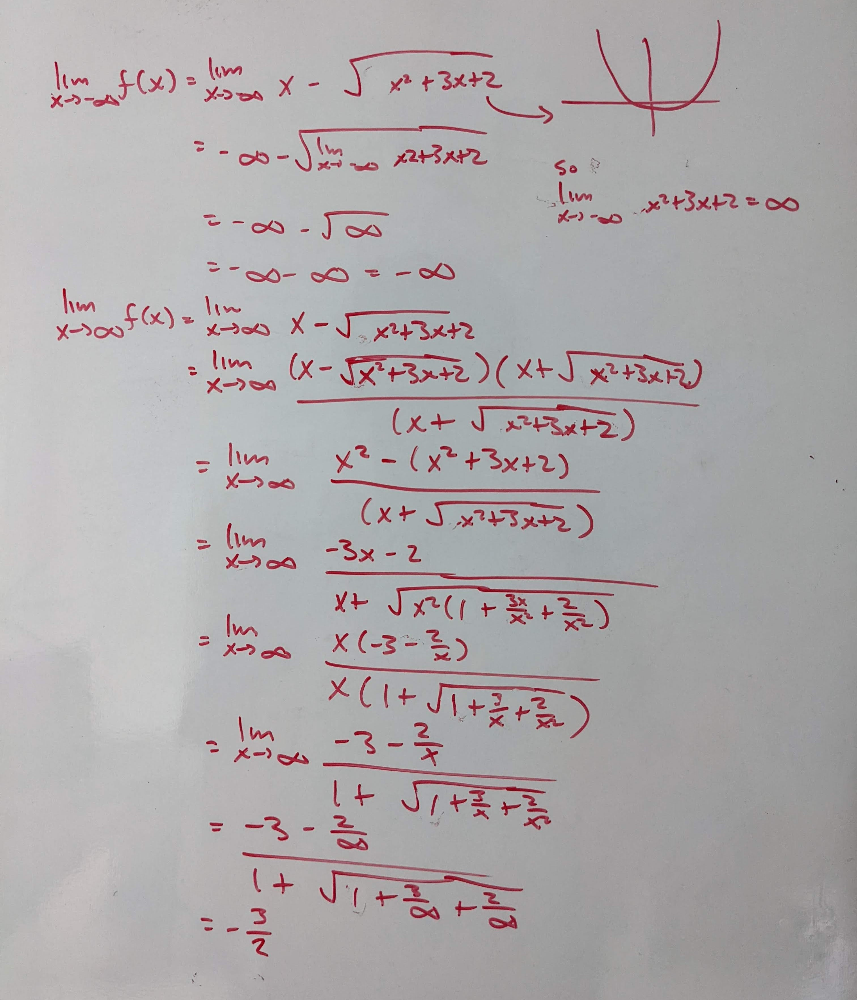

.. _2022_mata30_fall_tut_4:

Tutorial Week 4
===============

.. toctree::
   :hidden:

.. raw:: html

    

In this tutorial, we'll be mainly focusing on limits and the different ways to find limits.

Proof of Trigonometric Limit Identities
---------------------------------------

Prove why :math:`\lim_{x \to 0} \frac{\sin(x)}{x} = 1`.
~~~~~~~~~~~~~~~~~~~~~~~~~~~~~~~~~~~~~~~~~~~~~~~~~~~~~~~

Squeeze Theorem
---------------

Q1: What is :math:`\lim_{x \to 0}\; xtan^{-1}(\dfrac{1}{x})`?
~~~~~~~~~~~~~~~~~~~~~~~~~~~~~~~~~~~~~~~~~~~~~~~~~~~~~~~~~~~~~

Q2: Calculate :math:`lim_{x \to \infty} \; \dfrac{3x^2 + \sin(x^3)}{4x^2 - 2}`.
~~~~~~~~~~~~~~~~~~~~~~~~~~~~~~~~~~~~~~~~~~~~~~~~~~~~~~~~~~~~~~~~~~~~~~~~~~

.. image:: ./images/t4/2.jpg
    :width: 700

Indeterminant Forms
-------------------

Q3: Do the following lead to interdeterminate forms?
~~~~~~~~~~~~~~~~~~~~~~~~~~~~~~~~~~~~~~~~~~~~~~~~~~~~

1. :math:`\lim_{x \to 3} \frac{x + 2}{x - 3}`

2. :math:`\lim_{x \to 0} \frac{e^{-2x}}{e^{3x}}`

3. :math:`\lim_{x \to \infty} \frac{ln(x)}{x}`

4. :math:`\lim_{x \to \infty} \frac{e^{-2x}}{e^{3x}}`

5. :math:`\lim_{x \to 0} \frac{1}{x^2} + \dfrac{1}{3x^2}`

6. :math:`\lim_{x \to \infty} (\frac{1}{x})^{x}`

.. image:: ./images/t4/3.jpg
    :width: 700

Conjugates
----------

Q4: Find the limit :math:`\lim_{x \to 9} \frac{3 - \sqrt{x}}{9x - x^2}`.
~~~~~~~~~~~~~~~~~~~~~~~~~~~~~~~~~~~~~~~~~~~~~~~~~~~~~~~~~~~~~~~~~~~~~~~~

.. image:: ./images/t4/4.jpg
    :width: 700

Finding Limits
--------------

Q5: Let :math:`f(x) = \begin{cases} x < 1 & x^3 + xk \\ x > 1& \frac{1 + x^2k}{xk}\end{cases}`. For what values of :math:`k` does :math:`\lim_{x \to 1} f(x)` exist?
~~~~~~~~~~~~~~~~~~~~~~~~~~~~~~~~~~~~~~~~~~~~~~~~~~~~~~~~~~~~~~~~~~~~~~~~~~~~~~~~~~~~~~~~~~~~~~~~~~~~~~~~~~~~~~~~~~~~~~~~~~~~~~~~~~~~~~~~~~~~~~~~~~~~~~~~~~~~~~~~~~~~

.. image:: ./images/t4/5.jpg
    :width: 700

Q6: Compute :math:`\lim_{x \to -1} \frac{x + 1}{|x + 1|}` if it exists.
~~~~~~~~~~~~~~~~~~~~~~~~~~~~~~~~~~~~~~~~~~~~~~~~~~~~~~~~~~~~~~~~~~~~~~~

Q7: Compute :math:`\lim_{x \to -1} \frac{7 - |x|}{x^3 + 2}` if it exists.
~~~~~~~~~~~~~~~~~~~~~~~~~~~~~~~~~~~~~~~~~~~~~~~~~~~~~~~~~~~~~~~~~~~~~~~~~

.. image:: ./images/t4/7.jpg
    :width: 700

Q8: Compute :math:`\lim_{x \to \infty} \frac{\sqrt{2x^2 + 1}}{3x - 5}`.
~~~~~~~~~~~~~~~~~~~~~~~~~~~~~~~~~~~~~~~~~~~~~~~~~~~~~~~~~~~~~~~~~~~~~~~

Q9: Compute :math:`\lim_{x \to \infty} 3x - \sqrt{9x^2 - 1}`.
~~~~~~~~~~~~~~~~~~~~~~~~~~~~~~~~~~~~~~~~~~~~~~~~~~~~~~~~~~~~~~

Q10: Compute the horizontal asympotote of :math:`f(x) = x - \sqrt{2x^2 + 3x + 2}`.
~~~~~~~~~~~~~~~~~~~~~~~~~~~~~~~~~~~~~~~~~~~~~~~~~~~~~~~~~~~~~~~~~~~~~~~~~~~~~~~~~~

Trigonometric Limits
--------------------

Q11: Does the limit :math:`\lim_{x \to 0} sin(\frac{1}{x})` exist?
~~~~~~~~~~~~~~~~~~~~~~~~~~~~~~~~~~~~~~~~~~~~~~~~~~~~~~~~~~~~~~~~~~

Q12: Given an arbitrary constant :math:`k`, what is :math:`lim_{x \to 0}\; \cot(2kx)2kx + k`?
~~~~~~~~~~~~~~~~~~~~~~~~~~~~~~~~~~~~~~~~~~~~~~~~~~~~~~~~~~~~~~~~~~~~~~~~~~~~~~~~~~~~~~~~~~~~~

.. image:: ./images/t4/12.jpg
    :width: 700

Q13: Compute :math:`\lim_{x \to 0} \frac{\sin(e\cos(x))}{x}` if it exists.
~~~~~~~~~~~~~~~~~~~~~~~~~~~~~~~~~~~~~~~~~~~~~~~~~~~~~~~~~~~~~~~~~~~~~~~~~~

