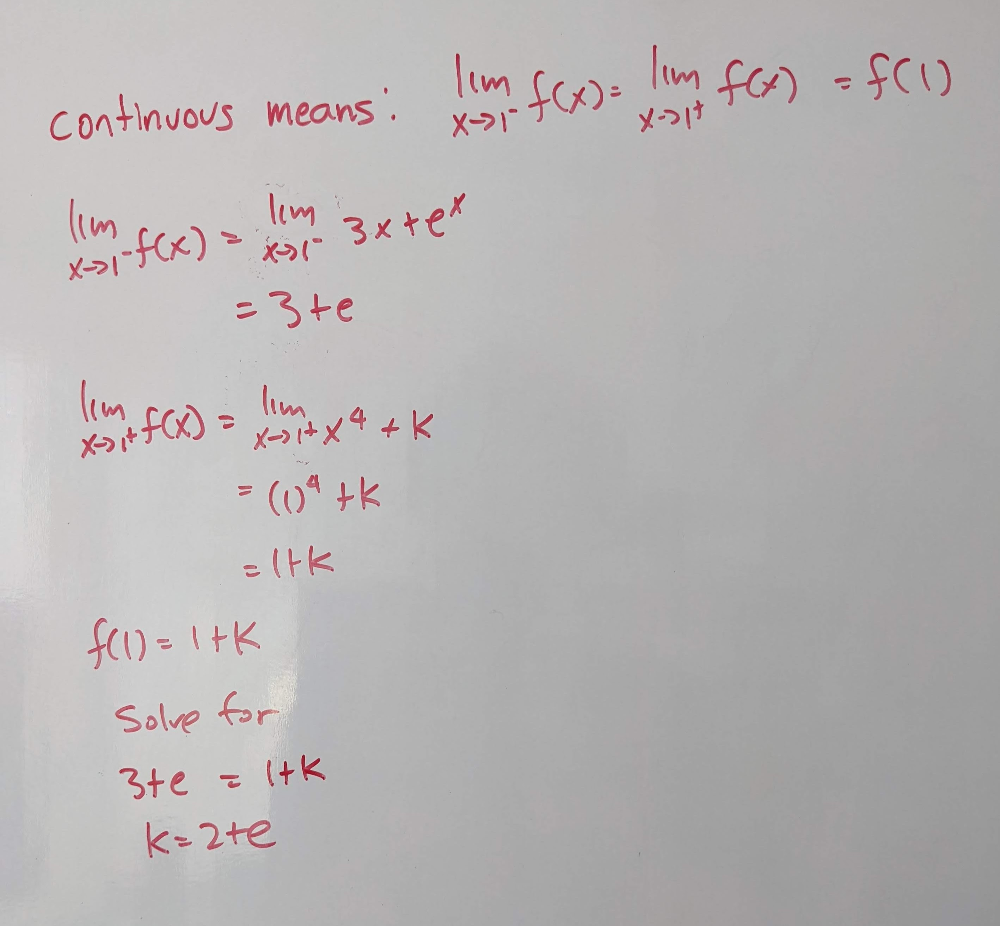
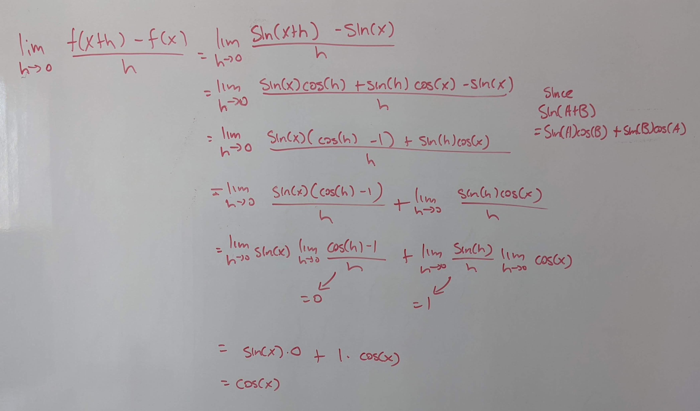
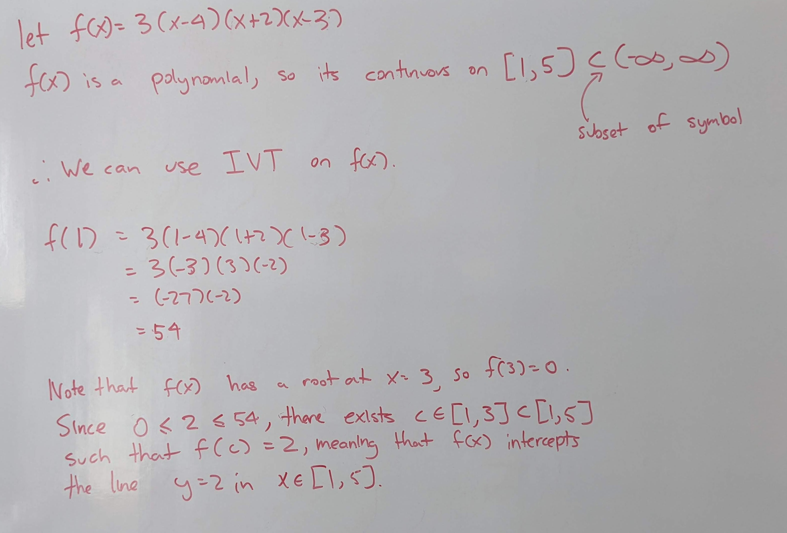

.. _2022_mata30_fall_tut_5:

Tutorial Week 5
===============

.. toctree::
   :hidden:

.. raw:: html

   
   
This week, let's review continuity, intermediate value theorem, and the limit definition of a derivative.

Continuity
----------

Q1: Classify the discontinuities in the following image:
~~~~~~~~~~~~~~~~~~~~~~~~~~~~~~~~~~~~~~~~~~~~~~~~~~~~~~~~

.. raw:: html

   

      <button onClick="toggleClicked(this)" class="show-answer-button">Show Solution</button>
      

.. image:: ./images/t5/1.jpg
   :width: 700

.. raw:: html

        

    

Q2: Let :math:`f(x) = \begin{cases} 3x + e^x & \text{if } x \leq 1 \\ x^4 + k & \text{if } x \gt 1\end{cases}`. For what value(s) of :math:`k` makes the :math:`f(x)` continuous?
~~~~~~~~~~~~~~~~~~~~~~~~~~~~~~~~~~~~~~~~~~~~~~~~~~~~~~~~~~~~~~~~~~~~~~~~~~~~~~~~~~~~~~~~~~~~~~~~~~~~~~~~~~~~~~~~~~~~~~~~~~~~~~~~~~~~~~~~~~~~~~~~~~~~~~~~~~~~~~~~~~~~~~~~~~~~~~~~~

.. raw:: html

   

      <button onClick="toggleClicked(this)" class="show-answer-button">Show Solution</button>
      

.. raw:: html

        

    

Q3: Let :math:`f(x) = \begin{cases} log(-x) - 1& \text{if } x \leq -1 \\ x & \text{if } -1 \lt x \lt 1 \\ (x - 2)^2 & \text{if } x \gt 1 \end{cases}`. Where is :math:`f(x)` continuous and where is it differentiable?
~~~~~~~~~~~~~~~~~~~~~~~~~~~~~~~~~~~~~~~~~~~~~~~~~~~~~~~~~~~~~~~~~~~~~~~~~~~~~~~~~~~~~~~~~~~~~~~~~~~~~~~~~~~~~~~~~~~~~~~~~~~~~~~~~~~~~~~~~~~~~~~~~~~~~~~~~~~~~~~~~~~~~~~~~~~~~~~~~~~~~~~~~~~~~~~~~~~~~~~~~~~~~~~~~~~~~~~

.. raw:: html

   

      <button onClick="toggleClicked(this)" class="show-answer-button">Show Solution</button>
      

.. image:: ./images/t5/3_0.jpg
   :width: 700

.. image:: ./images/t5/3_1.jpg
   :width: 700

.. raw:: html

        

    

Q4: Let :math:`f(x) = \begin{cases} \dfrac{(1 - cos(x))(x + 2)}{x^3 + 3x^2 + 5x} & \text{if } x \lt 0 \\ sin(x) & \text{if } x \ge 0 \end{cases}`. Where is :math:`f(x)` continuous? Classify the discontinuities.
~~~~~~~~~~~~~~~~~~~~~~~~~~~~~~~~~~~~~~~~~~~~~~~~~~~~~~~~~~~~~~~~~~~~~~~~~~~~~~~~~~~~~~~~~~~~~~~~~~~~~~~~~~~~~~~~~~~~~~~~~~~~~~~~~~~~~~~~~~~~~~~~~~~~~~~~~~~~~~~~~~~~~~~~~~~~~~~~~~~~~~~~~~~~~~~~~~~~~~~~~~~~~~~~~~

.. raw:: html

   

      <button onClick="toggleClicked(this)" class="show-answer-button">Show Solution</button>
      

.. image:: ./images/t5/4.jpg
   :width: 700

.. raw:: html

        

    

Q5: Let :math:`f(x) = \begin{cases} 4 & \text{if } x \lt -1 \\ ax + b & \text{if } -1 \lt x \lt 1 \\ x + 6 & \text{if } x \gt 1 \end{cases}`. What values of :math:`a` and :math:`b` makes :math:`f(x)` have 2 removable discontinuities?
~~~~~~~~~~~~~~~~~~~~~~~~~~~~~~~~~~~~~~~~~~~~~~~~~~~~~~~~~~~~~~~~~~~~~~~~~~~~~~~~~~~~~~~~~~~~~~~~~~~~~~~~~~~~~~~~~~~~~~~~~~~~~~~~~~~~~~~~~~~~~~~~~~~~~~~~~~~~~~~~~~~~~~~~~~~~~~~~~~~~~~~~~~~~~~~~~~~~~~~~~~~~~~~~~~~~~~~~~~~~~~~~~~~~~~~~~

.. raw:: html

   

      <button onClick="toggleClicked(this)" class="show-answer-button">Show Solution</button>
      

.. image:: ./images/t5/5.jpg
   :width: 700

.. raw:: html

        

    

Finding Derivatives using the Limit Definition of a Derivative
--------------------------------------------------------------

Q6: Use the limit definition of a derivative to compute :math:`f^{'}(x)` if :math:`f(x) = x^2 - 5x`.
~~~~~~~~~~~~~~~~~~~~~~~~~~~~~~~~~~~~~~~~~~~~~~~~~~~~~~~~~~~~~~~~~~~~~~~~~~~~~~~~~~~~~~~~~~~~~~~~~~~~

.. raw:: html

   

      <button onClick="toggleClicked(this)" class="show-answer-button">Show Solution</button>
      

.. image:: ./images/t5/6.jpg
   :width: 700

.. raw:: html

        

    

Q7: Use the limit definition of a derivative to compute :math:`f^{'}(0)` if :math:`f(x) = \dfrac{x^3 - 4x}{x + 3}`.
~~~~~~~~~~~~~~~~~~~~~~~~~~~~~~~~~~~~~~~~~~~~~~~~~~~~~~~~~~~~~~~~~~~~~~~~~~~~~~~~~~~~~~~~~~~~~~~~~~~~~~~~~~~~~~~~~~~

.. raw:: html

   

      <button onClick="toggleClicked(this)" class="show-answer-button">Show Solution</button>
      

.. image:: ./images/t5/7.jpg
   :width: 700

.. raw:: html

        

    

Q8: Use the limit definition of a derivative to compute :math:`f^{'}(x)` if :math:`f(x) = sin(x)`.
~~~~~~~~~~~~~~~~~~~~~~~~~~~~~~~~~~~~~~~~~~~~~~~~~~~~~~~~~~~~~~~~~~~~~~~~~~~~~~~~~~~~~~~~~~~~~~~~~~

.. raw:: html

   

      <button onClick="toggleClicked(this)" class="show-answer-button">Show Solution</button>
      

.. raw:: html

        

    

Differentiability using the Limit Definition of a Derivative
------------------------------------------------------------

Q9: Show that :math:`f(x) = x^{\tiny \dfrac{2}{3}}` is not differentiable at :math:`x = 0` using the limit definition of a derivative.
~~~~~~~~~~~~~~~~~~~~~~~~~~~~~~~~~~~~~~~~~~~~~~~~~~~~~~~~~~~~~~~~~~~~~~~~~~~~~~~~~~~~~~~~~~~~~~~~~~~~~~~~~~~~~~~~~~~~~~~~~~~~~~~~~~~~~~

.. raw:: html

   

      <button onClick="toggleClicked(this)" class="show-answer-button">Show Solution</button>
      

.. image:: ./images/t5/9.jpg
   :width: 700

.. raw:: html

        

    

Intermediate Value Theorem
--------------------------

Q10: Show that :math:`f(x) = e^{3x} + 4x^3 + 3` has a root in :math:`x \in [-1, 2]`.
~~~~~~~~~~~~~~~~~~~~~~~~~~~~~~~~~~~~~~~~~~~~~~~~~~~~~~~~~~~~~~~~~~~~~~~~~~~~~~~~~~~~

.. raw:: html

   

      <button onClick="toggleClicked(this)" class="show-answer-button">Show Solution</button>
      

.. image:: ./images/t5/10.jpg
   :width: 700

.. raw:: html

        

    

Q11: Show that the line :math:`y = 2` and the function :math:`y = 3(x - 4)(x + 2)(x - 3)` intercept each other on :math:`x \in [1, 5]`.
~~~~~~~~~~~~~~~~~~~~~~~~~~~~~~~~~~~~~~~~~~~~~~~~~~~~~~~~~~~~~~~~~~~~~~~~~~~~~~~~~~~~~~~~~~~~~~~~~~~~~~~~~~~~~~~~~~~~~~~~~~~~~~~~~~~~~~~

.. raw:: html

   

      <button onClick="toggleClicked(this)" class="show-answer-button">Show Solution</button>
      

.. raw:: html

        

    

.. raw:: html

  