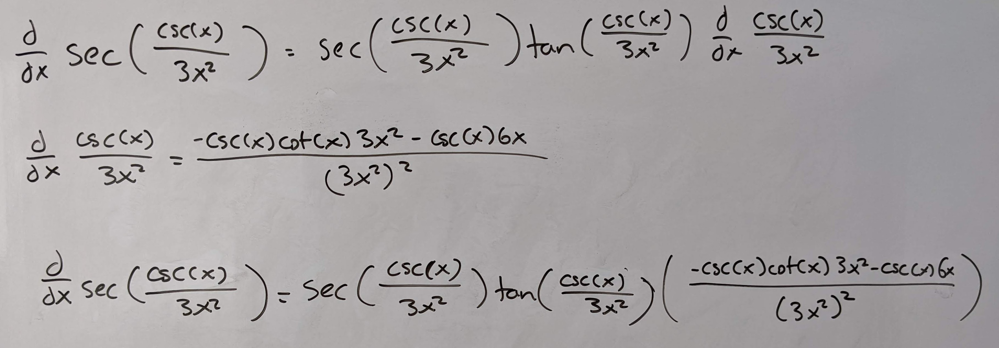

.. _2022_mata30_fall_tut_6:

Tutorial Week 6
===============

.. toctree::
   :hidden:

.. raw:: html

   

This week, we'll be looking more into derivatives.

Graphing differentiability
--------------------------

Q1: Sketch the graph of a function that:
~~~~~~~~~~~~~~~~~~~~~~~~~~~~~~~~~~~~~~~~

1. Has a corner at :math:`x = -3`
2. Is discontinuous at :math:`x = -1`
3. Has a vertical tangent at :math:`x = 0`
4. Has a domain of :math:`(-\infty, \infty)`

.. image:: ./images/t6/1.jpg
   :width: 700

Derivative Notation
-------------------

Q2: Find :math:`f'(x)` if :math:`f(x) = 3g(k(x)) - h(x)k(x)`.
~~~~~~~~~~~~~~~~~~~~~~~~~~~~~~~~~~~~~~~~~~~~~~~~~~~~~~~~~~~~~

Q3: Find :math:`\frac{df}{dx} |_{x = 3}` if :math:`f(x) = x^4 + k` for some constant :math:`k`.
~~~~~~~~~~~~~~~~~~~~~~~~~~~~~~~~~~~~~~~~~~~~~~~~~~~~~~~~~~~~~~~~~~~~~~~~~~~~~~~~~~~~~~~~~~~~~~~

Q4: Given functions :math:`f(x) = 4h(x)^2`, :math:`g(x) = 2f(x)`, :math:`h'(x) = x`, :math:`\frac{dg}{dx} = 8x^3 + 16x`, find :math:`h(x)`.
~~~~~~~~~~~~~~~~~~~~~~~~~~~~~~~~~~~~~~~~~~~~~~~~~~~~~~~~~~~~~~~~~~~~~~~~~~~~~~~~~~~~~~~~~~~~~~~~~~~~~~~~~~~~~~~~~~~~~~~~~~~~~~~~~~~~~~~~~~~

Q5: Given :math:`f(x) = x^3`, :math:`h` is a function defined in terms of :math:`f(x)`, and :math:`\frac{dh}{df} = 5`, find :math:`\frac{dh}{dx}`.
~~~~~~~~~~~~~~~~~~~~~~~~~~~~~~~~~~~~~~~~~~~~~~~~~~~~~~~~~~~~~~~~~~~~~~~~~~~~~~~~~~~~~~~~~~~~~~~~~~~~~~~~~~~~~~~~~~~~~~~~~~~~~~~~~~~~~~~~~~~~~~~~~~

Derivatives with absolute values
--------------------------------

Q6: Find the derivative of :math:`f(x) = cos(x) - |x|^3`.
~~~~~~~~~~~~~~~~~~~~~~~~~~~~~~~~~~~~~~~~~~~~~~~~~~~~~~~~~

Q7: Find the derivative of :math:`f(x) = |x + 2| + (|x - 2|)^2`.
~~~~~~~~~~~~~~~~~~~~~~~~~~~~~~~~~~~~~~~~~~~~~~~~~~~~~~~~~~~~~~~~

Computing derivatives
---------------------

Q8: Find the derivative of :math:`cos(sin(tan(x))) \cdot 2x^{e}`.
~~~~~~~~~~~~~~~~~~~~~~~~~~~~~~~~~~~~~~~~~~~~~~~~~~~~~~~~~~~~~~~~~

Q9: Find the derivative of :math:`sec(\frac{csc(x)}{3x^3})`.
~~~~~~~~~~~~~~~~~~~~~~~~~~~~~~~~~~~~~~~~~~~~~~~~~~~~~~~~~~~~

Q10: Find the derivative of :math:`\sqrt[4]{2x^3 - 4x} + 4`.
~~~~~~~~~~~~~~~~~~~~~~~~~~~~~~~~~~~~~~~~~~~~~~~~~~~~~~~~~~~~

Derivative tables
-----------------

Q11: Given :math:`f(x) = g(h(x))`, find :math:`g'(3)`.
~~~~~~~~~~~~~~~~~~~~~~~~~~~~~~~~~~~~~~~~~~~~~~~~~~~~~~

========== ============ ============== =============
:math:`x`  :math:`h(x)` :math:`h'(x)`  :math:`f'(x)`
========== ============ ============== =============
1          2            1              2
2          3            -3             1
3          5            4              -4
========== ============ ============== =============

Q12: Using the below table, find the equation of the line perpendicular to :math:`f(x)` at :math:`x = 1`.
~~~~~~~~~~~~~~~~~~~~~~~~~~~~~~~~~~~~~~~~~~~~~~~~~~~~~~~~~~~~~~~~~~~~~~~~~~~~~~~~~~~~~~~~~~~~~~~~~~~~~~~~~

========== ============ ==============
:math:`x`  :math:`f(x)` :math:`f'(x)` 
========== ============ ==============
1          7            -2            
2          -3           -3           
3          2            -5           
========== ============ ==============

Piecewise function differentiability
------------------------------------

Q13: Which values of :math:`k` make :math:`f(x) = \begin{cases} kx^2 + k & \text{if } x \leq 1 \\ 2kx + k - 2 & \text{if } x \gt 1 \end{cases}` continuous on its domain. Are there any values of :math:`k` that make it differentiable on its domain?
~~~~~~~~~~~~~~~~~~~~~~~~~~~~~~~~~~~~~~~~~~~~~~~~~~~~~~~~~~~~~~~~~~~~~~~~~~~~~~~~~~~~~~~~~~~~~~~~~~~~~~~~~~~~~~~~~~~~~~~~~~~~~~~~~~~~~~~~~~~~~~~~~~~~~~~~~~~~~~~~~~~~~~~~~~~~~~~~~~~~~~~~~~~~~~~~~~~~~~~~~~~~~~~~~~~~~~~~~~~~~~~~~~~~~~~~~~~~~~~~~~~~~~

