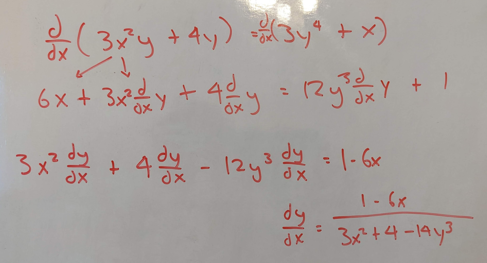
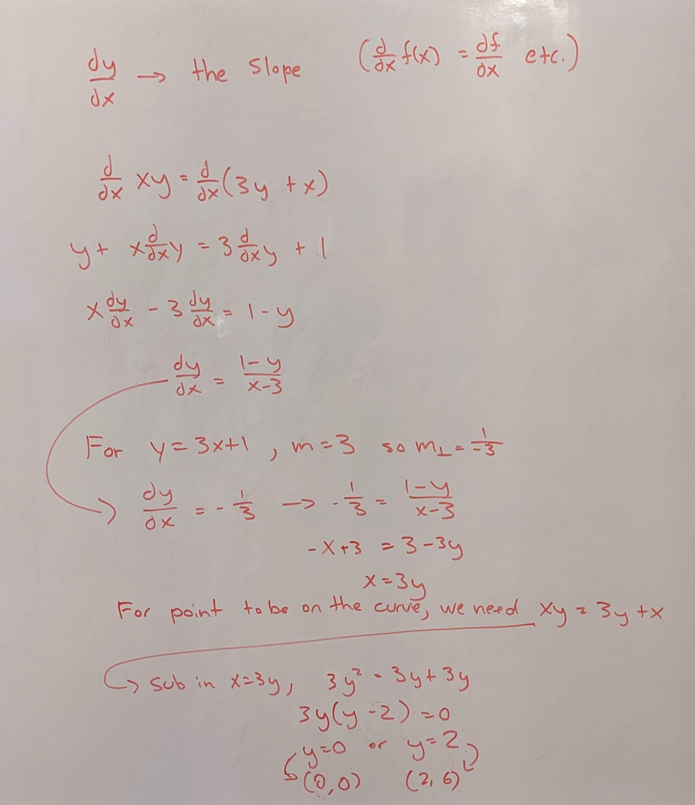
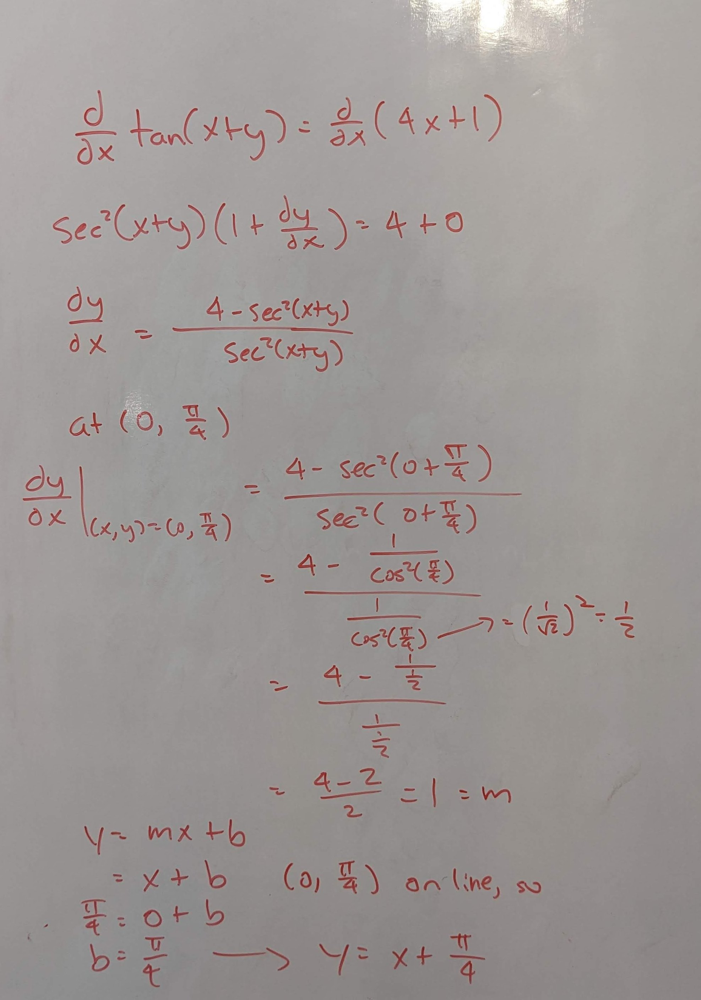
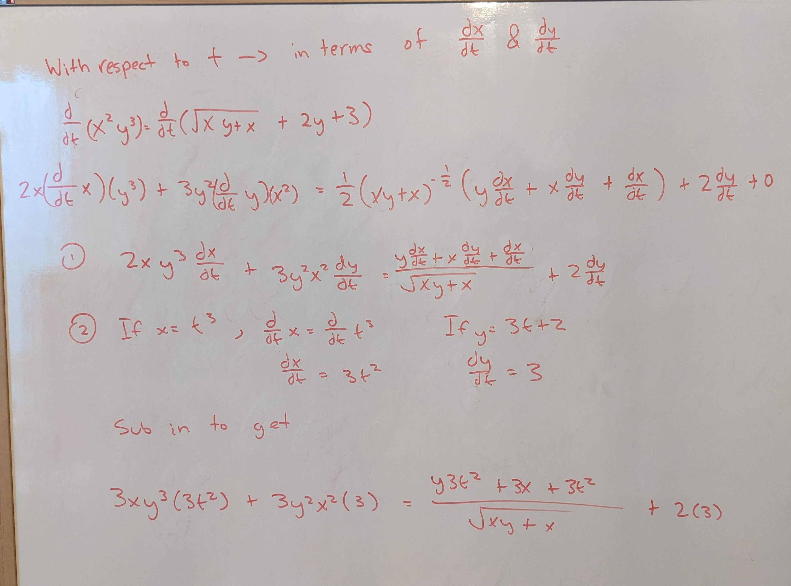
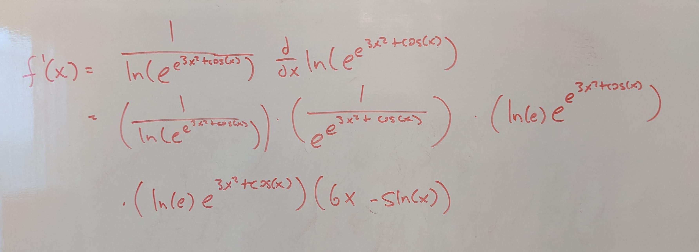
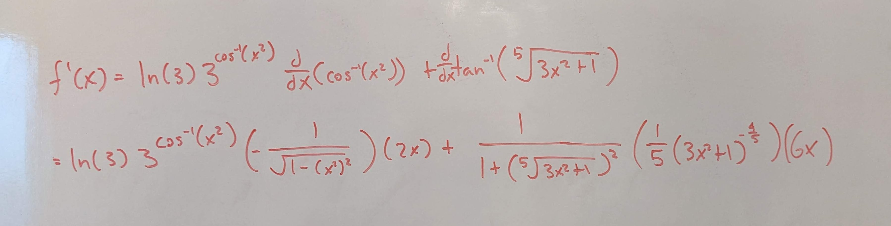
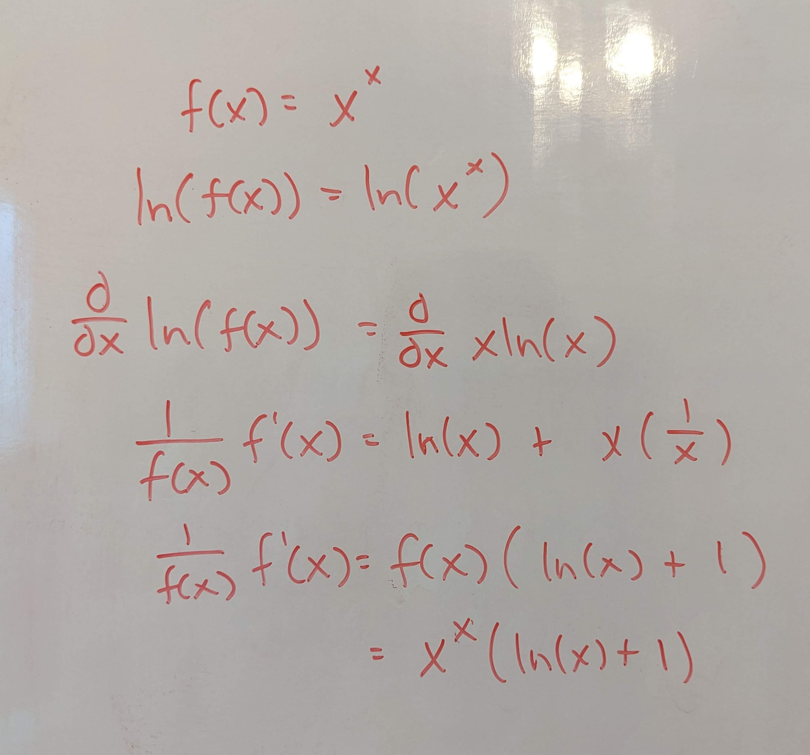
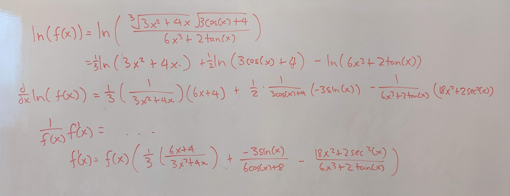
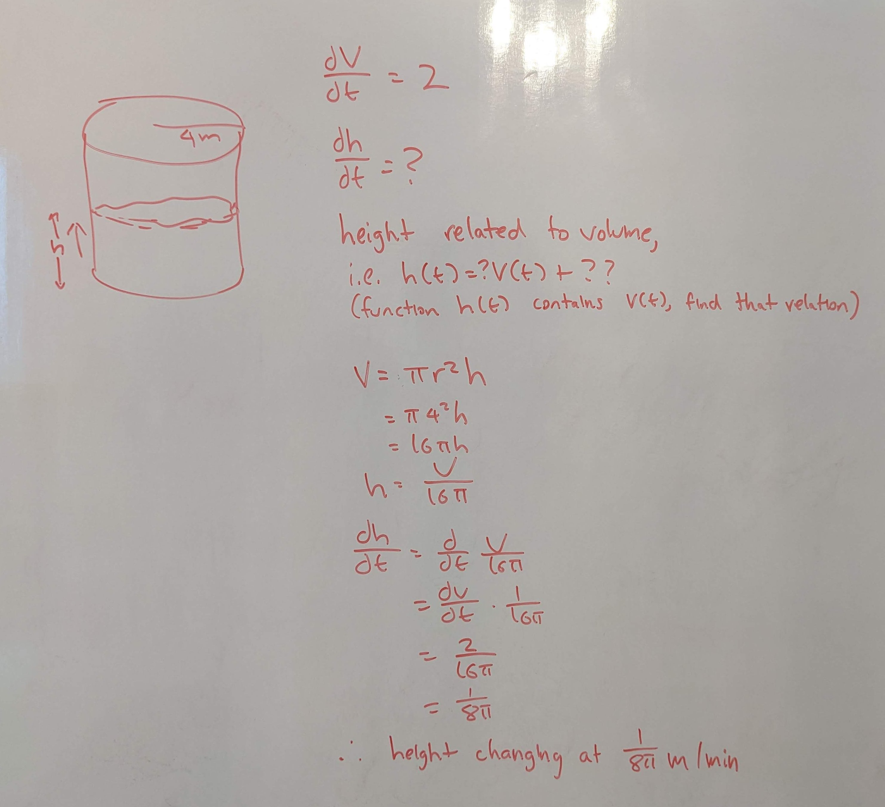
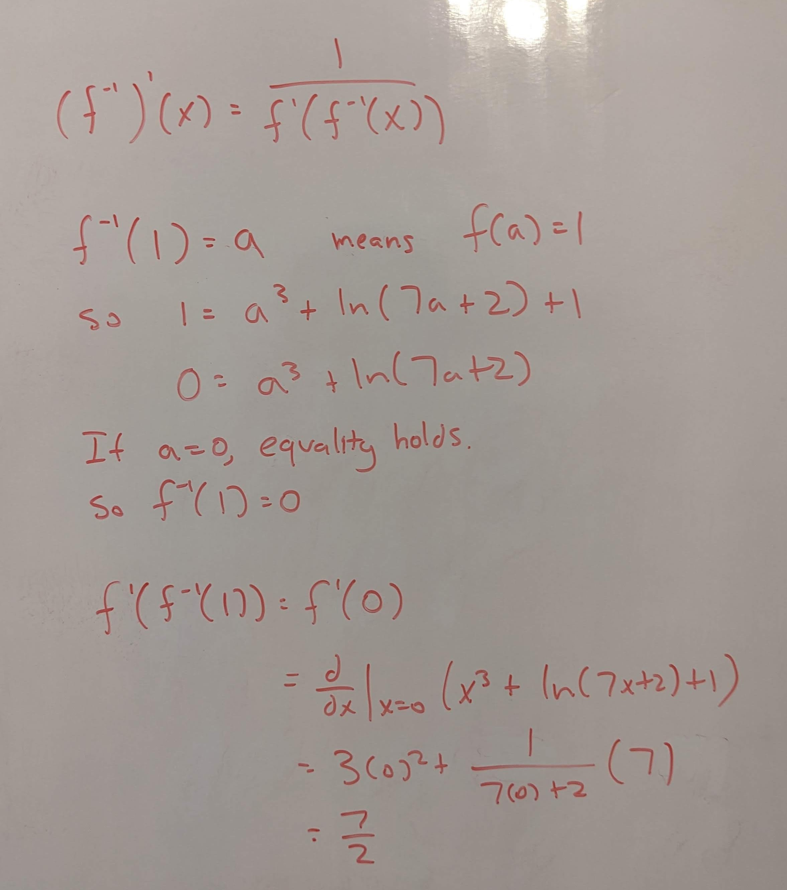

.. _2022_mata30_fall_tut_7:

Tutorial Week 7
===============

.. toctree::
   :hidden:

.. raw:: html

   

This tutorial will be about implicit differentiation and logarithmitic differentiation, as well as some application questions.

Implicit Differentiation
------------------------

Q1: Given :math:`y` and :math:`x` are implicitly related, find :math:`\frac{dy}{dx}` for :math:`3x^2y + 4y = 3y^4 + x`.
~~~~~~~~~~~~~~~~~~~~~~~~~~~~~~~~~~~~~~~~~~~~~~~~~~~~~~~~~~~~~~~~~~~~~~~~~~~~~~~~~~~~~~~~~~~~~~~~~~~~~~~~~~~~~~~~~~~~~~~

.. raw:: html

   

      <button onClick="toggleClicked(this)" class="show-answer-button">Show Solution</button>
      

.. raw:: html

        

    

Q2: Which points on the curve :math:`xy = 3y + x` have a tangent line perpendicular to :math:`y = 3x + 1`?
~~~~~~~~~~~~~~~~~~~~~~~~~~~~~~~~~~~~~~~~~~~~~~~~~~~~~~~~~~~~~~~~~~~~~~~~~~~~~~~~~~~~~~~~~~~~~~~~~~~~~~~~~~

.. raw:: html

   

      <button onClick="toggleClicked(this)" class="show-answer-button">Show Solution</button>
      

.. raw:: html

        

    

Q3: What is the equation of the line tangent to :math:`\tan(x+y)=4x+1` at :math:`(0, \frac{\pi}{4})`?
~~~~~~~~~~~~~~~~~~~~~~~~~~~~~~~~~~~~~~~~~~~~~~~~~~~~~~~~~~~~~~~~~~~~~~~~~~~~~~~~~~~~~~~~~~~~~~~~~~~~~

.. raw:: html

   

      <button onClick="toggleClicked(this)" class="show-answer-button">Show Solution</button>
      

.. raw:: html

        

    

Q4: Find the derivative of :math:`x^2y^3 = \sqrt{xy + x} + 2y + 3` with respect to :math:`t` if :math:`x` and :math:`y` are functions of :math:`t`. What would the derivative be if :math:`x = t^3` and :math:`y = 3t + 2`?
~~~~~~~~~~~~~~~~~~~~~~~~~~~~~~~~~~~~~~~~~~~~~~~~~~~~~~~~~~~~~~~~~~~~~~~~~~~~~~~~~~~~~~~~~~~~~~~~~~~~~~~~~~~~~~~~~~~~~~~~~~~~~~~~~~~~~~~~~~~~~~~~~~~~~~~~~~~~~~~~~~~~~~~~~~~~~~~~~~~~~~~~~~~~~~~~~~~~~~~~~~~~~~~~~~~~~~~~~~~

.. raw:: html

   

      <button onClick="toggleClicked(this)" class="show-answer-button">Show Solution</button>
      

.. raw:: html

        

    

Exponential Derivatives
-----------------------

Q5: Find :math:`f'(x)` if :math:`f(x) = ln(ln(e^{e^{3x^3 + cos(x)}}))`.
~~~~~~~~~~~~~~~~~~~~~~~~~~~~~~~~~~~~~~~~~~~~~~~~~~~~~~~~~~~~~~~~~~~~~~~

.. raw:: html

   

      <button onClick="toggleClicked(this)" class="show-answer-button">Show Solution</button>
      

.. raw:: html

        

    

Inverse Trigonometric Derivatives
---------------------------------

Q6: Find the derivative of :math:`f(x) = 3^{cos^{-1}(x^2)} + tan^{-1}(\sqrt[5]{3x^3 + 1})`.
~~~~~~~~~~~~~~~~~~~~~~~~~~~~~~~~~~~~~~~~~~~~~~~~~~~~~~~~~~~~~~~~~~~~~~~~~~~~~~~~~~~~~~~~~~~

.. raw:: html

   

      <button onClick="toggleClicked(this)" class="show-answer-button">Show Solution</button>
      

.. raw:: html

        

    

Logarithmitic Differentiation
-----------------------------

Q7: Find the derivative of :math:`f(x) = x^x`.
~~~~~~~~~~~~~~~~~~~~~~~~~~~~~~~~~~~~~~~~~~~~~~

.. raw:: html

   

      <button onClick="toggleClicked(this)" class="show-answer-button">Show Solution</button>
      

.. raw:: html

        

    

Q8: Find the derivative of :math:`f(x) = \frac{\sqrt[3]{3x^4 + 4x}\sqrt{3cos(x) + 4}}{6x^3 + 2tan(x)}`.
~~~~~~~~~~~~~~~~~~~~~~~~~~~~~~~~~~~~~~~~~~~~~~~~~~~~~~~~~~~~~~~~~~~~~~~~~~~~~~~~~~~~~~~~~~~~~~~~~~~~~~~

.. raw:: html

   

      <button onClick="toggleClicked(this)" class="show-answer-button">Show Solution</button>
      

.. raw:: html

        

    

Related Rates
-------------

Q9: A cylinder with a radius of :math:`4m` is being filled at a rate of :math:`2m^3/min`. How quickly is the height of the water changing?
~~~~~~~~~~~~~~~~~~~~~~~~~~~~~~~~~~~~~~~~~~~~~~~~~~~~~~~~~~~~~~~~~~~~~~~~~~~~~~~~~~~~~~~~~~~~~~~~~~~~~~~~~~~~~~~~~~~~~~~~~~~~~~~~~~~~~~~~~~~

.. raw:: html

   

      <button onClick="toggleClicked(this)" class="show-answer-button">Show Solution</button>
      

.. raw:: html

        

    

Q10: Ship A is located :math:`100km` west of ship B. Ship A is travelling at :math:`20km/h` east and ship B is travelling at :math:`30km/h` north. At what rate does the distance between the two ships change after :math:`6` hours?
~~~~~~~~~~~~~~~~~~~~~~~~~~~~~~~~~~~~~~~~~~~~~~~~~~~~~~~~~~~~~~~~~~~~~~~~~~~~~~~~~~~~~~~~~~~~~~~~~~~~~~~~~~~~~~~~~~~~~~~~~~~~~~~~~~~~~~~~~~~~~~~~~~~~~~~~~~~~~~~~~~~~~~~~~~~~~~~~~~~~~~~~~~~~~~~~~~~~~~~~~~~~~~~~~~~~~~~~~~~~~~~~~~~~~

.. raw:: html

   

      <button onClick="toggleClicked(this)" class="show-answer-button">Show Solution</button>
      

.. image:: ./images/t7/10.jpg
   :width: 700

.. raw:: html

        

    

Inverse Function Derivatives
----------------------------

Q11: Given :math:`f(x) = x^3 + ln(7x + 2) + 1`, find :math:`(f^{-1})'(1)`.
~~~~~~~~~~~~~~~~~~~~~~~~~~~~~~~~~~~~~~~~~~~~~~~~~~~~~~~~~~~~~~~~~~~~~~~~~~

.. raw:: html

   

      <button onClick="toggleClicked(this)" class="show-answer-button">Show Solution</button>
      

.. raw:: html

        

    

.. raw:: html

  