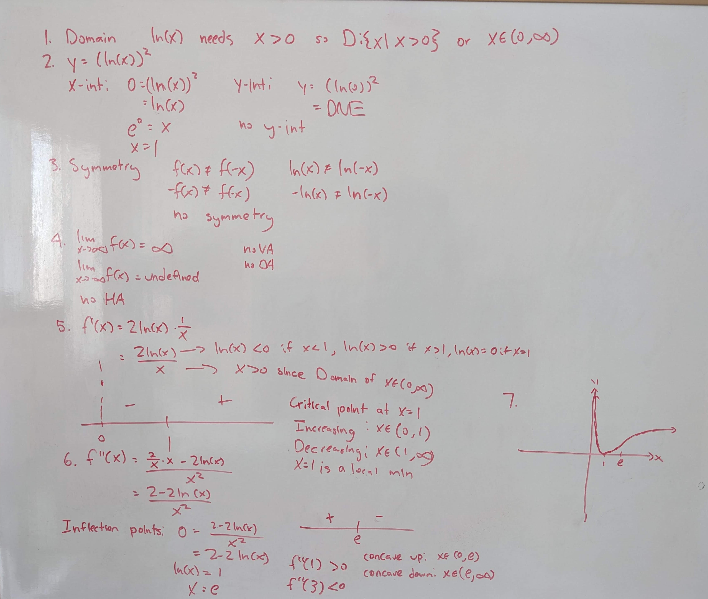
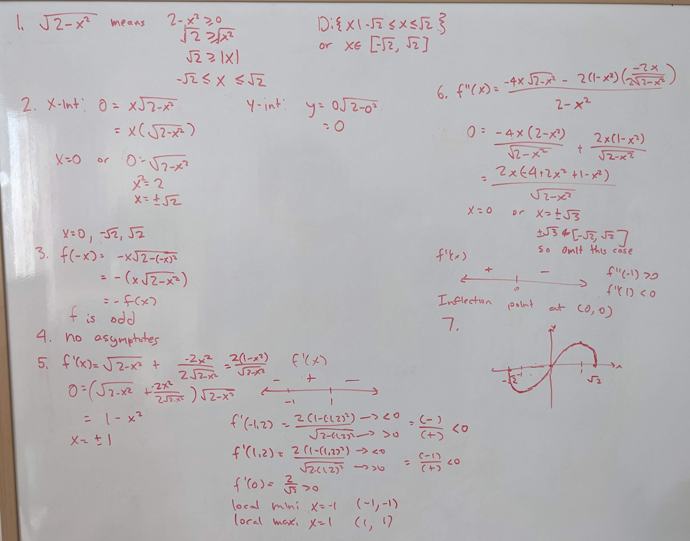
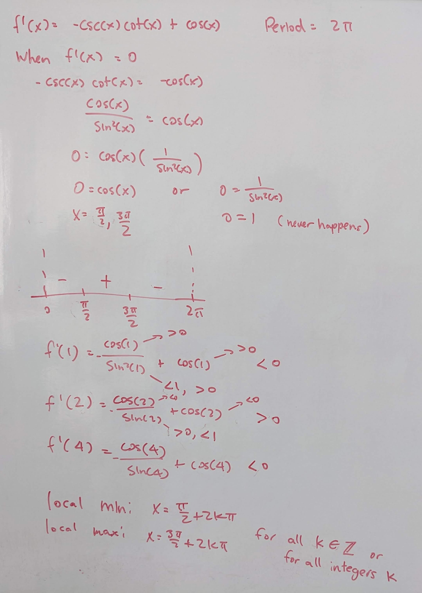
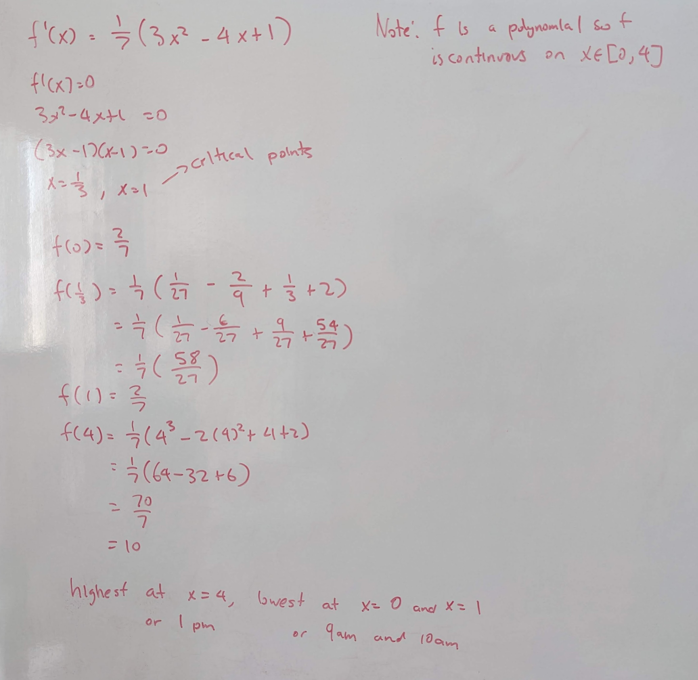
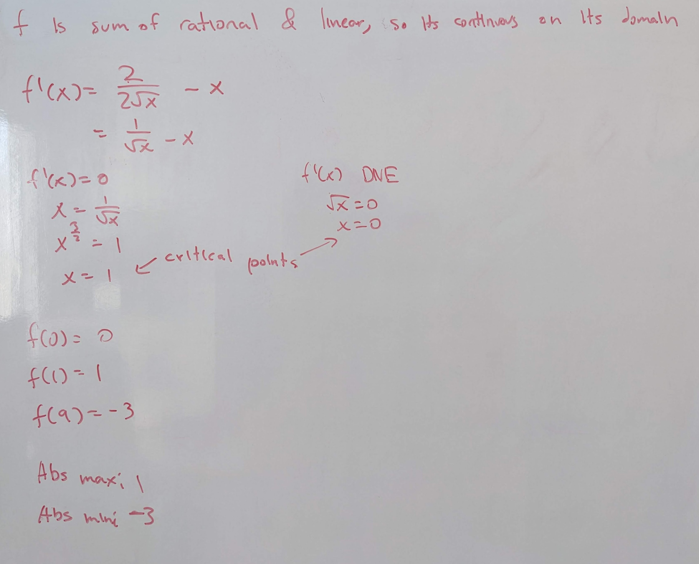

.. _2022_mata30_fall_tut_8:

Tutorial Week 8
===============

.. toctree::
   :hidden:

.. raw:: html

   

We'll be focusing on curve sketching using first and second derivatives.

The curve sketching guidlines are as follows:

1. Domain

2. Intercepts (x and y intercepts)

3. Symmetry (odd or even)

4. Asymptotes (horizontal, vertical, slant/oblique)

5. Critical points (and intervals of increase/decrease)

6. Concavity (and inflection points)

7. Sketch

Curve Sketching
---------------

Q1: Sketch :math:`f(x) = \ln\left(x\right)^{2}`.
~~~~~~~~~~~~~~~~~~~~~~~~~~~~~~~~~~~~~~~~~~~~~~~~

Q2: Sketch :math:`f(x) = x\sqrt{2-x^{2}}`. Where are the local minimums or local maximums?
~~~~~~~~~~~~~~~~~~~~~~~~~~~~~~~~~~~~~~~~~~~~~~~~~~~~~~~~~~~~~~~~~~~~~~~~~~~~~~~~~~~~~~~~~~

.. Q3: Sketch :math:`f(x) = \frac{2x^{3}+4x^{2}+2x}{x^{2}+x-1}`.
.. ~~~~~~~~~~~~~~~~~~~~~~~~~~~~~~~~~~~~~~~~~~~~~~~~~~~~~~~~~~~~~~~~~~~~~~~~~~

Sinusodial Function Derivatives
-------------------------------

Q3: Find the local maximums and minimums of :math:`f(x) = \csc\left(x\right)+\sin x`.
~~~~~~~~~~~~~~~~~~~~~~~~~~~~~~~~~~~~~~~~~~~~~~~~~~~~~~~~~~~~~~~~~~~~~~~~~~~~~~~~~~~~~

.. Q4: Which points in :math:`f(x) = \sec\left(2x\right)-\tan\left(2x\right)` are inflection points?
.. ~~~~~~~~~~~~~~~~~~~~~~~~~~~~~~~~~~~~~~~~~~~~~~~~~~~~~~~~~~~~~~~~~~~~~~~~~~~~~~~~~~~~~~~~~~~~~~~~~

Test for Absolute Extrema
-------------------------

Q4. Let :math:`f(x) = \frac{1}{7}\left(x^{3}-2x^{2}+x+2\right)` represent the water level of a lake x hours after 9am. Between 9am and 1pm (inclusive), when was the water highest? When was it lowest?
~~~~~~~~~~~~~~~~~~~~~~~~~~~~~~~~~~~~~~~~~~~~~~~~~~~~~~~~~~~~~~~~~~~~~~~~~~~~~~~~~~~~~~~~~~~~~~~~~~~~~~~~~~~~~~~~~~~~~~~~~~~~~~~~~~~~~~~~~~~~~~~~~~~~~~~~~~~~~~~~~~~~~~~~~~~~~~~~~~~~~~~~~~~~~~~~~~~~~~~~

Q5: Determine the absolute extrema of :math:`f(x) = 2\sqrt{x}-x` on the interval :math:`x \in [0, 9]`.
~~~~~~~~~~~~~~~~~~~~~~~~~~~~~~~~~~~~~~~~~~~~~~~~~~~~~~~~~~~~~~~~~~~~~~~~~~~~~~~~~~~~~~~~~~~~~~~~~~~~~~

Drawing Functions
-----------------

Q6: Draw a function with domain :math:`[0, 5]` that does not satisfy the conclusion of the Extreme Value Theorem on the interval :math:`[0, 5]`.
~~~~~~~~~~~~~~~~~~~~~~~~~~~~~~~~~~~~~~~~~~~~~~~~~~~~~~~~~~~~~~~~~~~~~~~~~~~~~~~~~~~~~~~~~~~~~~~~~~~~~~~~~~~~~~~~~~~~~~~~~~~~~~~~~~~~~~~~~~~~~~~~

Q7: Draw a function with domain :math:`[0, 5]` that does not satisfy the conclusion of the Extreme Value Theorem on the interval :math:`[2, 3]`.
~~~~~~~~~~~~~~~~~~~~~~~~~~~~~~~~~~~~~~~~~~~~~~~~~~~~~~~~~~~~~~~~~~~~~~~~~~~~~~~~~~~~~~~~~~~~~~~~~~~~~~~~~~~~~~~~~~~~~~~~~~~~~~~~~~~~~~~~~~~~~~~~

Q8: Draw a continuous function with domain :math:`(-2, 2)` that does not satisfy the conclusion of the Extrema Value Theorem on its domain.
~~~~~~~~~~~~~~~~~~~~~~~~~~~~~~~~~~~~~~~~~~~~~~~~~~~~~~~~~~~~~~~~~~~~~~~~~~~~~~~~~~~~~~~~~~~~~~~~~~~~~~~~~~~~~~~~~~~~~~~~~~~~~~~~~~~~~~~~~~~