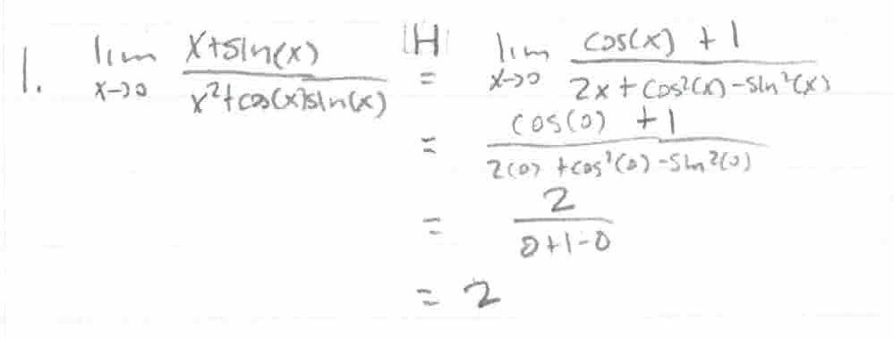
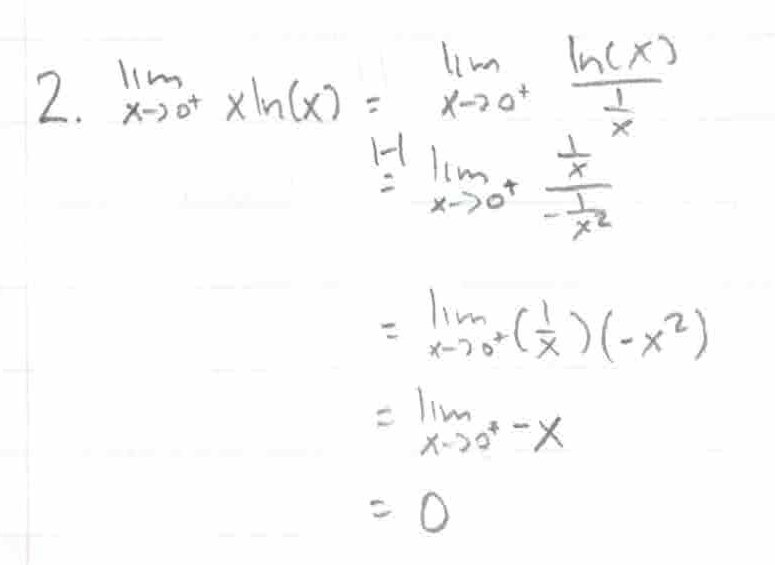
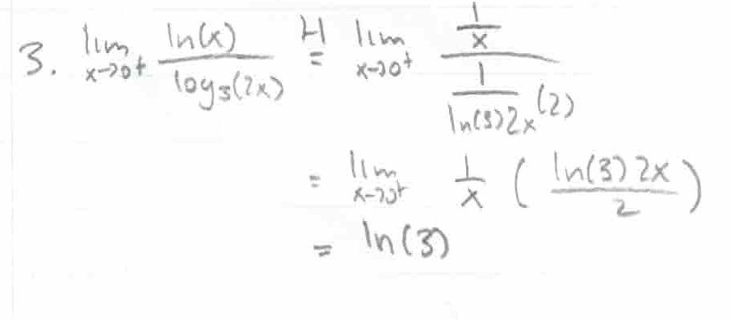
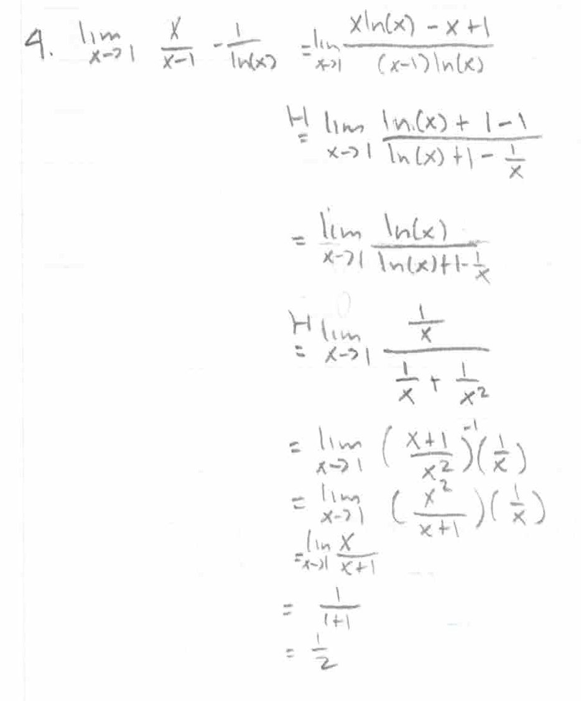
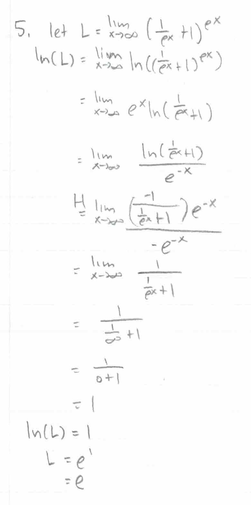
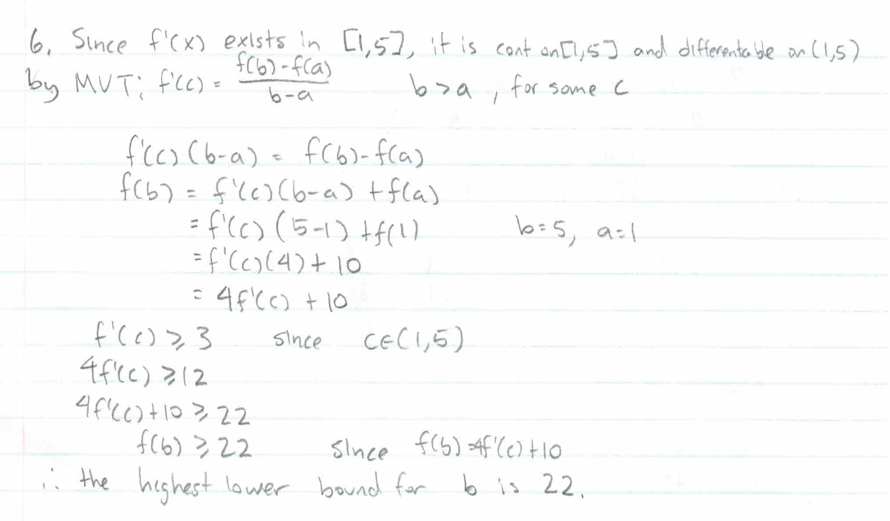
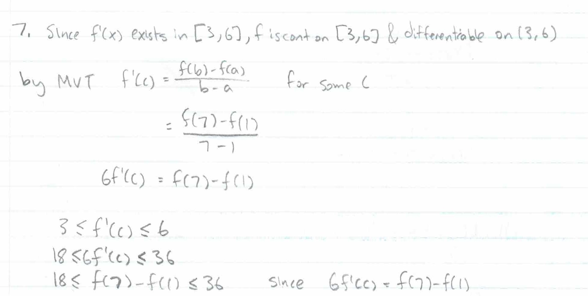
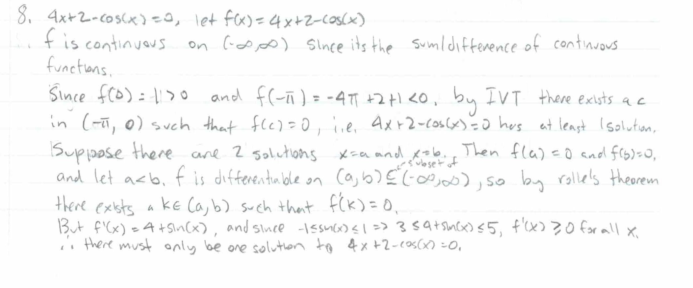
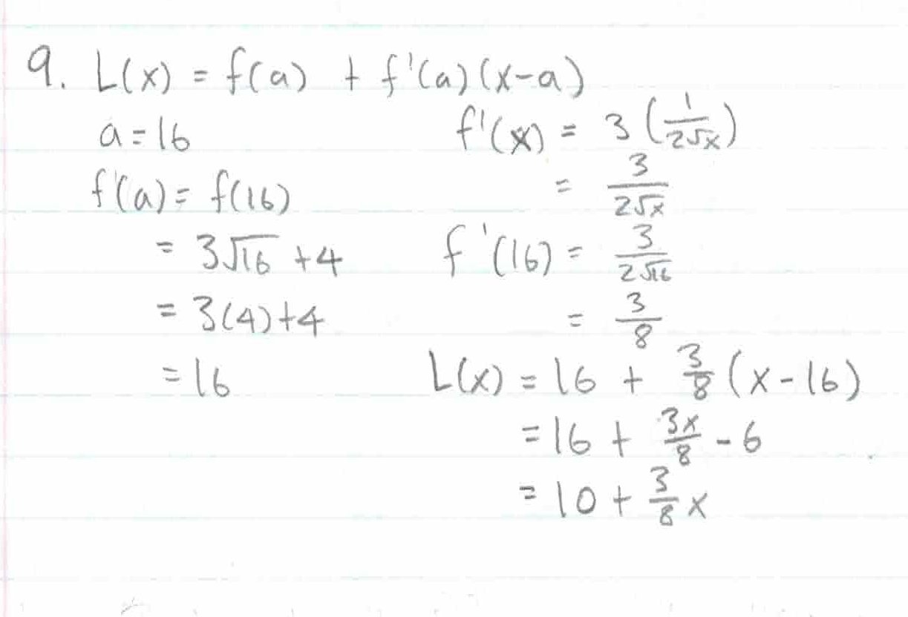
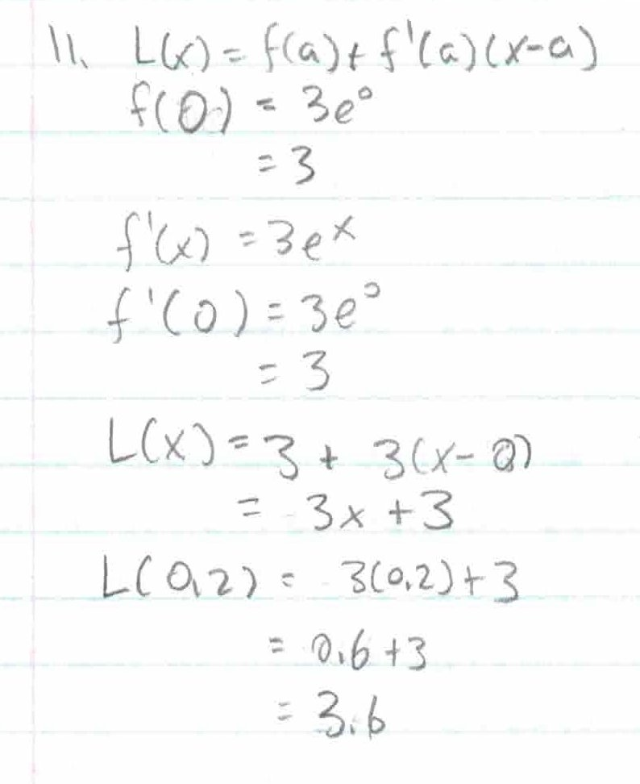

.. _2022_mata30_fall_tut_9:

Tutorial Week 9
===============

.. toctree::
   :hidden:

.. raw:: html

   

This tutorial covers L'Hopital's rule, linearization, and Mean Value Theorem.

L'Hopital's Rule
----------------

Q1: Compute :math:`\lim_{x \to 0} \frac{x + sin(x)}{x^2 + cos(x)tan(x)}`.
*************************************************************************

Q2: Compute :math:`\lim_{x \to 0^+} xln(x)`.
********************************************

Q3: Compute :math:`\lim_{x \to 0^{+}} \frac{ln(x)}{log_3(2x)}`.
***************************************************************

Q4: Compute :math:`\lim_{x \to 1} (\frac{x}{x-1} - \frac{1}{ln(x)})`.
*********************************************************************

L'Hopital's Rule with Logs
--------------------------

Q5: Compute :math:`\lim_{x \to \infty} \left(\frac{1}{e^{x}}+1\right)^{e^{x}}`.
*******************************************************************************

.. Piecewise function

Mean Value Theorem
------------------

Q6: Given :math:`f(1) = 10`, :math:`f'(x) \geq 3` for :math:`x \in [1, 5]`, what would be the highest lower bound for :math:`f(5)`?
***********************************************************************************************************************************

Q7: If :math:`3 \leq f'(x) \leq 6` for all :math:`x`, show that :math:`18 \leq f(7) − f(1) \leq 36`.
****************************************************************************************************

Q8: Show that :math:`4x+2 = \cos\left(x\right)` has exactly one solution.
*************************************************************************

Linearization
-------------

Q9: Find the linearization of :math:`f(x)=3\sqrt{x} + 4` at :math:`x=16`.
*************************************************************************

Q10: Find the linear approximation of :math:`f(x) = tan(x)` at :math:`x=\pi`.
*****************************************************************************

.. image:: ./images/t9/10.jpg
   :width: 700

Q11: Find the linear approximation of :math:`f(x) = 3e^{x}` at :math:`x=0`. Use it to approximate :math:`3e^{0.2}`.
*******************************************************************************************************************

