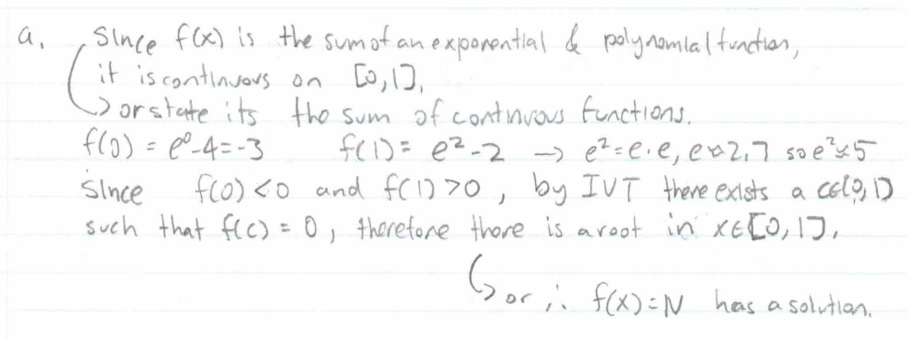
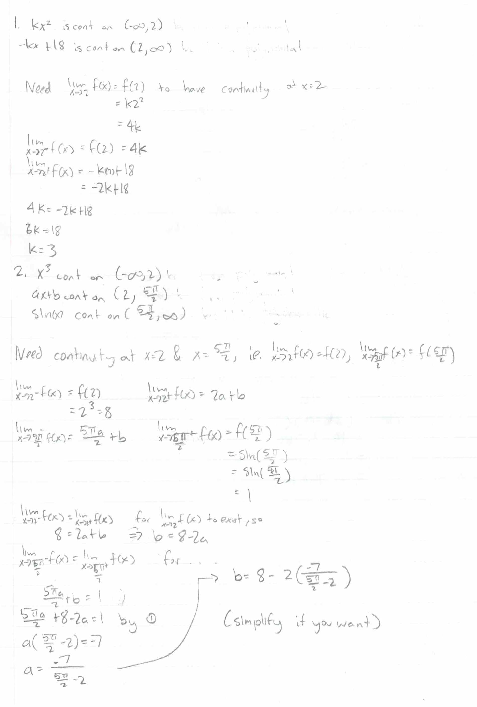
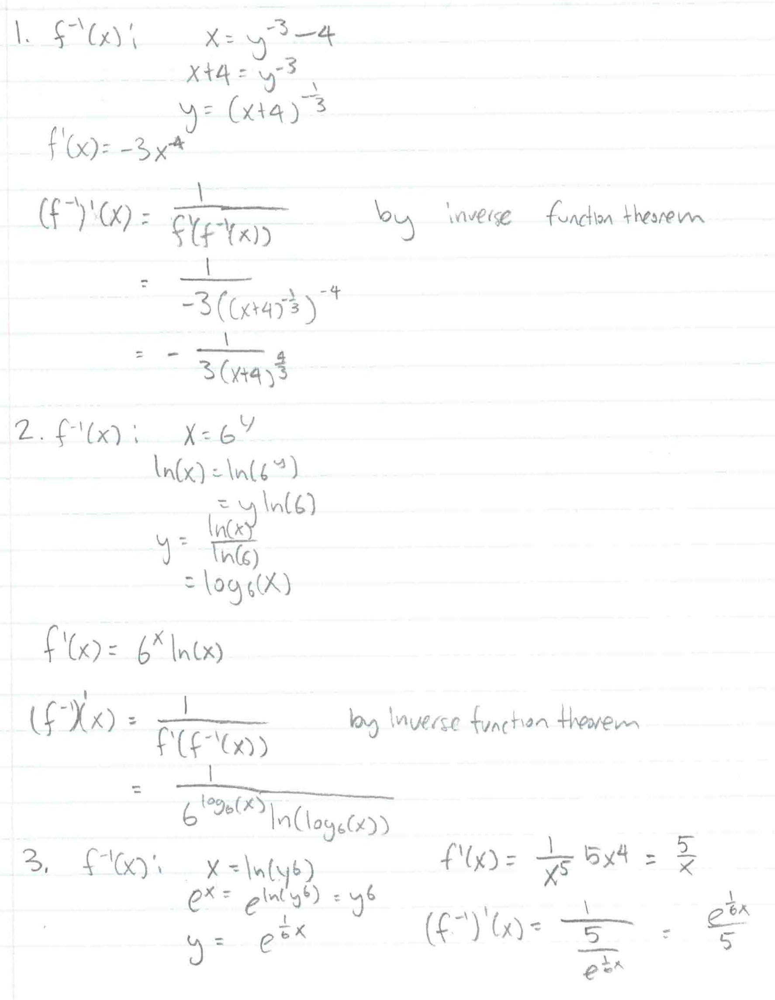

.. _2022_mata30_fall_tut_9_tt2:

Term Test 2 Supplementary Practice
==================================

.. toctree::
   :hidden:

.. raw:: html

   

.. |v| raw:: latex

   \vspace{5mm}

.. |b| raw:: latex

   \vspace{2mm}

Q1: Definitions
~~~~~~~~~~~~~~~

Recalling Definitions
---------------------

.. EVT: If f (x) is continuous on the closed interval [a, b], then f (x) must attain both an absolute maximum and an absolute minimum on [a, b].

.. Critical Point: Critical point (c, f(c)) if c is a critical value if (c in domain f, f'(c) = 0 or f'(c) = undefined)

.. Inflection Point: (c, f(c)) inflection if c is continuous at c and concavity changes at c

.. If f is a continuous function on the closed interval [a,b] and N is any number between f (a) and f (b), then there exists a number c in [a,b] such that f (c ) = N .

.. Cont at point: A function f (x) is continuous at x = a if limx→a f (x) = f (a)

.. Limit def of d/dx

Write down the defintions for the following:

1. Intermediate Value Theorem

2. Extreme Value Theorem

3. Critical Point

4. Inflection Point

5. Continuity at a point

6. Limit definition of a derivative

.. raw:: html

    

        <button onClick="toggleClicked(this)" class="show-answer-button">Show Solution</button>
        

1. If a function :math:`f(x)` is continuous on :math:`[a, b]` and :math:`N` is between :math:`f(a)` and :math:`f(b)`, then there exists a number :math:`c` such that :math:`f(c) = N`.

|v|

2. If a function :math:`f(x)` is continuous on :math:`[a, b]`, then :math:`f(x)` must attain both an absolute maximum and an absolute minimum on :math:`[a, b]`.

|v|

3. Point :math:`(c, f(c))` is a critical point if :math:`c` is in the domain of :math:`f` and :math:`f'(c) = 0` or :math:`f'(c)` is undefined.

|v|

4. Point :math:`(c, f(c))` is an inflection point if :math:`f(x)` is continuous at :math:`c` and the concavity changes at :math:`c`.

|v|

5. A function :math:`f(x)` is continuous at :math:`x = a` if :math:`\;lim_{x \to a} f(x) = f(a)`.

|v|

6. :math:`f'(x) = lim_{h \to 0} \frac{f(x + h) - f(x)}{h}`

.. raw:: html

        

    

Rewriting in the Form of "if ... then ..."
------------------------------------------

Some of the statements above can be written in the form of a conditional statement; that is,
in the form of "if {condition} then {conclusion}", e.g. if :math:`x > 0` then :math:`x > -1`.

Fill out the following chart:

.. list-table:: 

    * - Concept
      - Condition
      - Conclusion
      - Full statement: if {condition} then {conclusion}
    * - IVT
      - 
      - 
      - 
    * - EVT
      - 
      - 
      - 
    * - Critical Point
      - 
      - 
      - 
    * - Inflection Point
      - 
      - 
      - 
    * - Continuity at a point
      - 
      - 
      - 

.. raw:: html

    

        <button onClick="toggleClicked(this)" class="show-answer-button">Show Solution</button>
        

.. list-table:: 

    * - Concept
      - Condition
      - Conclusion
      - Full statement: if {condition} then {conclusion}
    * - IVT
      - A function :math:`f(x)` is continuous on :math:`[a, b]` and :math:`N` is in between :math:`f(a)` and :math:`f(b)`
      - There exists a number :math:`c` such that :math:`f(c) = N`
      - If a function :math:`f(x)` is continuous on :math:`[a, b]` and :math:`N` is in between :math:`f(a)` and :math:`f(b)` then there exists a number :math:`c` such that :math:`f(c) = N`.
    * - EVT
      - A function :math:`f(x)` is continuous on :math:`[a, b]`
      - :math:`f(x)` must attain both an absolute maximum and an absolute minimum on :math:`[a, b]`
      - If a function :math:`f(x)` is continuous on :math:`[a, b]`, then :math:`f(x)` must attain both an absolute maximum and an absolute minimum on :math:`[a, b]`.
    * - Critical Point
      - :math:`c` is in the domain of :math:`f` and :math:`f'(c) = 0` or :math:`f'(c)` is undefined
      - Point :math:`(c, f(c))` is a critical point
      - If :math:`c` is in the domain of :math:`f` and :math:`f'(c) = 0` or :math:`f'(c)` is undefined then point :math:`(c, f(c))` is a critical point.
    * - Inflection Point
      - :math:`f(x)` is continuous at :math:`c` and the concavity changes at :math:`c`
      - Point :math:`(c, f(c))` is an inflection point
      - If :math:`f(x)` is continuous at :math:`c` and the concavity changes at :math:`c` then point :math:`(c, f(c))` is an inflection point.
    * - Continuity at a point
      - :math:`\;lim_{x \to a} f(x) = f(a)`
      - :math:`f(x)` is continuous at :math:`x = a`
      - If :math:`\;lim_{x \to a} f(x) = f(a)` then :math:`f(x)` is continuous at :math:`x = a`.

.. raw:: html

        

    

Q2: Continuity & IVT
~~~~~~~~~~~~~~~~~~~~

Showing that Roots exist
------------------------

a) Show that :math:`f\left(x\right)=e^{2x}+2x^{2}-4` has root in between :math:`0` and :math:`1`.

b) Show that a solution exists for :math:`2\sin\left(x\right)+1=0` on the interval :math:`[-\frac{\pi}{2}, \frac{3\pi}{2}]`.

c) Show that :math:`x^{3}-10x=1` has at least 3 solutions on the interval :math:`[-4, 4]`.

d) Show that :math:`f(x)=\pi x^{2}-4` has two roots in :math:`[-2, 2]`.

.. raw:: html

    

        <button onClick="toggleClicked(this, 'Show Sample Solution', 'Hide Sample Solution')" class="show-answer-button">Show Sample Solution</button>
        

.. raw:: html

        

    

Continuity for Piecewise Functions
----------------------------------

a) What values of :math:`k` makes :math:`f(x) = \begin{cases} kx^2 & \text{if } x \leq 2 \\ -kx + 18 & \text{if } x \gt 2 \end{cases}` continuous everywhere.

|b|

b) What values of :math:`a` and :math:`b` make :math:`f(x) = \begin{cases} x^3 & \text{if } x \leq 2 \\ ax + b & \text{if } 2 \lt x \lt \frac{5\pi}{2} \\ sin(x) & \text{if } x \ge \frac{5\pi}{2} \end{cases}` continuous everywhere.

|b|

c) What values of :math:`a` and :math:`b` make :math:`f(x) = \begin{cases} \frac{\left(2ax^{2}+ax+2\right)}{ax-4}& \text{if } x \leq 0 \\ 3ax+b & \text{if } 0 \lt x \lt 1 \\ \frac{\left(bx-6b\right)}{x} & \text{if } x \ge 1 \end{cases}` continuous everywhere.

.. https://www.desmos.com/calculator/rjngmyy4k4

.. raw:: html

    

        <button onClick="toggleClicked(this)" class="show-answer-button">Show Solution</button>
        

.. raw:: html

        

    

Q3: Limit Definition of a Derivative
~~~~~~~~~~~~~~~~~~~~~~~~~~~~~~~~~~~~

Applying Limit Definition
-------------------------

Use the limit definition of a derivative for the following (:math:`f'(x) = lim_{h \to 0} \frac{f(x + h) - f(x)}{h}`).

a) Find :math:`f'(x)` if :math:`f\left(x\right)=3\sqrt{4x+e}+3x`.

b) Find :math:`f'(x)` if :math:`f\left(x\right)=2x^{2}+4x+3`.

c) Find :math:`f'(x)` if :math:`f\left(x\right)=10x+2`.

d) Find :math:`f'(x)` if :math:`f\left(x\right)=\frac{3}{2x-3}`.

e) Find :math:`f'(x)` if :math:`f\left(x\right)=\frac{7}{\sqrt{x}}`.

f) Find :math:`f'(x)` if :math:`f\left(x\right)=\frac{2}{\sqrt{x+3}}`.

Check your answer by using derivative rules to find the derivative or https://www.derivative-calculator.net/.

.. raw:: html

    

        <button onClick="toggleClicked(this, 'Show Hints', 'Hide Hints')" class="show-answer-button">Show Hints</button>
        

a) Split into two limit expressions (one for :math:`3\sqrt{4x+e}`, the other for :math:`3x`). For the former, multiply by the conjugate (:math:`\frac{\text{conjugate}}{\text{conjugate}}`).

|b|

e) Get a common denominator, then multiply by conjugate.

|b|

f) Get a common denominator, then multiply by conjugate.

.. raw:: html

        

    

Q4/5: Computing Derivatives
~~~~~~~~~~~~~~~~~~~~~~~~~~~

Directly Computing Derivatives
------------------------------

a) Find :math:`\frac{df}{dx}` if :math:`f\left(x\right)=3x^{3}+\cos\left(x\right)-e^{\sin\left(x\right)}`.

b) Find :math:`\frac{df}{dx}` if :math:`f\left(x\right)=\tan\left(\arctan\left(x\right)+3x^{99}\right)e^{x}`

c) Find :math:`\frac{df}{dx}` if :math:`f\left(x\right)=5^{\log_4\left(x\right)}+4^{x^{3}}`

d) Find :math:`\frac{df}{dx}` if :math:`f\left(x\right)=\arcsin\left(x^{2}+x\right)\arctan\left(x^{3}\right)\arccos\left(x\right)`

d) Find :math:`\frac{df}{dx}` if :math:`f\left(x\right)=\frac{\arctan\left(x\right)-3x^{2}}{2+5xe^{x}}`

Check your answers using https://www.derivative-calculator.net/.

Derivatives of Inverse Functions
--------------------------------

a) Find :math:`(f^{-1})'(x)` if :math:`f\left(x\right)=x^{-3}-4`.

b) Find :math:`(f^{-1})'(x)` if :math:`f\left(x\right)=6^x`.

c) Find :math:`(f^{-1})'(x)` if :math:`f\left(x\right)=ln(x^5)`.

.. raw:: html

    

        <button onClick="toggleClicked(this)" class="show-answer-button">Show Solutions</button>
        

.. raw:: html

        

    

Logarithmic Differentiation
---------------------------

a) Find :math:`\frac{df}{dx}` if :math:`f\left(x\right)=ex^{ex}`.

b) Find :math:`\frac{df}{dx}` if :math:`f\left(x\right)=\sin\left(x\right)^{\cos\left(x\right)\tan\left(x\right)}`.

c) Find :math:`\frac{df}{dx}` if :math:`f\left(x\right)=f\left(x\right)=\frac{\left(x^{3}+2x+1\right)^{\pi}\left(e^{x}+\cos\left(x\right)\right)^{1142}}{\left(4x+5x^{5}\right)^{3}}`.

Check your answers using https://www.derivative-calculator.net/.

Implicit Differentiation
------------------------

a) Find :math:`\frac{dy}{dx}` for :math:`3x^{2}y+2xy-y^{3}=0`

b) Find :math:`\frac{dy}{dx}` for :math:`\arctan\left(x^{3}y\right)=3y`

c) Find :math:`\frac{dy}{dx}` for :math:`\frac{xy+2}{x^{2}-y}=3y`

d) Find :math:`\frac{dy}{dx}` for :math:`2^{x^2y^3}=x`

Check your answers using https://calculator-derivative.com/implicit-differentiation-calculator.

Q6: Related Rates
~~~~~~~~~~~~~~~~~

Formulas to know
----------------

Fill out the following table:

.. list-table:: 

    * - Shape
      - Area/Volume
      - Perimeter/Surface Area
    * - Triangle
      - 
      - :math:`\text{Side 1} + \text{Side 2} + \text{Side 3}``
    * - Rectangle
      - 
      - 
    * - Right Circular Cylinders
      - 
      - 
    * - Right Rectangular Prisms
      - 
      - 

.. raw:: html

    

        <button onClick="toggleClicked(this)" class="show-answer-button">Show Solution</button>
        

.. list-table:: 

    * - Shape
      - Area/Volume
      - Perimeter/Surface Area
    * - Triangle
      - :math:`\frac{1}{2}\text{base}\cdot\text{height}`
      - :math:`\text{Side 1} + \text{Side 2} + \text{Side 3}``
    * - Rectangle
      - :math:`\text{length}\cdot\text{width}`
      - :math:`2 \cdot \text{length} + 2 \cdot {width}`
    * - Right Circular Cylinders
      - :math:`\pi \text{r}^2 \text{h}`
      - :math:`2\pi \text{rh} + 2 \pi \text{r}^2`
    * - Right Rectangular Prisms
      - :math:`\text{lwh}`
      - :math:`2\text{lw} + 2\text{wh} + 2\text{lh}`

.. raw:: html

        

    

Expanding Volumes
-----------------

a) The radius of a right circular cylinder is growing at a rate of :math:`2m/s` while the volume remains the same. How fast is the height changing when the radius is :math:`1m`?

|b|

b) Suppose you have a right rectangular prism with a width that is increasing at :math:`3m/s`, height that is increasing at :math:`5m/s`, and a length that is decreasing at :math:`1m/s`. How much is the volume changing when the length, width, and height are all :math:`3m`?

Sample solution is in `practice test 1, question 6 <https://q.utoronto.ca/courses/267509/files/23007575?wrap=1>`__.

Ladder Problem
--------------

a) A 5m ladder leaning against a wall has its base pushed towards the wall at a rate of :math:`4m/s`. At what rate was the ladder going up the wall when the base of the ladder was :math:`2m` from the wall?

|b|

b) An 8m ladder leaning against a wall is sliding down the wall at a rate of :math:`20m/s`. At what rate was the base sliding away from the wall when the ladder was :math:`5m` from the bottom of the wall (height of 5m)?

|b|

c) An extendible ladder leaning against a wall is being extended at a rate of :math:`2m/s` and is sliding down the wall at a rate of :math:`1m/s`. How fast was the base of the ladder moving away from the wall when the ladder was :math:`6m` from the bottom of the wall?

Sample solution is in `practice test 3, question 6 <https://q.utoronto.ca/courses/267509/files/22885001?wrap=1>`__.

Cylindrical Tank
----------------

a) A cylinder with radius 10m is being filled with a rate of :math:`3m/s`. How fast is the height changing?

|b|

b) The height of water in a cylinder with radius 1m is falling at a rate of :math:`2m/s`. At what rate does the volume decrease?

Sample solution is in `practice test 4, question 6 <https://q.utoronto.ca/courses/267509/files/22884499?wrap=1>`__.

Sailing Ships
-------------

.. image:: ./images/tt2/compass.png
   :width: 200

a) Ship A is 5km north of ship B. Ship A sails west at a rate of :math:`2km/h` and ship B sails south at a rate of :math:`3km/h`. How fast is the distance between the ships changing after three hours?

|b|

b) Ship A is 3km south, 5km east of ship B. Ship A sails north at a rate of :math:`2km/h` and ship B sails east at a rate of :math:`1km/h`. How fast is the distance between the ships changing after an hour?

Sample solution is in `practice test 2, question 6 <https://q.utoronto.ca/courses/267509/files/23144334?wrap=1>`__.

Q7: Absolute Extrema
~~~~~~~~~~~~~~~~~~~~

.. (1) Verify that f (x) is continuous on the closed interval [a, b] (and apply EVT).
.. (2) Find all critical points of f (x) that are in the interval [a, b].
.. (3) Evaluate f (x) at the critical points in [a, b] and at the endpoints (x = a, x = b).
.. (4) Identify the absolute extrema by comparing value

Test for Absolute Extrema
-------------------------

a) What are the four steps in the test for absolute extrema.

|b|

b) Can you use the test for absolute extrema for finding the absolute minimum of :math:`f(x)=3ln(x)` in :math:`(3, 10]`?

|b|

c) Find the absolute extrema of :math:`f(x)=x^2+3-x` in :math:`[-2, 2]`

|b|

d) Find the absolute extrema of :math:`f(x)= sin(x)+\frac{x}{\sqrt{2}}` on the interval :math:`[0, 2\pi]`.

Check your answer using `desmos <https://www.desmos.com/calculator>`__.
Your answer should include all the steps of the Test for Absolute Extrema (points might be taken off if you don't). Refer to `practice test 3, question 7 <https://q.utoronto.ca/courses/267509/files/22885001?wrap=1>`__ for a sample solution.

Q8: Curve Sketching
~~~~~~~~~~~~~~~~~~~

Practice Problems
-----------------

For the below questions, be sure the include all the steps of curve sketching as listed on `slide 24 from week 7 <https://q.utoronto.ca/courses/267509/files/22858797?wrap=1>`__.

a) Sketch :math:`f(x) = 2x^3 + x^2 - 4x + 1`.

|b|

b) Sketch :math:`f(x) = x^{6}+x^{2}`.

Check your answer using `desmos <https://www.desmos.com/calculator>`__.

Q9: Tangent Lines
~~~~~~~~~~~~~~~~~

Tangent Line given a Point
--------------------------

|b|

a) Find the equation of the line tangent to :math:`f\left(x\right)=x^{3}+2x+3` that passes through :math:`(0, 19)`

Point given a Tangent Line
--------------------------

a) Find the point where the line :math:`y=13x-11` is the tangent line of :math:`y=x^{3}+x+5`.

|b|

b) Find the point where the line :math:`y=x` is the tangent line of :math:`y=x^{4}+x^{3}-3x^{2}+2`.

.. raw:: html

  