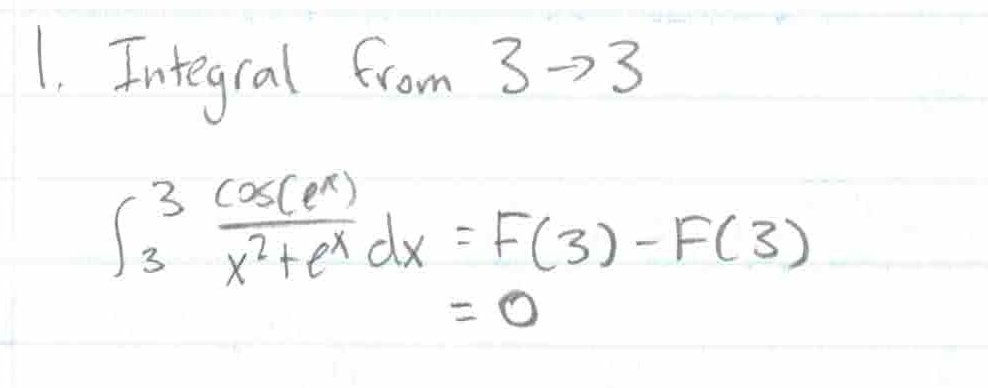
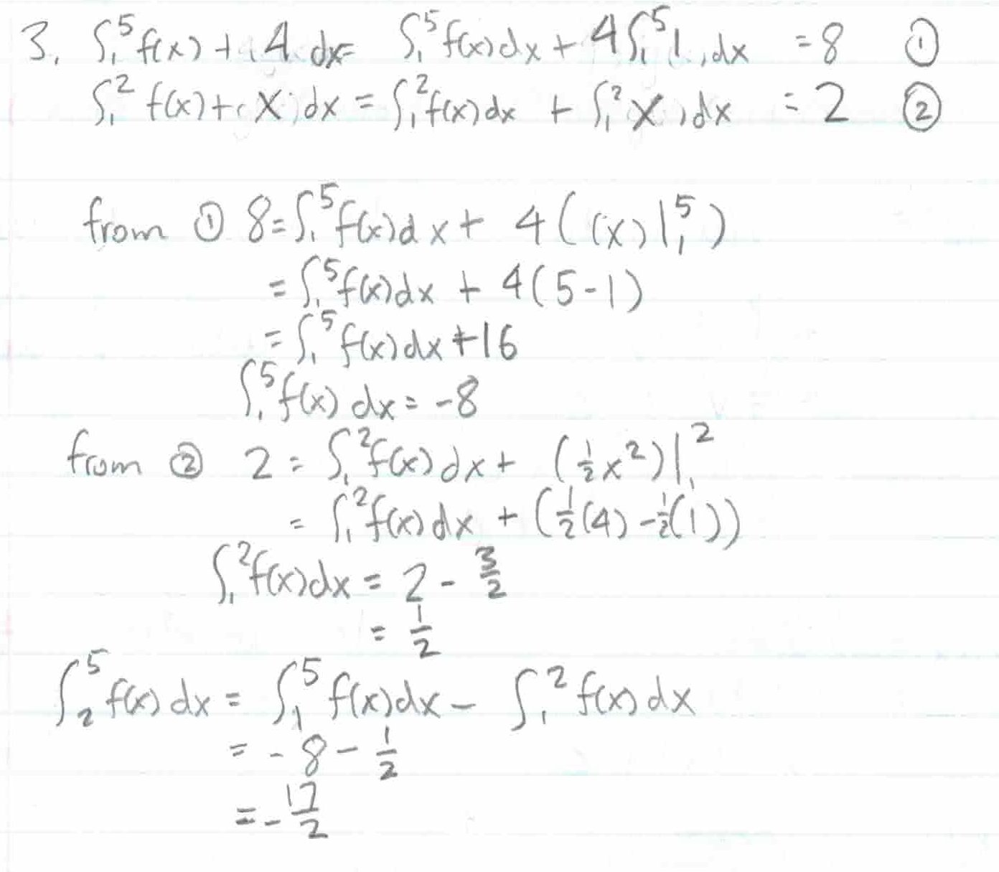

Tutorial Week 12
================

.. toctree::
   :hidden:
   

.. raw:: html

    

Sigma Notation
--------------

We use sigma (:math:`\Sigma`) notation as a way to express sums of numbers.

With :math:`\Sigma_{n=3}^5n^2`, we sum from :math:`n = 3` to :math:`n = 5` inclusive, giving :math:`\Sigma_{n=3}^5n^2 = 3^2 + 4^2 + 5^2`.

With sums, we also have a few useful formulas, those being:

- :math:`\Sigma_{k = m}^n ca_k = c\Sigma_{k = m}^n a_k`

- :math:`\Sigma_{k = m}^n a_k + b_k = \Sigma_{k = m}^n a_k + \Sigma_{k = m}^n b_k`

- :math:`\Sigma_{k = 1}^n 1 = n`

- :math:`\Sigma_{k = 1}^n n = \frac{n(n+1)}{2}`

- :math:`\Sigma_{k = 1}^n n^2 = \frac{n(n+1)(2n+1)}{6}`

- :math:`\Sigma_{k = 1}^n n^3 = \frac{n^2(n + 1)^2}{4}`

Riemann Sums
------------

Riemann sums are used to approximate the area under a function by using rectangles.

To define a riemann sum from on the interval [a, b] for f(x), we need:

- :math:`\Delta x = \frac{b - a}{n}`

- :math:`x_k = a + k\Delta x` for :math:`k = 0, 1, 2, ... , n`

- :math:`x^\ast_k` is a point in :math:`[x_{k-1}, x_k]`

The riemann sum is :math:`\Sigma_{k=1}^n f(x_n^\ast)\Delta x`.

We have two common types of riemann sums, those being the left riemann sum and the right riemann sum.

The left riemann sum is defined with :math:`x^\ast_k = x_{k-1}` :math:`L_n = \Sigma_{k=1}^n f(x_{k-1})\Delta x = \Sigma_{k=1}^n f(a + (k-1)\Delta x)\Delta x`

The right riemann sum is defined with :math:`x^\ast_k = x_{k}` :math:`R_n = \Sigma_{k=1}^n f(x_{k})\Delta x = \Sigma_{k=1}^n f(a + k\Delta x)\Delta x`

Q1: Approximate the area under :math:`10 - x^2` for :math:`x \in [0, 1]` using the right Riemann sum over four intervals.
~~~~~~~~~~~~~~~~~~~~~~~~~~~~~~~~~~~~~~~~~~~~~~~~~~~~~~~~~~~~~~~~~~~~~~~~~~~~~~~~~~~~~~~~~~~~~~~~~~~~~~~~~~~~~~~~~~~~~~~~~

.. raw:: html

   

      <button onClick="toggleClicked(this)" class="show-answer-button">Show Solution</button>
      

We first need to find the following: 

- :math:`\Delta x = \frac{b - a}{n} = \frac{1 - 0}{4} = \frac{1}{4}`

- :math:`x_k = a + k\Delta x = 0 + \frac{k}{4}` for :math:`k = 0, 1, 2, ... , n`

- :math:`x^\ast_k = x_{k} = \frac{k}{4}` since we're using the right Riemann sum.

- :math:`\Sigma_{k=1}^n f(x_{k})\Delta x = \Sigma_{k=1}^n f(\frac{k}{4})\Delta x`

Then the right riemann sum is

:math:`R_n = \Sigma_{k=1}^n f(\frac{k}{4})\Delta x = (\frac{1}{4})((10 - (\frac{1}{4})^2) + (10 - (\frac{2}{4})^2) + (10 - (\frac{3}{4})^2) + (10 - 1^2))`

.. raw:: html

        

    

Integrals
---------

Integrals are essentially riemann sums with an infinite number of partitions. That is, :math:`\int_a^b f(x) dx = \lim_{n\to \infty} \Sigma_{k=1}^n f(x^\ast_k) \Delta x` for the riemann sum over :math:`x \in [a, b]`.
The :math:`dx` tells you which variable to integrate, which is useful in multivariable calculus.

Q2: Evaluate :math:`\int_0^4 2x^2 + x \,dx` using Riemann sums.
~~~~~~~~~~~~~~~~~~~~~~~~~~~~~~~~~~~~~~~~~~~~~~~~~~~~~~~~~~~~~~~

.. raw:: html

   

      <button onClick="toggleClicked(this)" class="show-answer-button">Show Solution</button>
      

For simplicity, let's use the right riemann sum.

We have: 

- :math:`\Delta x = \frac{b - a}{n} = \frac{4 - 0}{n} = \frac{4}{n}`

- :math:`x_k = a + k\Delta x = 0 + \frac{4k}{n}` for :math:`k = 0, 1, 2, ... , n`

- :math:`x^\ast_k = x_{k} = \frac{4k}{n}` since we're using the right Riemann sum.

So then 

.. math::
    \begin{aligned}
    \int_1^5 2x^2 + x dx &= \lim_{n \to \infty} \Sigma_{k=1}^n f(x_{k})\Delta x \\
    &= \lim_{n \to \infty} \Sigma_{k=1}^n f(\frac{4k}{n})\Delta x \\
    &=\lim_{n \to \infty} \Sigma_{k=1}^n (2(\frac{4k}{n})^2 + \frac{4k}{n})(\frac{4}{n})
    \end{aligned}

Solving for this gives us 

.. math::
    \begin{aligned}
    &\lim_{n \to \infty} \Sigma_{k=1}^n (2(\frac{4k}{n})^2 + \frac{4k}{n})(\frac{4}{n}) \\ &= \lim_{n \to \infty} \frac{4}{n}\Sigma^n_{k = 1}2(\frac{4k}{n})^2 + \frac{4k}{n} \\
    &= \lim_{n \to \infty} \frac{4}{n}\Sigma^n_{k = 1}\frac{32k^2}{n^2} + \frac{4k}{n} \\
    &= \lim_{n \to \infty} \frac{4}{n} ( \frac{32}{n^2} \Sigma^n_{k = 1} k^2 + \frac{4}{n} \Sigma^n_{k = 1} k) \\
    &= \lim_{n \to \infty} \frac{4}{n} (\frac{32}{n^2} \cdot \frac{n(n+1)(2n+1)}{6} + \frac{4}{n} \cdot \frac{n(n+1)}{2} ) \\
    &= \lim_{n \to \infty} \frac{128(2n^3+3n^2+n)}{6n^3} + \frac{16(n^2 + n)}{2n^2} \\
    &= \text{... skipping a few steps for finding the limit} \\
    &= \frac{128 \cdot 2}{6} + \frac{16}{2} \\
    &= \frac{128}{3} + 8
    \end{aligned}

.. raw:: html

        

    

Integral Properties and Formulas
--------------------------------

- :math:`\int x^n dx = \frac{x^{n+1}}{n+1} + C` if :math:`n \neq -1`

- :math:`\int \frac{1}{x} dx = ln|x| + C`

- :math:`\int e^x dx = e^x + C`

(and a few more for trigonometric functions)

- :math:`\int_a^b f(x) + g(x) dx= \int_a^b f(x) dx+ \int_a^b g(x) dx`

- :math:`\int_a^b kf(x) dx = k \int_a^b f(x) dx`

- :math:`\int_a^a f(x) dx = 0`

- :math:`\int_b^a f(x) dx = -\int_a^b f(x) dx`

- :math:`\int_a^b f(x) dx + \int_b^c f(x) dx = \int_a^c f(x) dx`

Fundamental Theorem of Calculus 2 (FTC 2)
-----------------------------------------

With FTC 2, you're able to evaluate integrals at the endpoints of your interval.

If :math:`\int f(x) dx = F(x)`, then :math:`\int_a^b f(x) dx = F(x) |_a^b = F(b) - F(a)`

Q3: Find :math:`\int_{0}^{1} 5x + x^2\sqrt[3]{x} \, dx`.
~~~~~~~~~~~~~~~~~~~~~~~~~~~~~~~~~~~~~~~~~~~~~~~~~~~~~~~~

.. raw:: html

   

      <button onClick="toggleClicked(this)" class="show-answer-button">Show Solution</button>
      

.. image:: ../../2022/mata30_fall/images/t11/5.jpg
   :width: 700

.. raw:: html

        

    

Q4: Find :math:`\int^3_3 \frac{\cos(e^{x})}{x^{2}+e^{x}} \, dx`.
~~~~~~~~~~~~~~~~~~~~~~~~~~~~~~~~~~~~~~~~~~~~~~~~~~~~~~~~~~~~~~~~

.. raw:: html

   

      <button onClick="toggleClicked(this)" class="show-answer-button">Show Solution</button>
      

.. raw:: html

        

    

Q5: If :math:`\int_{1}^{5} f(x) + 4 \, dx = 8`, :math:`\int_1^2 f(x) + x \, dx = 2`, find :math:`\int_2^5 f(x) \, dx`.
~~~~~~~~~~~~~~~~~~~~~~~~~~~~~~~~~~~~~~~~~~~~~~~~~~~~~~~~~~~~~~~~~~~~~~~~~~~~~~~~~~~~~~~~~~~~~~~~~~~~~~~~~~~~~~~~~~~~~~

.. raw:: html

   

      <button onClick="toggleClicked(this)" class="show-answer-button">Show Solution</button>
      

.. raw:: html

        

    
