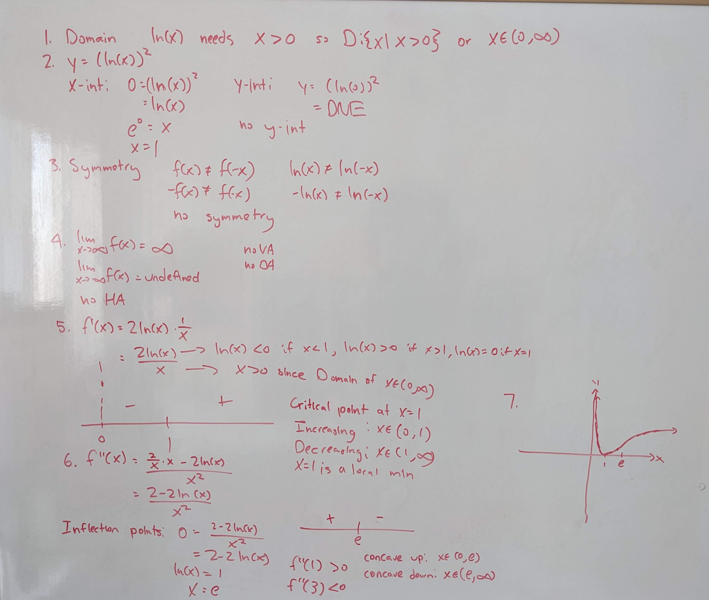
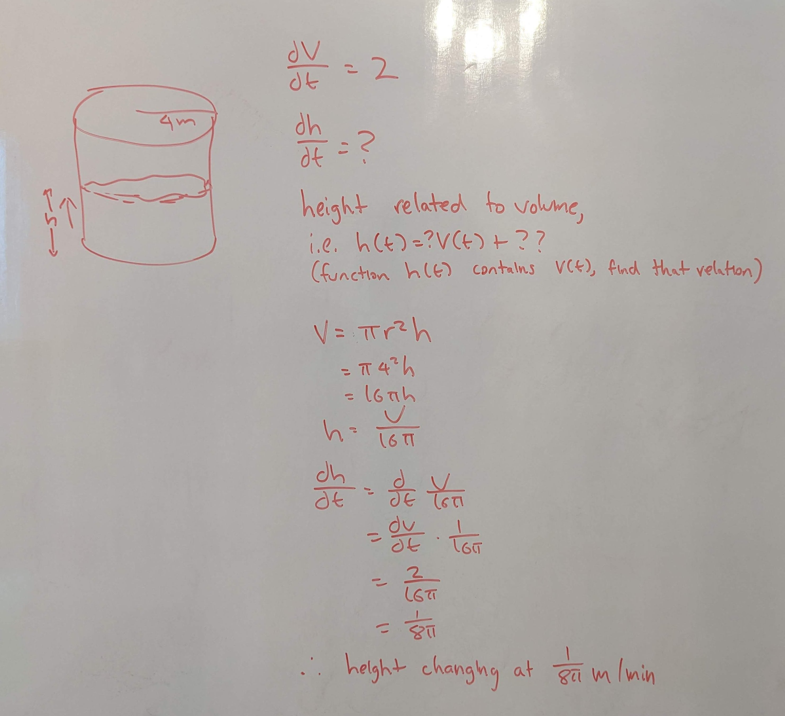
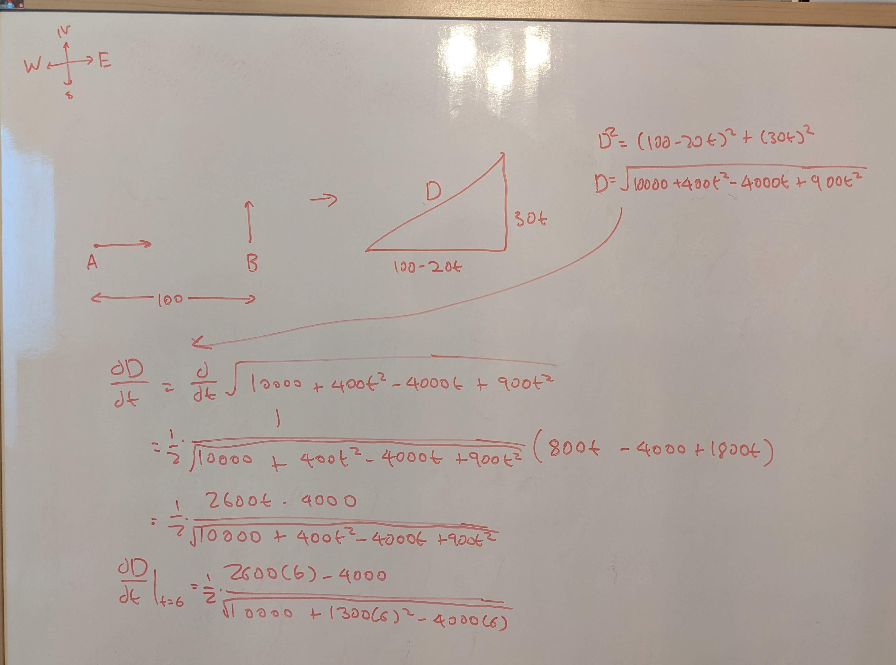

Tutorial Week 8
===============

.. toctree::
   :hidden:
   

.. raw:: html

    

Curve Sketching
---------------

There isn't one single way to do curve sketching, but the following steps present an easy-to-follow method that ensures
you'll have all the information required to sketch:

1. Domain

2. Intercepts (x and y intercepts)

3. Symmetry (odd or even)

4. Asymptotes (horizontal, vertical, slant/oblique)

5. Critical points and intervals of increase/decrease (first derivative)

6. Concavity and inflection points (second derivative)

7. Sketch

Q1: Sketch :math:`f(x) = \ln\left(x\right)^{2}`.
~~~~~~~~~~~~~~~~~~~~~~~~~~~~~~~~~~~~~~~~~~~~~~~~

.. raw:: html

   

      <button onClick="toggleClicked(this)" class="show-answer-button">Show Solution</button>
      

.. raw:: html

        

    

Derivatives of inverse functions
--------------------------------

There's a helpful formula to find the derivative of an inverse function, that being :math:`(f^{-1}(x))' = \frac{1}{f'(f^{-1}(x))`.

Q2: Given :math:`f(x) = x^3 + ln(7x + 1) + 1`, find :math:`(f^{-1})'(1)`.
~~~~~~~~~~~~~~~~~~~~~~~~~~~~~~~~~~~~~~~~~~~~~~~~~~~~~~~~~~~~~~~~~~~~~~~~~

.. raw:: html

   

      <button onClick="toggleClicked(this)" class="show-answer-button">Show Solution</button>
      

We will use the formula :math:`(f^{-1}(x))' = \frac{1}{f'(f^{-1}(x))}`.

We see that first of all, we need :math:`f^{-1}(x)`. Notice how this function isn't 
easily invertible. The strategy now would be to simply try substituting in random integers
for x (e.g. -2, -1, 0, 1, 2), and most of the time, it will be one of those since you're 
not really expected to actually find the inverse function.

Let :math:`a = f^{-1}(1)`. This means that :math:`f(a) = 1`.

We have 

:math:`1 = a^3 + ln(7a + 1) + 1`

:math:`0 = a^3 + ln(7a + 1) + 1`

If we try plugging in -2, -1, 0, 1, and 2 for the value of a, we see that :math:`a = 0`
is a solution to the equation.

So :math:`f^{-1}(1) = a = 0`.

Now let's find :math:`f'(f^{-1}(1)) = f'(0)`.

.. math::
  \begin{aligned}
  f'(x) &= \frac{d}{dx} x^3 + ln(7x + 1) + 1 \\
  &= 3x^2 + \frac{7}{7x + 1} \\
  f'(0) &= 3(0)^2 + \frac{7}{7(0) + 1} \\
  &= 7
  \end{aligned}

So then 

.. math::
  \begin{aligned}
  (f^{-1}(1))' &= \frac{1}{f'(f^{-1}(1))} \\
  &= \frac{1}{7}
  \end{aligned}

.. raw:: html

        

    

Applications of derivatives and related rates
---------------------------------------------

To begin with related rates problems, you'll need to know the formulas for the surface area and volume of some basic shapes.

.. list-table:: 

    * - Shape
      - Area/Volume
      - Perimeter/Surface Area
    * - Triangle
      - :math:`\frac{1}{2}\text{base}\cdot\text{height}`
      - :math:`\text{Side 1} + \text{Side 2} + \text{Side 3}``
    * - Rectangle
      - :math:`\text{length}\cdot\text{width}`
      - :math:`2 \cdot \text{length} + 2 \cdot {width}`
    * - Right Circular Cylinders
      - :math:`\pi \text{r}^2 \text{h}`
      - :math:`2\pi \text{rh} + 2 \pi \text{r}^2`
    * - Right Rectangular Prisms
      - :math:`\text{lwh}`
      - :math:`2\text{lw} + 2\text{wh} + 2\text{lh}`

Q3: A cylinder with a radius of :math:`4m` is being filled at a rate of :math:`2m^3/min`. How quickly is the height of the water changing?
~~~~~~~~~~~~~~~~~~~~~~~~~~~~~~~~~~~~~~~~~~~~~~~~~~~~~~~~~~~~~~~~~~~~~~~~~~~~~~~~~~~~~~~~~~~~~~~~~~~~~~~~~~~~~~~~~~~~~~~~~~~~~~~~~~~~~~~~~~~

.. raw:: html

   

      <button onClick="toggleClicked(this)" class="show-answer-button">Show Solution</button>
      

.. raw:: html

        

    

Q4: Ship A is located :math:`100km` west of ship B. Ship A is travelling at :math:`20km/h` east and ship B is travelling at :math:`30km/h` north. At what rate does the distance between the two ships change after :math:`6` hours?
~~~~~~~~~~~~~~~~~~~~~~~~~~~~~~~~~~~~~~~~~~~~~~~~~~~~~~~~~~~~~~~~~~~~~~~~~~~~~~~~~~~~~~~~~~~~~~~~~~~~~~~~~~~~~~~~~~~~~~~~~~~~~~~~~~~~~~~~~~~~~~~~~~~~~~~~~~~~~~~~~~~~~~~~~~~~~~~~~~~~~~~~~~~~~~~~~~~~~~~~~~~~~~~~~~~~~~~~~~~~~~~~~~~~

.. raw:: html

   

      <button onClick="toggleClicked(this)" class="show-answer-button">Show Solution</button>
      

.. raw:: html

        

    
