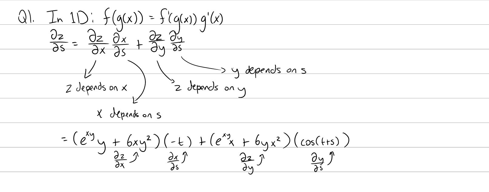
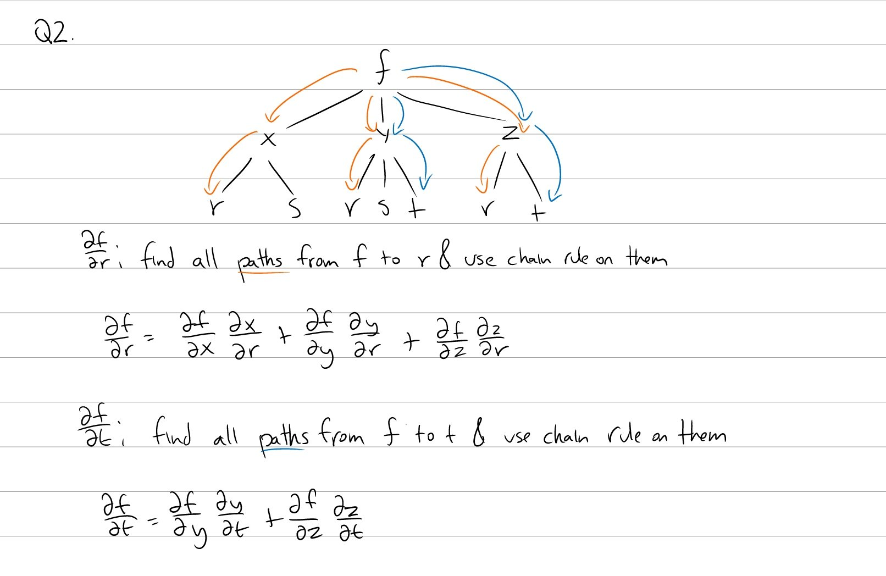
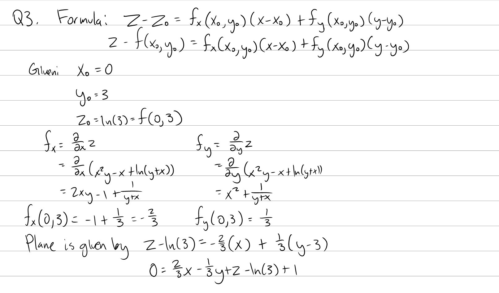
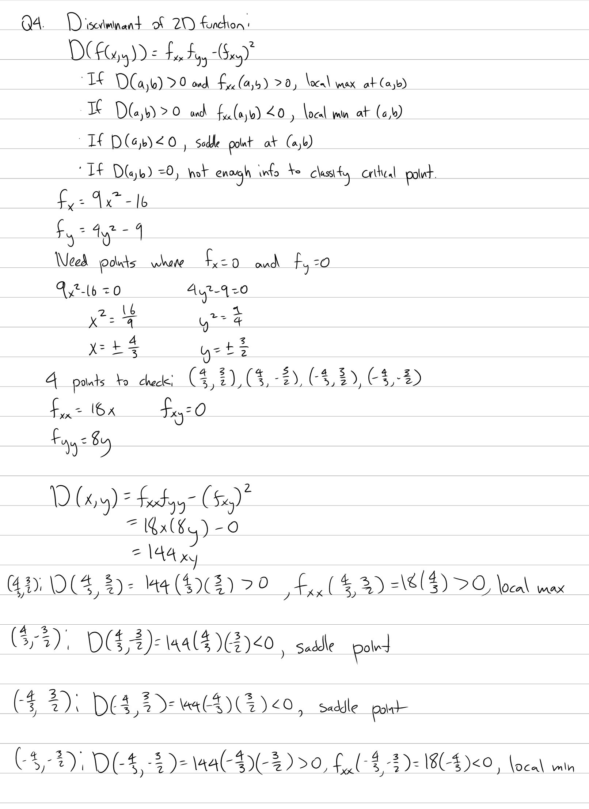

Tutorial Week 10
================

.. toctree::
   :hidden:
   

.. raw:: html

      

Chain Rule
----------

Q1: Let :math:`z = e^{xy} + 3x^2y^2`, :math:`x = ln(t + 1) - st`, :math:`y = cos(t + s)`. Find :math:`\frac{\partial z}{\partial s}` using the chain rule.
~~~~~~~~~~~~~~~~~~~~~~~~~~~~~~~~~~~~~~~~~~~~~~~~~~~~~~~~~~~~~~~~~~~~~~~~~~~~~~~~~~~~~~~~~~~~~~~~~~~~~~~~~~~~~~~~~~~~~~~~~~~~~~~~~~~~~~~~~~~~~~~~~~~~~~~~~~

.. raw:: html

   

      <button onClick="toggleClicked(this)" class="show-answer-button">Show Solution</button>
      

.. raw:: html

        

    

Q2: Suppose :math:`f` depends on :math:`x`, :math:`y`, and :math:`z`; :math:`x` depends on :math:`r` and :math:`s`, :math:`y` depends on :math:`r`, :math:`s`, and :math:`t`; :math:`z` depends on :math:`r` and :math:`t`. Draw a tree diagram for the f and use the chain rule to find :math:`\frac{\partial f}{\partial r}` and :math:`\frac{\partial f}{\partial t}`.
~~~~~~~~~~~~~~~~~~~~~~~~~~~~~~~~~~~~~~~~~~~~~~~~~~~~~~~~~~~~~~~~~~~~~~~~~~~~~~~~~~~~~~~~~~~~~~~~~~~~~~~~~~~~~~~~~~~~~~~~~~~~~~~~~~~~~~~~~~~~~~~~~~~~~~~~~~~~~~~~~~~~~~~~~~~~~~~~~~~~~~~~~~~~~~~~~~~~~~~~~~~~~~~~~~~~~~~~~~~~~~~~~~~~~~~~~~~~~~~~~~~~~~~~~~~~~~~~~~~~~~~~~~~~~~~~~~~~~~~~~~~~~~~~~~~~~~~~~~~~~~~~~~~~~~~~~~~~~~~~~~~~~~~~~~~~~~~~~~~~~~~~~~~~~~~~~~~~~~~~~

.. raw:: html

   

      <button onClick="toggleClicked(this)" class="show-answer-button">Show Solution</button>
      

.. raw:: html

        

    

Tangent Planes
--------------

Q3: Given :math:`z =x^{2}y-x+\ln\left(y+x\right)`, find the equation of the plane tangent to the surface at :math:`(0, 3, ln(3))`.
~~~~~~~~~~~~~~~~~~~~~~~~~~~~~~~~~~~~~~~~~~~~~~~~~~~~~~~~~~~~~~~~~~~~~~~~~~~~~~~~~~~~~~~~~~~~~~~~~~~~~~~~~~~~~~~~~~~~~~~~~~~~~~~~~~

.. raw:: html

   

      <button onClick="toggleClicked(this)" class="show-answer-button">Show Solution</button>
      

.. raw:: html

        

    

Critical Points
---------------

Q4: Find and classify the critical points of the function :math:`f(x, y) = 3x^3 + \frac{4}{3}y^3 - 16x - 9y`.
~~~~~~~~~~~~~~~~~~~~~~~~~~~~~~~~~~~~~~~~~~~~~~~~~~~~~~~~~~~~~~~~~~~~~~~~~~~~~~~~~~~~~~~~~~~~~~~~~~~~~~~~~~~~~

.. raw:: html

   

      <button onClick="toggleClicked(this)" class="show-answer-button">Show Solution</button>
      

:math:`\;`

.. raw:: html

      <iframe src="https://www.math3d.org/1xMbc4aeq" height="800px" width="100%"></iframe>

.. raw:: html

        

    
