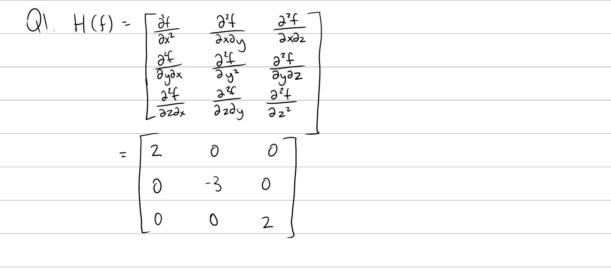
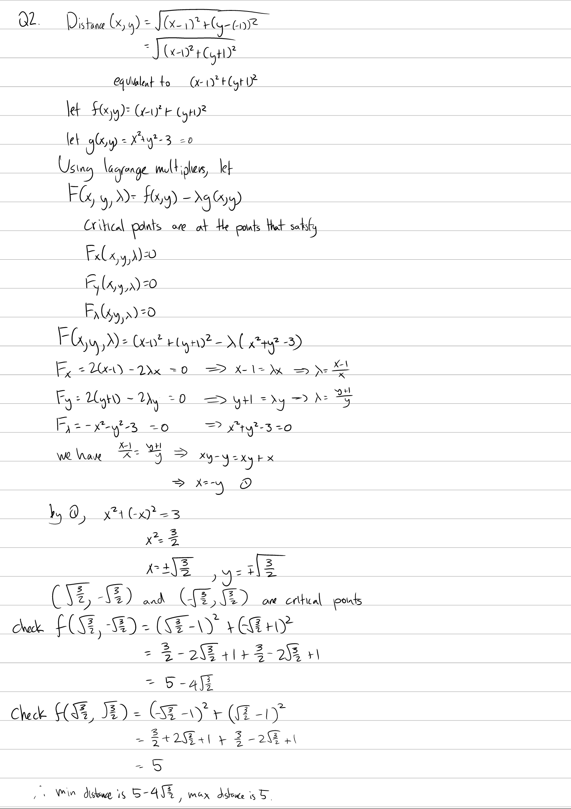

Tutorial Week 11
================

.. toctree::
   :hidden:
   

.. raw:: html

      

Hessian Matrix and Local Extrema
--------------------------------

Q1: Compute the hessian matrix of :math:`f(x, y, z) = z^2 + x^2 - y^3`.
~~~~~~~~~~~~~~~~~~~~~~~~~~~~~~~~~~~~~~~~~~~~~~~~~~~~~~~~~~~~~~~~~~~~~~~

.. raw:: html

   

      <button onClick="toggleClicked(this)" class="show-answer-button">Show Solution</button>
      

.. raw:: html

        

    

    
Multivariable Optimization and Lagrange Multipliers
---------------------------------------------------

Q2: Find the greatest and least distance from :math:`(1, -1)` for the surface :math:`x^2 + y^2 - 3 = 0`.
~~~~~~~~~~~~~~~~~~~~~~~~~~~~~~~~~~~~~~~~~~~~~~~~~~~~~~~~~~~~~~~~~~~~~~~~~~~~~~~~~~~~~~~~~~~~~~~~~~~~~~~~

.. raw:: html

   

      <button onClick="toggleClicked(this)" class="show-answer-button">Show Solution</button>
      

   
.. raw:: html

        

    
