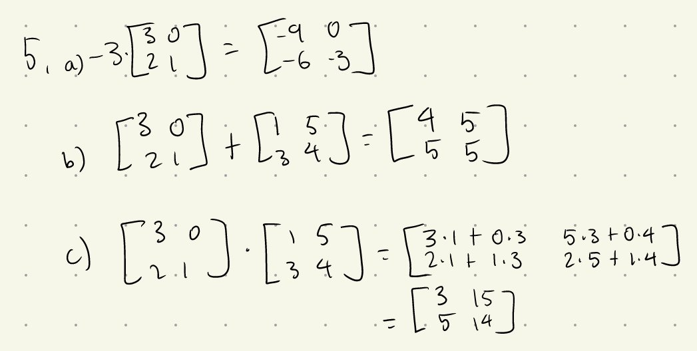
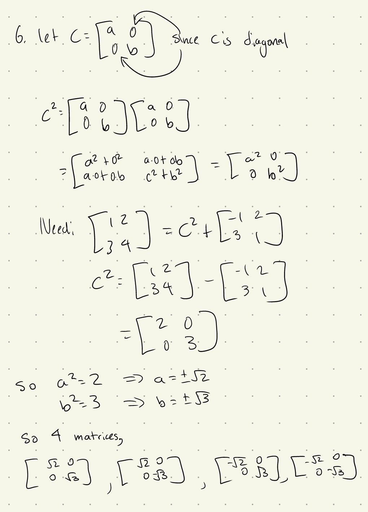
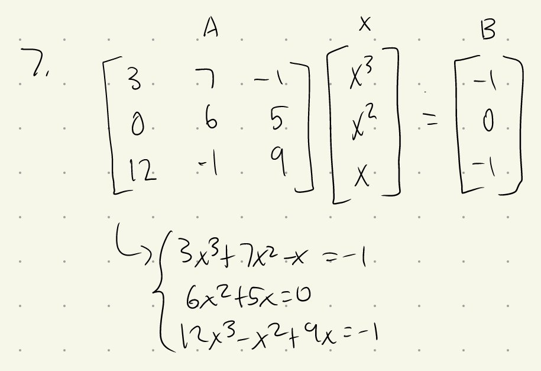

Tutorial Week 3
===============

.. toctree::
   :hidden:
   

.. raw:: html

      

Unbounded Regions
-----------------

Q1: Find the minimal value of :math:`Z =x+3y` given the constraints :math:`\begin{cases} 2x+4y\ge6 \\ 5x+y\ge5 \\ x, y \ge 0 \end{cases}`.
~~~~~~~~~~~~~~~~~~~~~~~~~~~~~~~~~~~~~~~~~~~~~~~~~~~~~~~~~~~~~~~~~~~~~~~~~~~~~~~~~~~~~~~~~~~~~~~~~~~~~~~~~~~~~~~~~~~~~~~~~~~~~~~~~~~~~~~~~~

.. raw:: html

   

      <button onClick="toggleClicked(this)" class="show-answer-button">Show Solution</button>
      

.. raw:: html

   <iframe src="https://www.desmos.com/calculator/o0djgwubjx?embed" width="500" height="500" style="border: 1px solid #ccc" frameborder=0></iframe>

.. raw:: html

        

    

Q2: Is there a maximal value for the above function :math:`Z`?
~~~~~~~~~~~~~~~~~~~~~~~~~~~~~~~~~~~~~~~~~~~~~~~~~~~~~~~~~~~~~~

Numbers of Solutions
--------------------

Q3: For the above question, if :math:`Z = x + 2y`, how many solutions would there be?
~~~~~~~~~~~~~~~~~~~~~~~~~~~~~~~~~~~~~~~~~~~~~~~~~~~~~~~~~~~~~~~~~~~~~~~~~~~~~~~~~~~~~

Constructing feasible regions
-----------------------------

Q4: Create a set of inequalities with the feasible region as the triangle bounded by :math:`(1, 1)`, :math:`(10, 5)`, :math:`(10, 1)`.
~~~~~~~~~~~~~~~~~~~~~~~~~~~~~~~~~~~~~~~~~~~~~~~~~~~~~~~~~~~~~~~~~~~~~~~~~~~~~~~~~~~~~~~~~~~~~~~~~~~~~~~~~~~~~~~~~~~~~~~~~~~~~~~~~~~~~~

Matrices
--------

Q5: Evaluate the following.
~~~~~~~~~~~~~~~~~~~~~~~~~~~

1. :math:`-3 \cdot \begin{bmatrix} 3 & 0 \\ 2 & 1  \end{bmatrix}`

:math:`\rule{0pt}{4ex}`
2. :math:`\begin{bmatrix} 3 & 0 \\ 2 & 1  \end{bmatrix} + \begin{bmatrix} 1 & 5 \\ 3 & 4 \end{bmatrix}`

:math:`\rule{0pt}{4ex}`
3. :math:`\begin{bmatrix} 3 & 0 \\ 2 & 1  \end{bmatrix} \cdot \begin{bmatrix} 1 & 5 \\ 3 & 4 \end{bmatrix}`?

.. raw:: html

   

      <button onClick="toggleClicked(this)" class="show-answer-button">Show Solution</button>
      

.. raw:: html

        

    

Q6: Find all diagonal matrices C such that :math:`\begin{bmatrix} 1 & 2 \\ 3 & 4  \end{bmatrix} = C^2 + \begin{bmatrix} -1 & 2 \\ 3 & 1  \end{bmatrix}`.
~~~~~~~~~~~~~~~~~~~~~~~~~~~~~~~~~~~~~~~~~~~~~~~~~~~~~~~~~~~~~~~~~~~~~~~~~~~~~~~~~~~~~~~~~~~~~~~~~~~~~~~~~~~~~~~~~~~~~~~~~~~~~~~~~~~~~~~~~~~~~~~~~~~~~~~~

.. raw:: html

   

      <button onClick="toggleClicked(this)" class="show-answer-button">Show Solution</button>
      

.. raw:: html

        

    

Q7: Represent :math:`\begin{cases} 3x^3 + 7x^2 - x + 1 = 0 \\ 6x^2 + 5x = 0 \\ 12x^3 - x^2 + 9x + 1 = 0 \end{cases}` as a matrix. Write this in the form of :math:`AX = B`, where :math:`A` is the coefficient matrix, :math:`X` is the variable matrix, and :math:`B` is the solution matrix.
~~~~~~~~~~~~~~~~~~~~~~~~~~~~~~~~~~~~~~~~~~~~~~~~~~~~~~~~~~~~~~~~~~~~~~~~~~~~~~~~~~~~~~~~~~~~~~~~~~~~~~~~~~~~~~~~~~~~~~~~~~~~~~~~~~~~~~~~~~~~~~~~~~~~~~~~~~~~~~~~~~~~~~~~~~~~~~~~~~~~~~~~~~~~~~~~~~~~~~~~~~~~~~~~~~~~~~~~~~~~~~~~~~~~~~~~~~~~~~~~~~~~~~~~~~~~~~~~~~~~~~~~~~~~~~~~~~~~~~~~~~~~~~

.. raw:: html

   

      <button onClick="toggleClicked(this)" class="show-answer-button">Show Solution</button>
      

.. raw:: html

        

    
