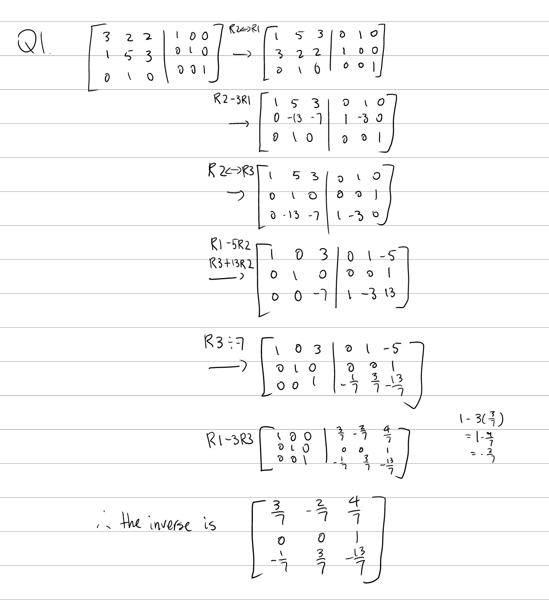
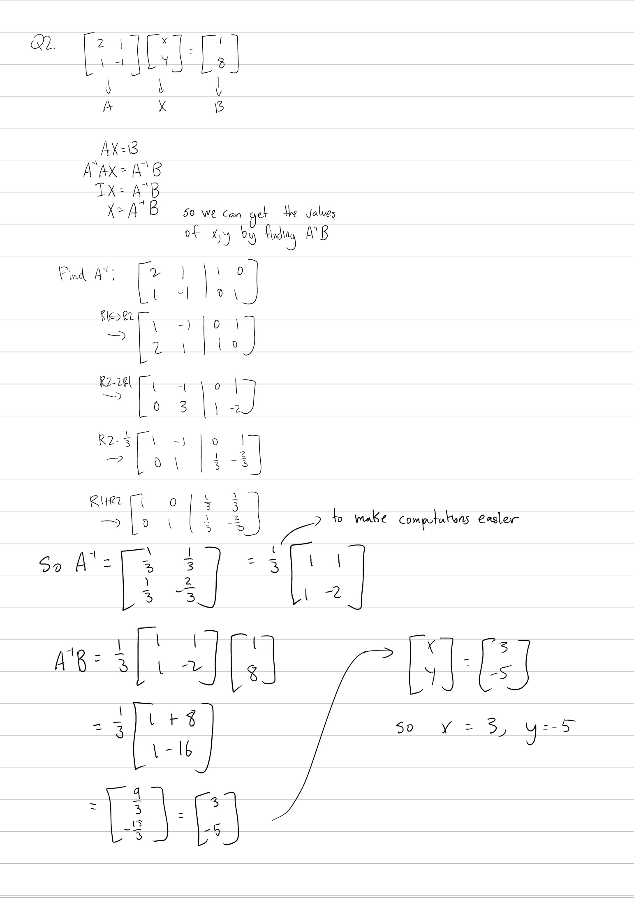
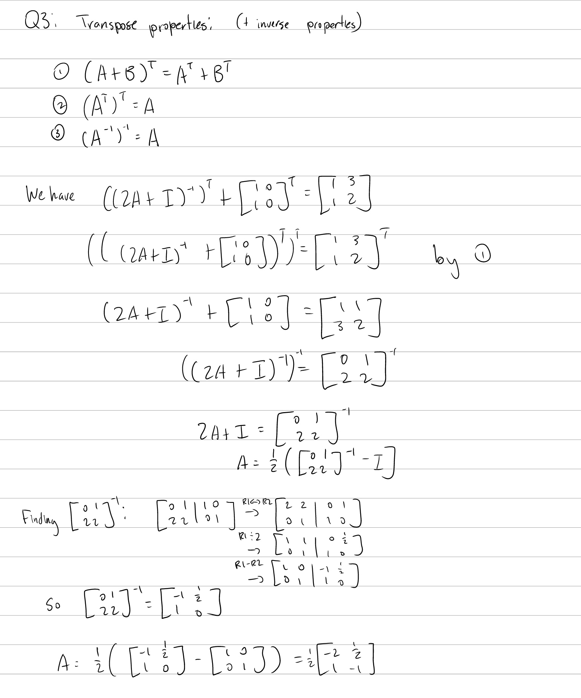
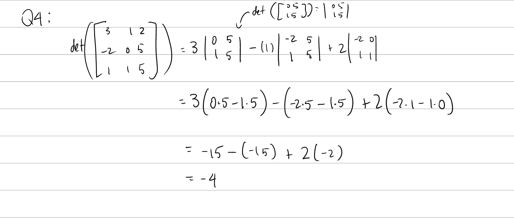
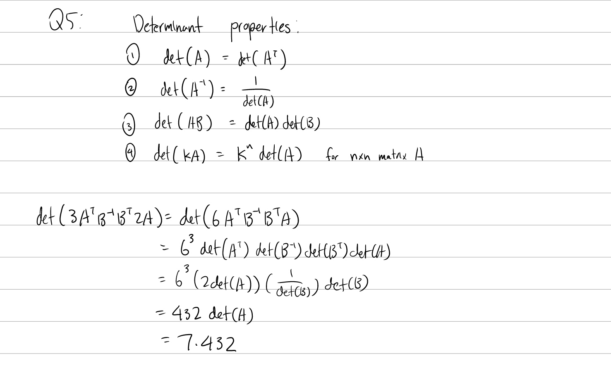

Tutorial Week 6
===============

.. toctree::
   :hidden:
   

.. raw:: html

      

Inverting Matrices
------------------

Q1: Find the inverse of :math:`\begin{bmatrix} 3 & 2 & 2 \\ 1 & 5 & 3 \\ 0 & 1 & 0 \end{bmatrix}`.
~~~~~~~~~~~~~~~~~~~~~~~~~~~~~~~~~~~~~~~~~~~~~~~~~~~~~~~~~~~~~~~~~~~~~~~~~~~~~~~~~~~~~~~~~~~~~~~~~~

.. raw:: html

   

      <button onClick="toggleClicked(this)" class="show-answer-button">Show Solution</button>
      

.. raw:: html

        

    

Solving System of Equations with Inverse Matrices
-------------------------------------------------

Q2: Solve the system of equations :math:`\begin{cases} 2x + y = 1 \\ x - y = 8 \end{cases}` using matrix inverses.
~~~~~~~~~~~~~~~~~~~~~~~~~~~~~~~~~~~~~~~~~~~~~~~~~~~~~~~~~~~~~~~~~~~~~~~~~~~~~~~~~~~~~~~~~~~~~~~~~~~~~~~~~~~~~~~~~~

.. raw:: html

   

      <button onClick="toggleClicked(this)" class="show-answer-button">Show Solution</button>
      

.. raw:: html

        

    

Equations with Inverse Matrices
-------------------------------

Q3: Find the matrix :math:`A` if :math:`((2A + I)^{-1})^T + \begin{bmatrix} 1 & 0 \\ 1 & 0 \end{bmatrix} ^T = \begin{bmatrix} 1 & 3 \\ 1 & 2 \end{bmatrix}`.
~~~~~~~~~~~~~~~~~~~~~~~~~~~~~~~~~~~~~~~~~~~~~~~~~~~~~~~~~~~~~~~~~~~~~~~~~~~~~~~~~~~~~~~~~~~~~~~~~~~~~~~~~~~~~~~~~~~~~~~~~~~~~~~~~~~~~~~~~~~~~~~~~~~~~~~~~~~~

.. raw:: html

   

      <button onClick="toggleClicked(this)" class="show-answer-button">Show Solution</button>
      

.. raw:: html

        

    

Determinants
------------

Q4: Compute the determinant of :math:`\begin{bmatrix} 3 & 1 & 2 \\ -2 & 0 & 5 \\ 1 & 1 & 5 \end{bmatrix}`.
~~~~~~~~~~~~~~~~~~~~~~~~~~~~~~~~~~~~~~~~~~~~~~~~~~~~~~~~~~~~~~~~~~~~~~~~~~~~~~~~~~~~~~~~~~~~~~~~~~~~~~~~~~

.. raw:: html

   

      <button onClick="toggleClicked(this)" class="show-answer-button">Show Solution</button>
      

.. raw:: html

        

    

Q5: If A and B are 3 by 3 matrices, :math:`\text{det}(A) = 7` and :math:`\text{det}(B) = 2`, find :math:`\text{det}(3A^TB^{-1}B^T2A)`.
~~~~~~~~~~~~~~~~~~~~~~~~~~~~~~~~~~~~~~~~~~~~~~~~~~~~~~~~~~~~~~~~~~~~~~~~~~~~~~~~~~~~~~~~~~~~~~~~~~~~~~~~~~~~~~~~~~~~~~~~~~~~~~~~~~~~~~

.. raw:: html

   

      <button onClick="toggleClicked(this)" class="show-answer-button">Show Solution</button>
      

.. raw:: html

        

    

