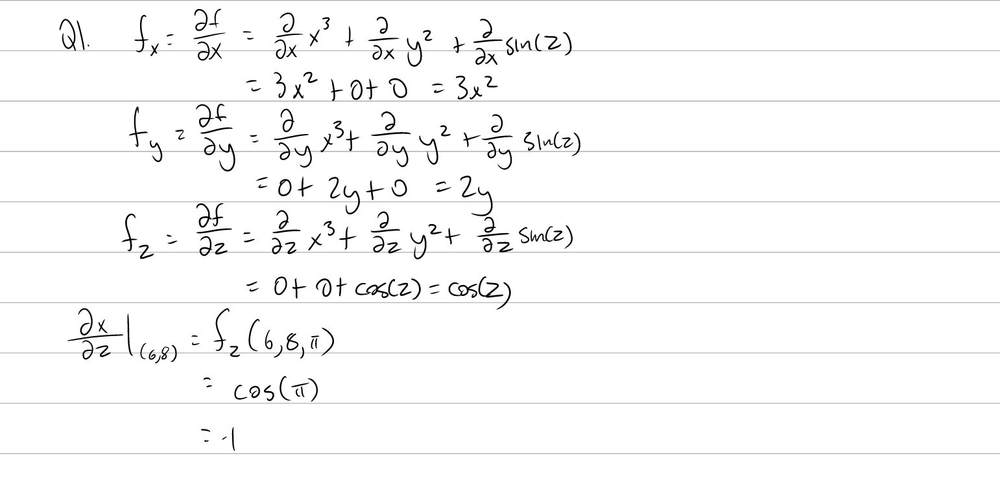
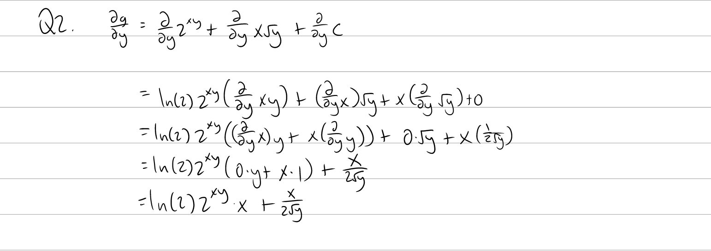
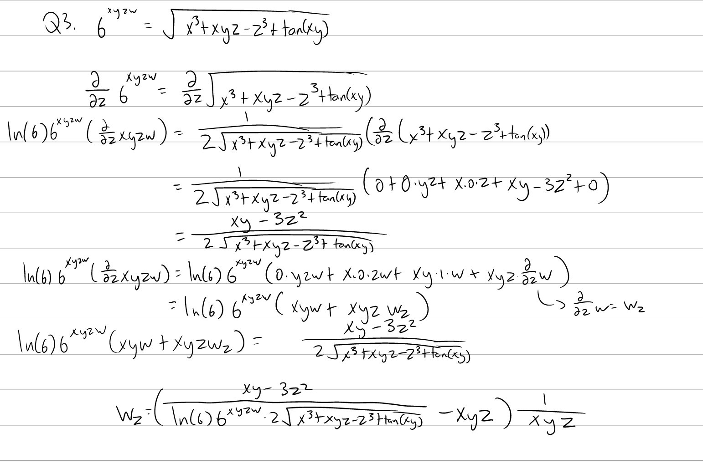
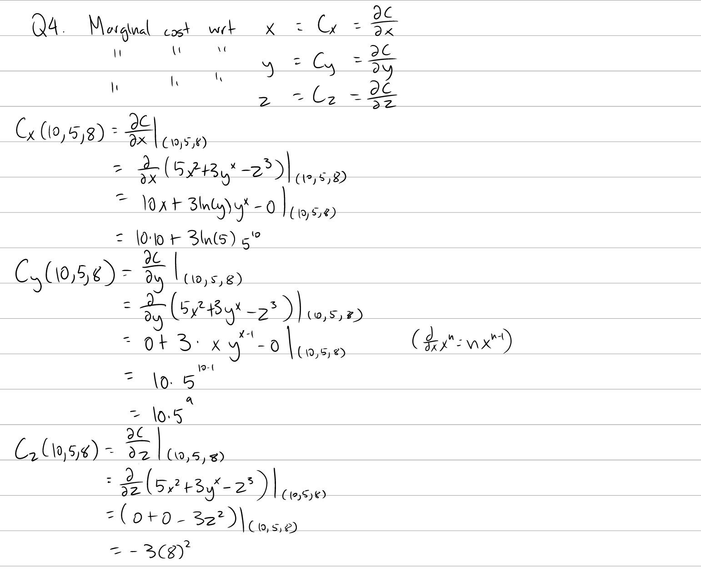

Tutorial Week 8
===============

.. toctree::
   :hidden:
   

.. raw:: html

      

Partial Derivatives
-------------------

Q1: Let :math:`f(x, y, z) = x^3 + y^2 + sin(z)`. Compute :math:`f_x, f_y, f_z`. Compute :math:`\frac{\partial x}{\partial z} |_{(6, 8, \pi)}`.
~~~~~~~~~~~~~~~~~~~~~~~~~~~~~~~~~~~~~~~~~~~~~~~~~~~~~~~~~~~~~~~~~~~~~~~~~~~~~~~~~~~~~~~~~~~~~~~~~~~~~~~~~~~~~~~~~~~~~~~~~~~~~~~~~~~~~~~~~~~~~~

.. raw:: html

   

      <button onClick="toggleClicked(this)" class="show-answer-button">Show Solution</button>
      

.. raw:: html

        

    

Q2: Let :math:`g(x, y) = 2^{xy} + x\sqrt{y}`. Find :math:`\frac{\partial g}{\partial y}`.
~~~~~~~~~~~~~~~~~~~~~~~~~~~~~~~~~~~~~~~~~~~~~~~~~~~~~~~~~~~~~~~~~~~~~~~~~~~~~~~~~~~~~~~~~

.. raw:: html

   

      <button onClick="toggleClicked(this)" class="show-answer-button">Show Solution</button>
      

.. raw:: html

        

    

    
Q3: Let :math:`6^{xyzw} = \sqrt{x^3 + xyz - z^3 + tan(xy)}` and :math:`w` be an implicitly defined function in terms of :math:`x`, :math:`y`, and :math:`z`. Find :math:`w_z`.
~~~~~~~~~~~~~~~~~~~~~~~~~~~~~~~~~~~~~~~~~~~~~~~~~~~~~~~~~~~~~~~~~~~~~~~~~~~~~~~~~~~~~~~~~~~~~~~~~~~~~~~~~~~~~~~~~~~~~~~~~~~~~~~~~~~~~~~~~~~~~~~~~~~~~~~~~~~~~~~~~~~~~~~~~~~~~~

.. raw:: html

   

      <button onClick="toggleClicked(this)" class="show-answer-button">Show Solution</button>
      

.. raw:: html

        

    

Marginal Costs
--------------

Q4: Let :math:`C(x, y, z) = 5x^2 + 3y^x - z^3` denote the cost of producing x number of product A, y number of product B, and z number of product C. If :math:`x = 10`, :math:`y = 5`, :math:`z = 8`, what is the marginal cost with respect to x, marginal cost with respect to y, and the marginal cost with respect to z?
~~~~~~~~~~~~~~~~~~~~~~~~~~~~~~~~~~~~~~~~~~~~~~~~~~~~~~~~~~~~~~~~~~~~~~~~~~~~~~~~~~~~~~~~~~~~~~~~~~~~~~~~~~~~~~~~~~~~~~~~~~~~~~~~~~~~~~~~~~~~~~~~~~~~~~~~~~~~~~~~~~~~~~~~~~~~~~~~~~~~~~~~~~~~~~~~~~~~~~~~~~~~~~~~~~~~~~~~~~~~~~~~~~~~~~~~~~~~~~~~~~~~~~~~~~~~~~~~~~~~~~~~~~~~~~~~~~~~~~~~~~~~~~~~~~~~~~~~~~~~~~~~~~~~~~~~~~~~

.. raw:: html

   

      <button onClick="toggleClicked(this)" class="show-answer-button">Show Solution</button>
      

.. raw:: html

        

    

