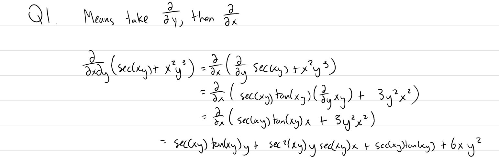
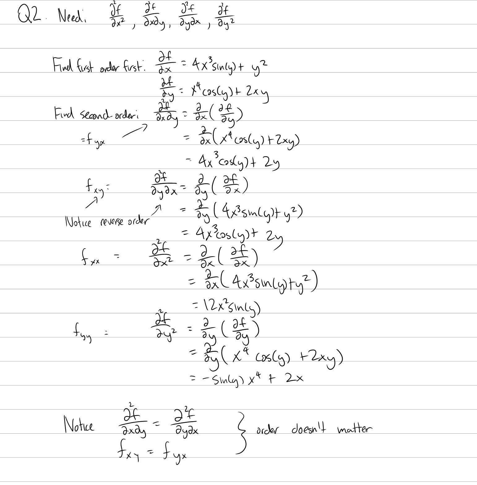
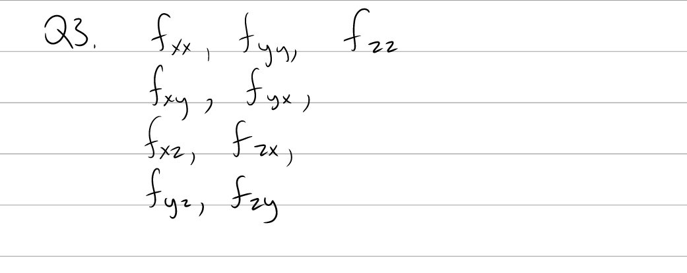
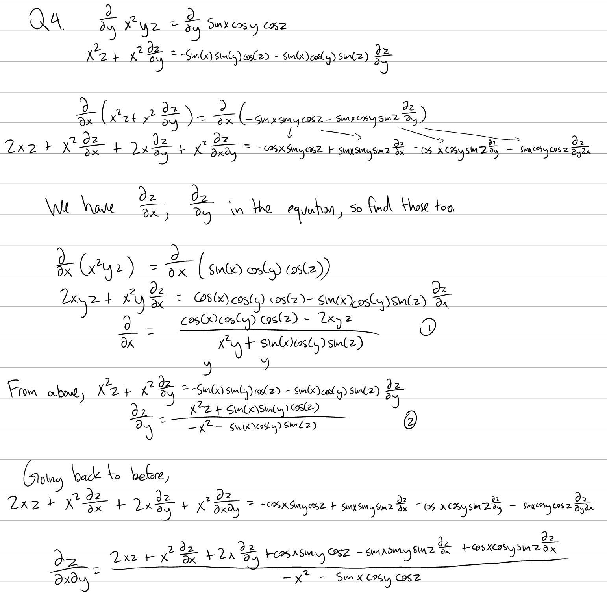

Tutorial Week 9
===============

.. toctree::
   :hidden:
   

.. raw:: html

      

Higher order Partial Derivatives
--------------------------------

Q1: Find :math:`\frac{\partial^2}{\partial x \partial y}(sec(xy) + x^2y^3)`.
~~~~~~~~~~~~~~~~~~~~~~~~~~~~~~~~~~~~~~~~~~~~~~~~~~~~~~~~~~~~~~~~~~~~~~~~~~~~

.. raw:: html

   

      <button onClick="toggleClicked(this)" class="show-answer-button">Show Solution</button>
      

.. raw:: html

        

    

Q2: Find all second-order partial derivatives of :math:`f(x, y) = x^4sin(y) + xy^2`.
~~~~~~~~~~~~~~~~~~~~~~~~~~~~~~~~~~~~~~~~~~~~~~~~~~~~~~~~~~~~~~~~~~~~~~~~~~~~~~~~~~~~

.. raw:: html

   

      <button onClick="toggleClicked(this)" class="show-answer-button">Show Solution</button>
      

.. raw:: html

        

    

Q3: List all second-order partial derivatives of :math:`f(x, y, z)`.
~~~~~~~~~~~~~~~~~~~~~~~~~~~~~~~~~~~~~~~~~~~~~~~~~~~~~~~~~~~~~~~~~~~~

.. raw:: html

   

      <button onClick="toggleClicked(this)" class="show-answer-button">Show Solution</button>
      

.. raw:: html

        

    

Implicit functions and Higher order Partial Derivatives
-------------------------------------------------------

Q4: Find :math:`\frac{\partial^2 z}{\partial x \partial y}` if :math:`x^2yz = sin(x)cos(y)cos(z)` if z is an implicitly defined function in terms of x and y.
~~~~~~~~~~~~~~~~~~~~~~~~~~~~~~~~~~~~~~~~~~~~~~~~~~~~~~~~~~~~~~~~~~~~~~~~~~~~~~~~~~~~~~~~~~~~~~~~~~~~~~~~~~~~~~~~~~~~~~~~~~~~~~~~~~~~~~~~~~~~~~~~~~~~~~~~~~~~~

.. raw:: html

   

      <button onClick="toggleClicked(this)" class="show-answer-button">Show Solution</button>
      

.. raw:: html

        

    
