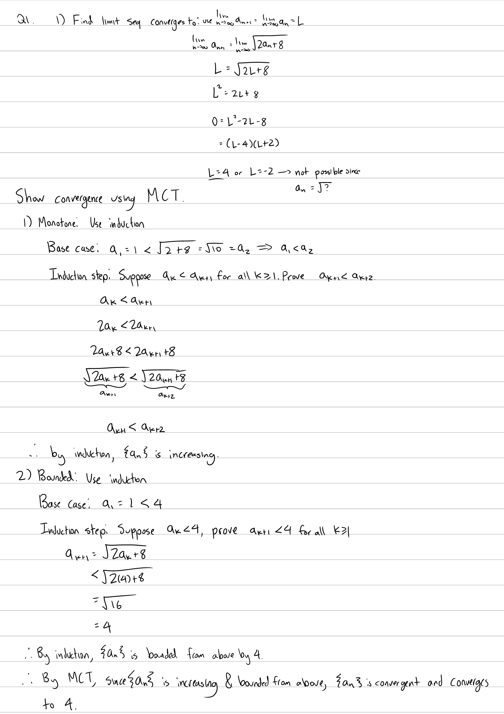
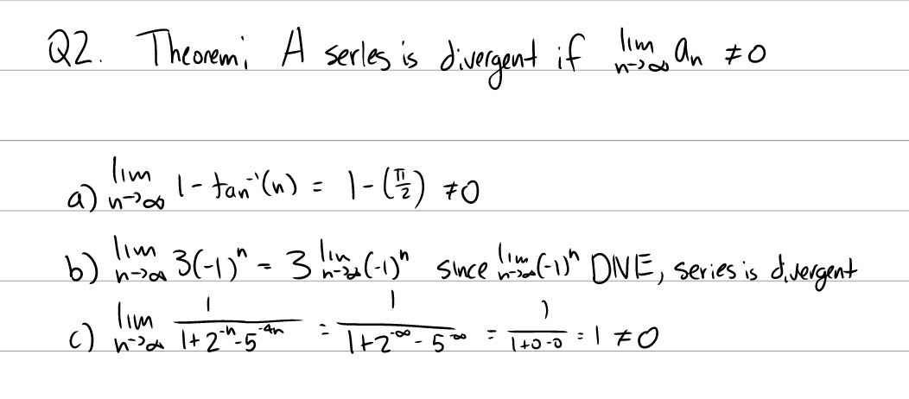
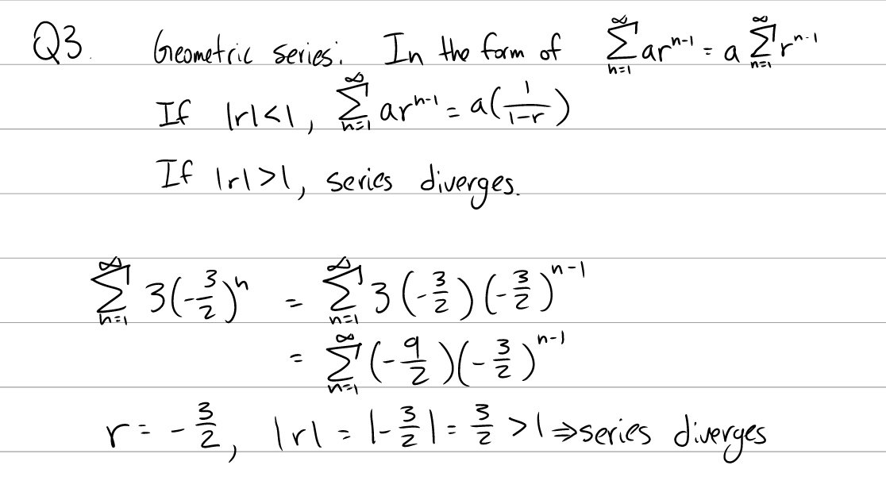
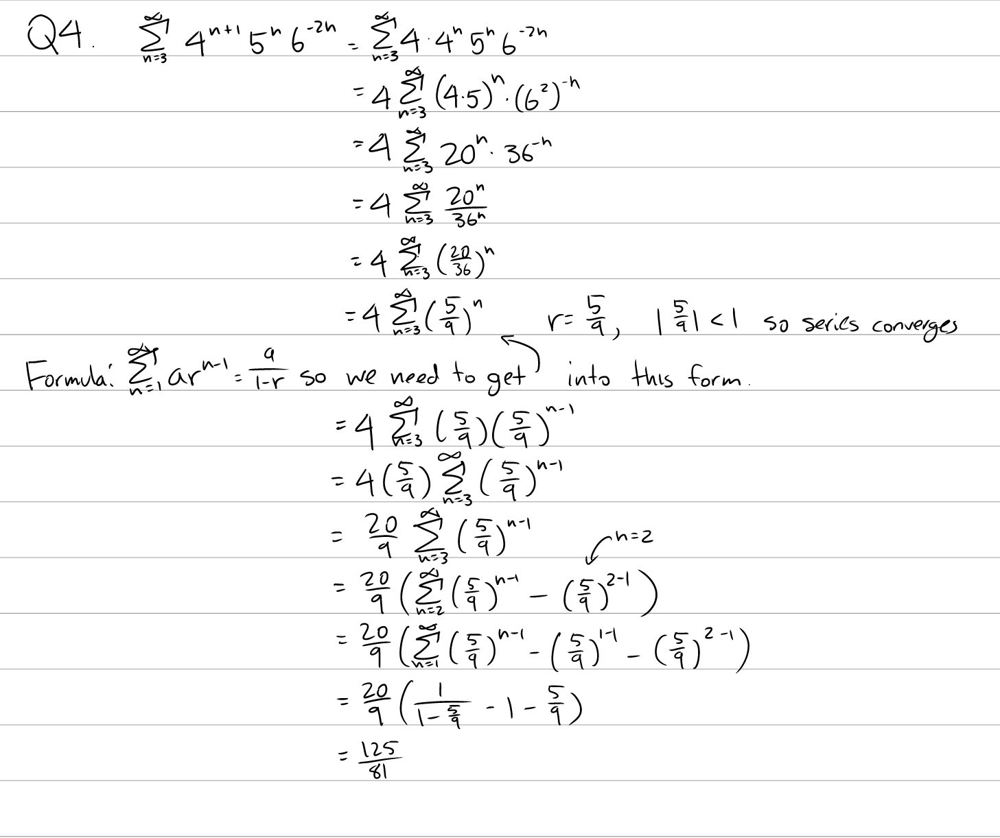
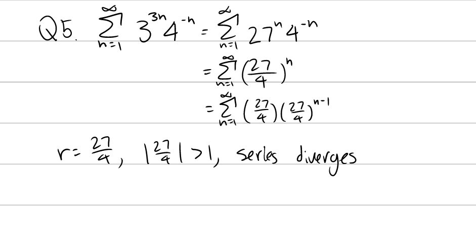
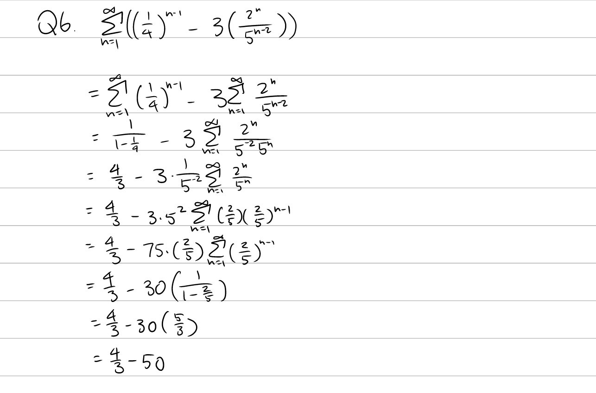

Tutorial Week 10
================

.. toctree::
   :hidden:
   

.. raw:: html

      

Recursively defined Functions
-----------------------------

Q1: Show that the sequence :math:`a_1 = 1` :math:`a_{n+1} = \sqrt{2a_n + 8}` converges and find the limit it converges to.
~~~~~~~~~~~~~~~~~~~~~~~~~~~~~~~~~~~~~~~~~~~~~~~~~~~~~~~~~~~~~~~~~~~~~~~~~~~~~~~~~~~~~~~~~~~~~~~~~~~~~~~~~~~~~~~~~~~~~~~~~~

.. raw:: html

   

      <button onClick="toggleClicked(this)" class="show-answer-button">Show Solution</button>
      

.. raw:: html

        

    

Conditions for convergent series
--------------------------------

Q2: Show that the following series are divergent.
~~~~~~~~~~~~~~~~~~~~~~~~~~~~~~~~~~~~~~~~~~~~~~~~~

| a. :math:`\sum_1^\infty 1 - \arctan(n)`
| :math:`\;`
| b. :math:`\sum_1^\infty 3(-1)^n`
| :math:`\;`
| c. :math:`\sum_1^\infty \frac{1}{1 + 2^{-n} - 5^{-4n}}`

.. raw:: html

   

      <button onClick="toggleClicked(this)" class="show-answer-button">Show Solution</button>
      

.. raw:: html

        

    

Geometric Series
----------------

Q3: Does :math:`\sum_{n=1}^\infty 3(-\frac{3}{2})^n` converge, if so, find its sum.
~~~~~~~~~~~~~~~~~~~~~~~~~~~~~~~~~~~~~~~~~~~~~~~~~~~~~~~~~~~~~~~~~~~~~~~~~~~~~~~~~~~

.. raw:: html

   

      <button onClick="toggleClicked(this)" class="show-answer-button">Show Solution</button>
      

.. raw:: html

        

    

Q4: Does :math:`\sum_{n=3}^\infty 4^{n+1}5^n6^{-2n}` converge? If so, find its sum.
~~~~~~~~~~~~~~~~~~~~~~~~~~~~~~~~~~~~~~~~~~~~~~~~~~~~~~~~~~~~~~~~~~~~~~~~~~~~~~~~~~~

.. raw:: html

   

      <button onClick="toggleClicked(this)" class="show-answer-button">Show Solution</button>
      

.. raw:: html

        

    

Q5: Does :math:`\sum_{n=1}^\infty 3^{3n}4^{-n}` converge? If so, find its sum.
~~~~~~~~~~~~~~~~~~~~~~~~~~~~~~~~~~~~~~~~~~~~~~~~~~~~~~~~~~~~~~~~~~~~~~~~~~~~~~

.. raw:: html

   

      <button onClick="toggleClicked(this)" class="show-answer-button">Show Solution</button>
      

.. raw:: html

        

    

Q6: Does :math:`\sum_{n=1}^\infty( (\frac{1}{4})^{n-1} - 3(\frac{2^n}{5^{n-2}}))` converge? If so, find its sum.
~~~~~~~~~~~~~~~~~~~~~~~~~~~~~~~~~~~~~~~~~~~~~~~~~~~~~~~~~~~~~~~~~~~~~~~~~~~~~~~~~~~~~~~~~~~~~~~~~~~~~~~~~~~~~~~~

.. raw:: html

   

      <button onClick="toggleClicked(this)" class="show-answer-button">Show Solution</button>
      

.. raw:: html

        

    

    