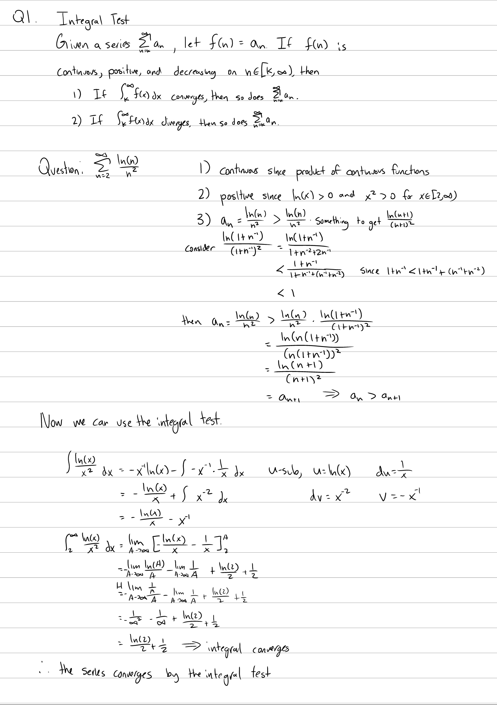
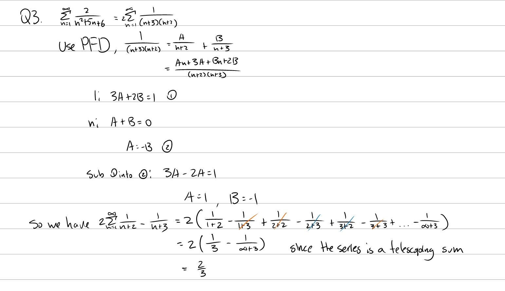

Tutorial Week 11
================

.. toctree::
   :hidden:
   

.. raw:: html

      

Integral Test
-------------

Q1: Use the integral test to show whether the series :math:`\sum_{n=2}^\infty \frac{ln(n)}{n^2}` converges.
~~~~~~~~~~~~~~~~~~~~~~~~~~~~~~~~~~~~~~~~~~~~~~~~~~~~~~~~~~~~~~~~~~~~~~~~~~~~~~~~~~~~~~~~~~~~~~~~~~~~~~~~~~~

.. raw:: html

   

      <button onClick="toggleClicked(this)" class="show-answer-button">Show Solution</button>
      

.. raw:: html

        

    

    

Comparison Test
---------------

Q2: Use the comparison test to show whether :math:`\sum_{n=1}^\infty \frac{3n + 5}{2^n + 5^n - 1}` converges.
~~~~~~~~~~~~~~~~~~~~~~~~~~~~~~~~~~~~~~~~~~~~~~~~~~~~~~~~~~~~~~~~~~~~~~~~~~~~~~~~~~~~~~~~~~~~~~~~~~~~~~~~~~~~~

.. raw:: html

   

      <button onClick="toggleClicked(this)" class="show-answer-button">Show Solution</button>
      

.. image:: ./images/t11/2.jpeg
   :width: 700

.. raw:: html

        

    

    

Telescoping Series
------------------

Q3: Find the sum of :math:`\sum_{n=1}^\infty \frac{2}{n^2+5n+6}`.
~~~~~~~~~~~~~~~~~~~~~~~~~~~~~~~~~~~~~~~~~~~~~~~~~~~~~~~~~~~~~~~~~

.. raw:: html

   

      <button onClick="toggleClicked(this)" class="show-answer-button">Show Solution</button>
      

.. raw:: html

        

    

    