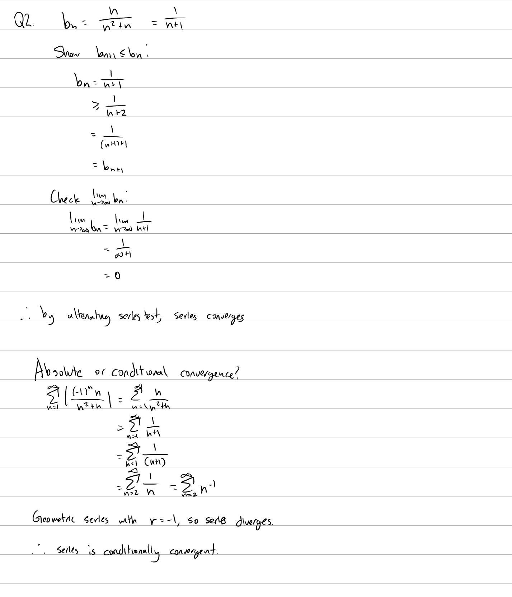

Tutorial Week 12
================

.. toctree::
   :hidden:
   

.. raw:: html

      

Alternating Series
------------------

Q1: Does the series :math:`\sum_{n=1}^\infty \frac{(-1)^nn^2}{n^2+n}` converge? If it converges, is it absolutely or conditionally convergent?
~~~~~~~~~~~~~~~~~~~~~~~~~~~~~~~~~~~~~~~~~~~~~~~~~~~~~~~~~~~~~~~~~~~~~~~~~~~~~~~~~~~~~~~~~~~~~~~~~~~~~~~~~~~~~~~~~~~~~~~~~~~~~~~~~~~~~~~~~~~~~~

.. raw:: html

   

      <button onClick="toggleClicked(this)" class="show-answer-button">Show Solution</button>
      

.. image:: ./images/t12/1.jpeg
   :width: 700
   
.. raw:: html

        

    

Q2: Does the series :math:`\sum_{n=1}^\infty \frac{(-1)^nn}{n^2+n}` converge? If it converges, is it absolutely or conditionally convergent?
~~~~~~~~~~~~~~~~~~~~~~~~~~~~~~~~~~~~~~~~~~~~~~~~~~~~~~~~~~~~~~~~~~~~~~~~~~~~~~~~~~~~~~~~~~~~~~~~~~~~~~~~~~~~~~~~~~~~~~~~~~~~~~~~~~~~~~~~~~~~

.. raw:: html

   

      <button onClick="toggleClicked(this)" class="show-answer-button">Show Solution</button>
      

   
.. raw:: html

        

    

Ratio Test
----------

Q3: Use the ratio test to test the convergence of :math:`\sum_{n=1}^\infty \frac{(-5)^n}{(n!)^2}`.
~~~~~~~~~~~~~~~~~~~~~~~~~~~~~~~~~~~~~~~~~~~~~~~~~~~~~~~~~~~~~~~~~~~~~~~~~~~~~~~~~~~~~~~~~~~~~~~~~~

.. raw:: html

   

      <button onClick="toggleClicked(this)" class="show-answer-button">Show Solution</button>
      

   
.. raw:: html

        

    

Q4: Use the root test to test the convergence of :math:`\sum_{n=1}^\infty (\frac{4 + n + ln(n)}{n^2})^n`.
~~~~~~~~~~~~~~~~~~~~~~~~~~~~~~~~~~~~~~~~~~~~~~~~~~~~~~~~~~~~~~~~~~~~~~~~~~~~~~~~~~~~~~~~~~~~~~~~~~~~~~~~~

.. raw:: html

   

      <button onClick="toggleClicked(this)" class="show-answer-button">Show Solution</button>
      

   
.. raw:: html

        

    
