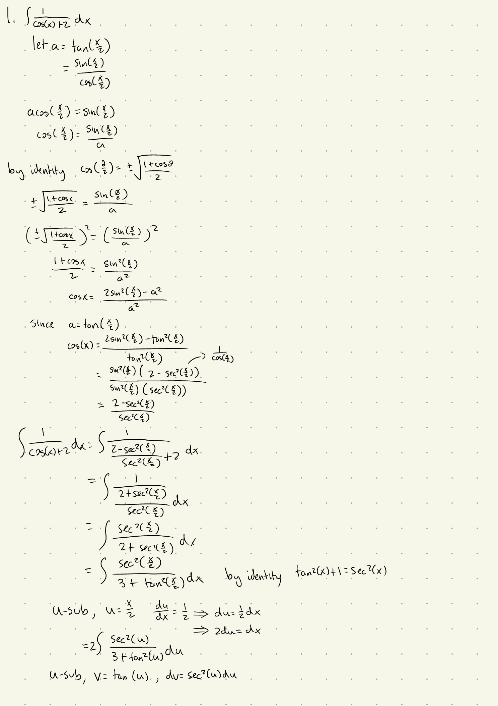
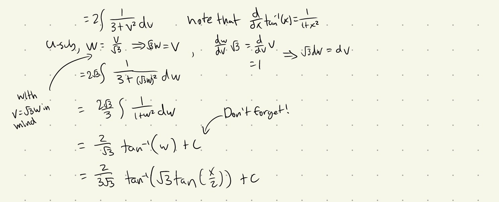
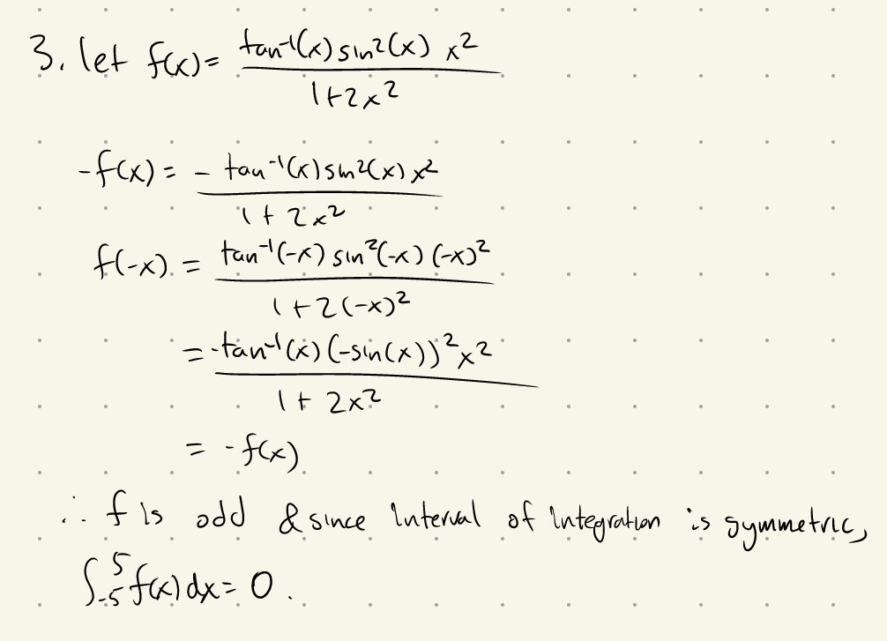
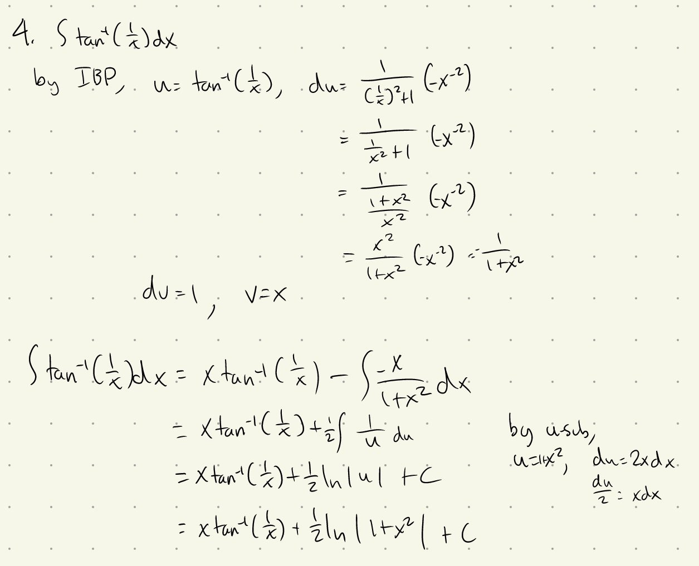

Tutorial Week 3
===============

.. toctree::
   :hidden:
   

.. raw:: html

      

Assignment Review
-----------------

Q1: Evaluate :math:`\int \frac{1}{cos(x) + 2}dx`.
~~~~~~~~~~~~~~~~~~~~~~~~~~~~~~~~~~~~~~~~~~~~~~~~~

.. raw:: html

   

      <button onClick="toggleClicked(this)" class="show-answer-button">Show Solution</button>
      

\* There's a mistake in the last line; it should be :math:`\frac{2}{\sqrt{3}}`.

.. raw:: html

        

    

Integral Practice
-----------------

Q2: Evaluate :math:`\int \frac{1}{1-cos(x)} dx`.
~~~~~~~~~~~~~~~~~~~~~~~~~~~~~~~~~~~~~~~~~~~~~~~~

.. raw:: html

   

      <button onClick="toggleClicked(this)" class="show-answer-button">Show Solution</button>
      

.. image:: ./images/t3/2.jpeg
   :width: 700

.. raw:: html

        

    

.. half angle

Q3: Evaluate :math:`\int_{-5}^{5} \frac{\arctan\left(x\right)\sin^2\left(x\right)x^{2}}{1+2x^{2}} dx`.
~~~~~~~~~~~~~~~~~~~~~~~~~~~~~~~~~~~~~~~~~~~~~~~~~~~~~~~~~~~~~~~~~~~~~~~~~~~~~~~~~~~~~~~~~~~~~~~~~~~~~~

.. raw:: html

   

      <button onClick="toggleClicked(this)" class="show-answer-button">Show Solution</button>
      

.. raw:: html

        

    

Q4: Evaluate :math:`\int arctan(1/x)dx`.
~~~~~~~~~~~~~~~~~~~~~~~~~~~~~~~~~~~~~~~~

.. raw:: html

   

      <button onClick="toggleClicked(this)" class="show-answer-button">Show Solution</button>
      

.. raw:: html

        

    

