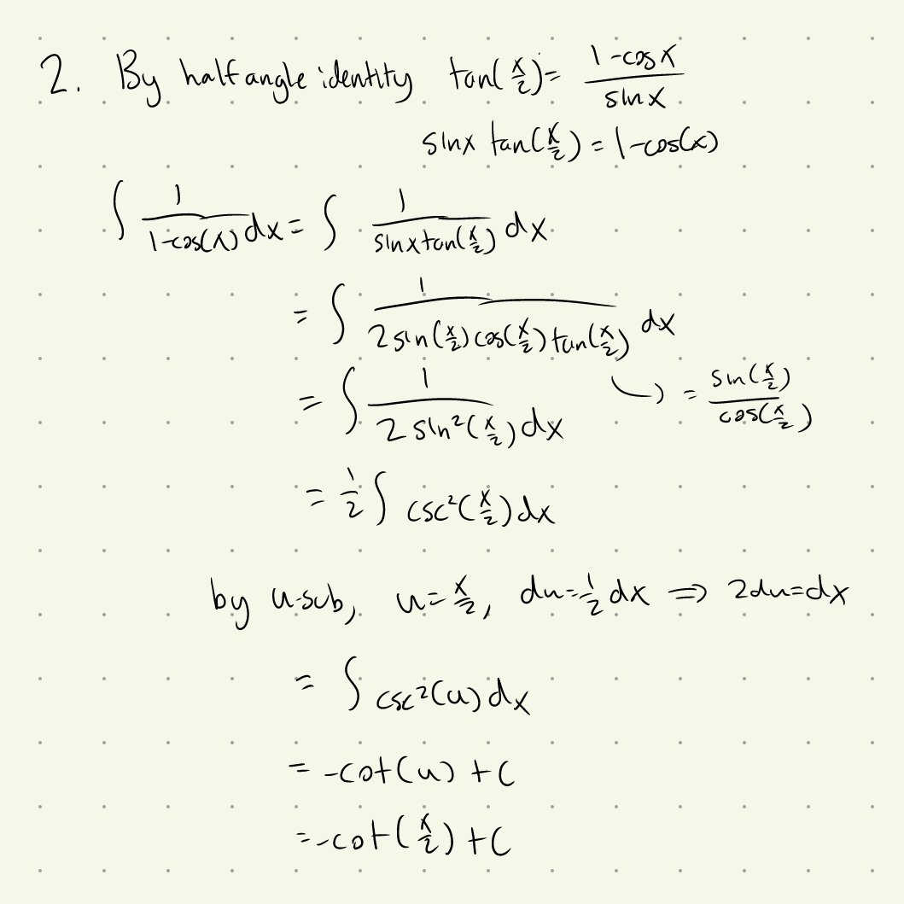

Tutorial Week 4
===============

.. toctree::
   :hidden:
   

.. raw:: html

      

Integral Practice
-----------------

Q1: Evaluate :math:`\int sin^4(x) \; dx`.
~~~~~~~~~~~~~~~~~~~~~~~~~~~~~~~~~~~~~~~~~

.. raw:: html

   

      <button onClick="toggleClicked(this)" class="show-answer-button">Show Solution</button>
      

.. raw:: html

        

    

Partial Fraction Decomposition
------------------------------

Q2: Evaluate :math:`\int \frac{x^4+2x^3-3x+4}{x(x-3)(x^2+1)} \; dx`.
~~~~~~~~~~~~~~~~~~~~~~~~~~~~~~~~~~~~~~~~~~~~~~~~~~~~~~~~~~~~~~~~~~~~

.. raw:: html

   

      <button onClick="toggleClicked(this)" class="show-answer-button">Show Solution</button>
      

.. raw:: html

        

    

Trigonometric Substitution
--------------------------

Q3: Evaluate :math:`\int x\sqrt{1-x^4} \; dx`.
~~~~~~~~~~~~~~~~~~~~~~~~~~~~~~~~~~~~~~~~~~~~~~

.. raw:: html

   

      <button onClick="toggleClicked(this)" class="show-answer-button">Show Solution</button>
      

.. raw:: html

        

    
