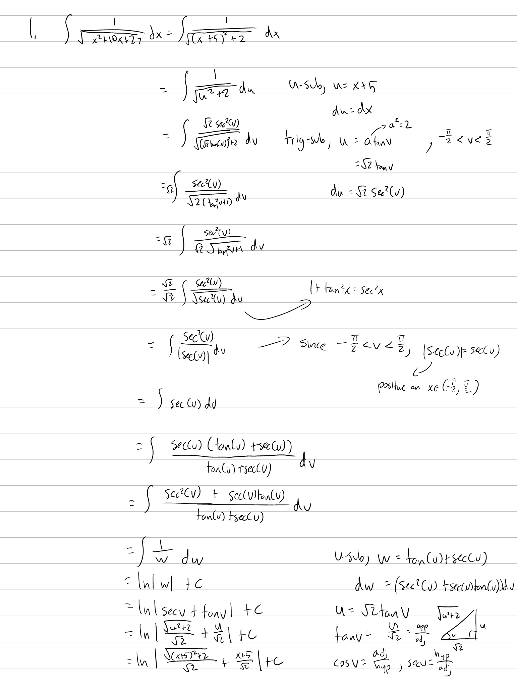
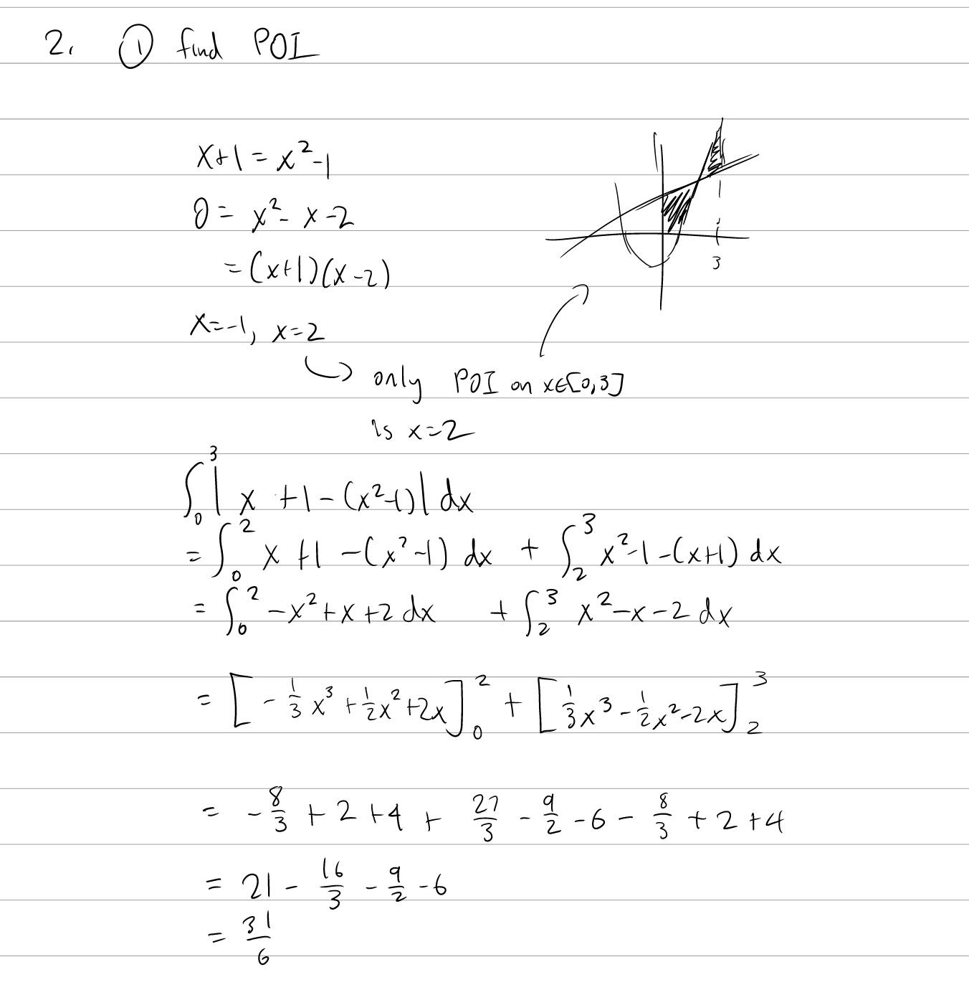
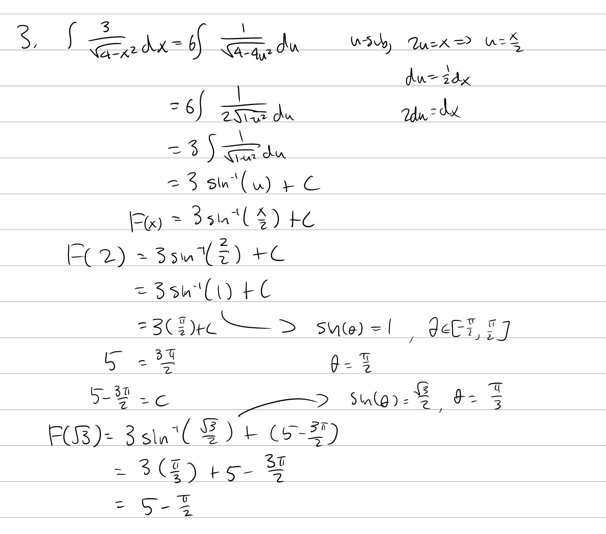

Tutorial Week 5
===============

.. toctree::
   :hidden:
   

.. raw:: html

      

Trigonometric Substitution
--------------------------

Q1: Integrate :math:`\int \frac{1}{\sqrt{x^2 + 10x + 27}} dx`.
~~~~~~~~~~~~~~~~~~~~~~~~~~~~~~~~~~~~~~~~~~~~~~~~~~~~~~~~~~~~~~

.. raw:: html

   

      <button onClick="toggleClicked(this)" class="show-answer-button">Show Solution</button>
      

.. raw:: html

        

    

Area Between Functions
----------------------

Q2: Find the area between the functions :math:`f(x) = x + 1` and :math:`f(x) = x^2 - 1` on the interval :math:`x \in [0, 3]`.
~~~~~~~~~~~~~~~~~~~~~~~~~~~~~~~~~~~~~~~~~~~~~~~~~~~~~~~~~~~~~~~~~~~~~~~~~~~~~~~~~~~~~~~~~~~~~~~~~~~~~~~~~~~~~~~~~~~~~~~~~~~~~

.. raw:: html

   

      <button onClick="toggleClicked(this)" class="show-answer-button">Show Solution</button>
      

.. raw:: html

        

    

Midterm Review
--------------

Q3: Let :math:`F(x) = \int \frac{3}{\sqrt{4 - x^2}} dx` and :math:`F(2) = 5`. Find :math:`F(\sqrt{3})`.
~~~~~~~~~~~~~~~~~~~~~~~~~~~~~~~~~~~~~~~~~~~~~~~~~~~~~~~~~~~~~~~~~~~~~~~~~~~~~~~~~~~~~~~~~~~~~~~~~~~~~~~

.. raw:: html

   

      <button onClick="toggleClicked(this)" class="show-answer-button">Show Solution</button>
      

.. raw:: html

        

    

