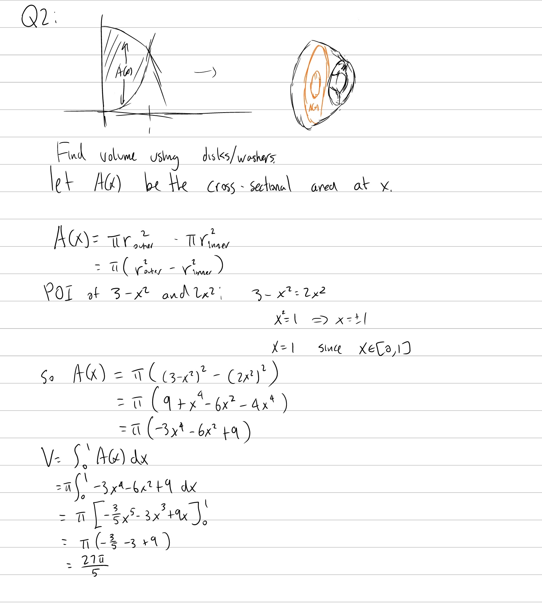
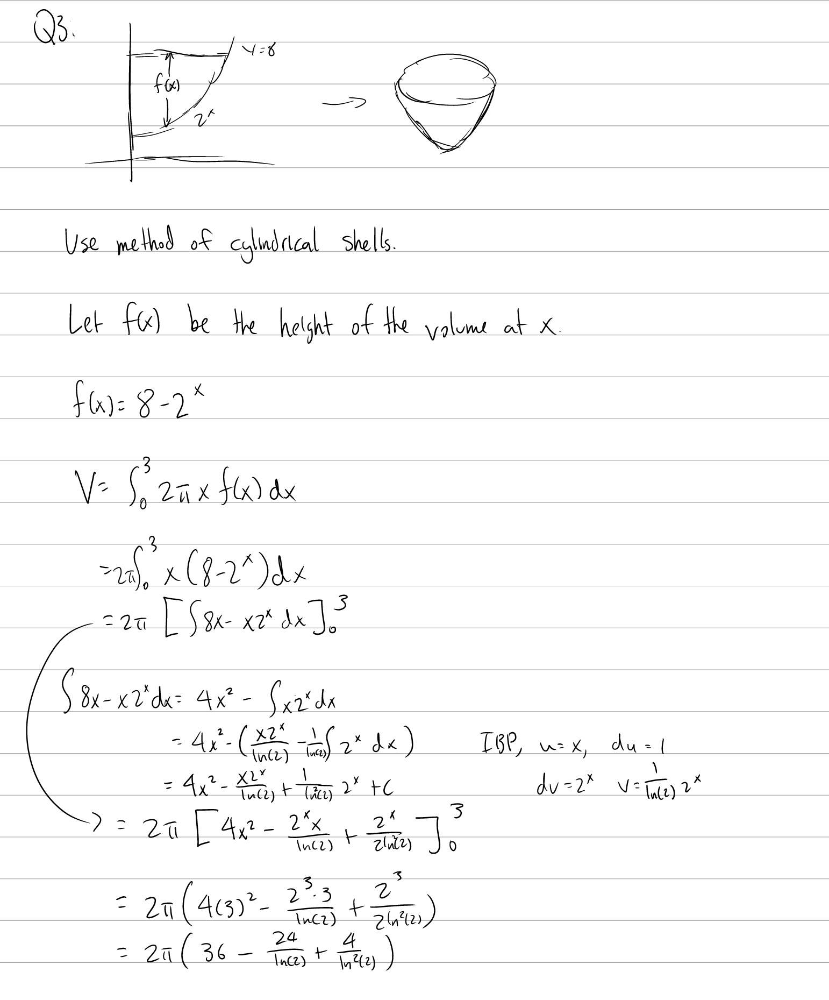

Tutorial Week 6
===============

.. toctree::
   :hidden:
   

.. raw:: html

      

Volumes using Cross-Sectional Areas
-----------------------------------

Q1: Find the volume of a pyramid-like shape with a square base of side length 4 and height 6. The sides of the pyramid are defined by the function :math:`y = \frac{6(x-2)^2}{4}`, with the origin of the function being the centre of the pyramid and the x axis running parallel to the sides of the pyramid.
~~~~~~~~~~~~~~~~~~~~~~~~~~~~~~~~~~~~~~~~~~~~~~~~~~~~~~~~~~~~~~~~~~~~~~~~~~~~~~~~~~~~~~~~~~~~~~~~~~~~~~~~~~~~~~~~~~~~~~~~~~~~~~~~~~~~~~~~~~~~~~~~~~~~~~~~~~~~~~~~~~~~~~~~~~~~~~~~~~~~~~~~~~~~~~~~~~~~~~~~~~~~~~~~~~~~~~~~~~~~~~~~~~~~~~~~~~~~~~~~~~~~~~~~~~~~~~~~~~~~~~~~~~~~~~~~~~~~~~~~~~~~~~~~~~~~~~~~~~~~~~~

Volumes of Revolution
---------------------

Q2: Find the volume created by rotating the region bounded between :math:`y =3-x^{2}` and :math:`y =2x^{2}` on the interval :math:`x\in[0, 1]` about the x-axis.
~~~~~~~~~~~~~~~~~~~~~~~~~~~~~~~~~~~~~~~~~~~~~~~~~~~~~~~~~~~~~~~~~~~~~~~~~~~~~~~~~~~~~~~~~~~~~~~~~~~~~~~~~~~~~~~~~~~~~~~~~~~~~~~~~~~~~~~~~~~~~~~~~~~~~~~~~~~~~~~~

.. raw:: html

   

      <button onClick="toggleClicked(this)" class="show-answer-button">Show Solution</button>
      

.. raw:: html

        

    

Volumes by Cylindrical Shells
-----------------------------

Q3: Find the volume created by rotating the region bounded below by :math:`y = 2^x` and bounded above by :math:`y = 8` on :math:`x \in [0, 3]` about the y-axis.
~~~~~~~~~~~~~~~~~~~~~~~~~~~~~~~~~~~~~~~~~~~~~~~~~~~~~~~~~~~~~~~~~~~~~~~~~~~~~~~~~~~~~~~~~~~~~~~~~~~~~~~~~~~~~~~~~~~~~~~~~~~~~~~~~~~~~~~~~~~~~~~~~~~~~~~~~~~~~~~~

.. raw:: html

   

      <button onClick="toggleClicked(this)" class="show-answer-button">Show Solution</button>
      

.. raw:: html

        

    

