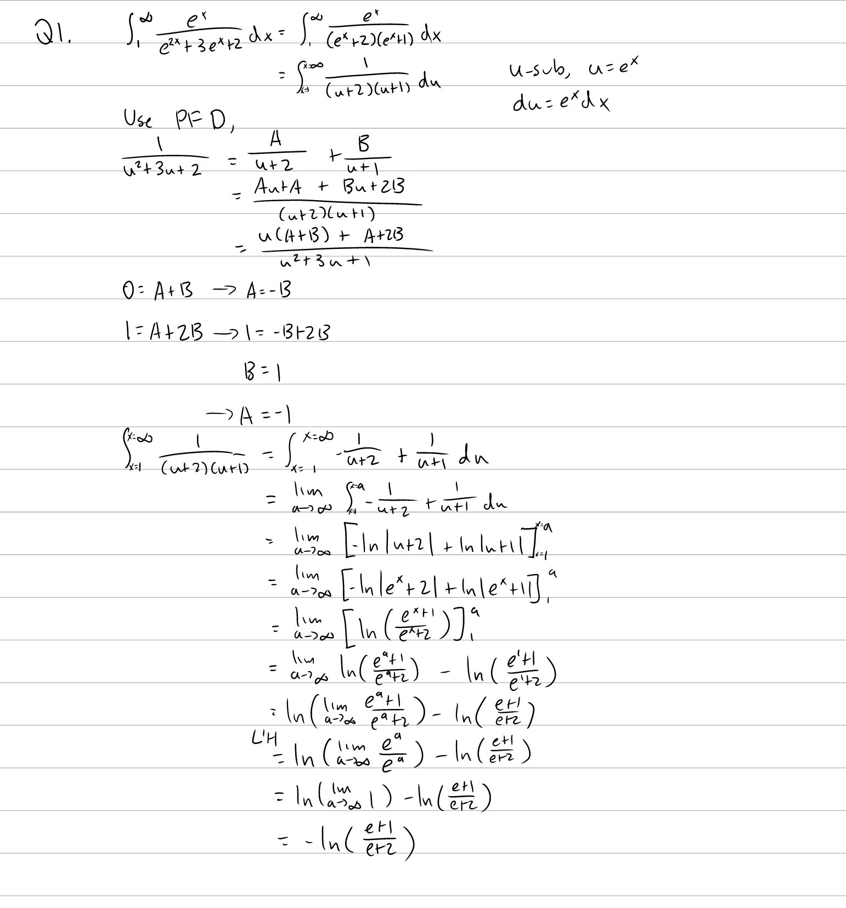
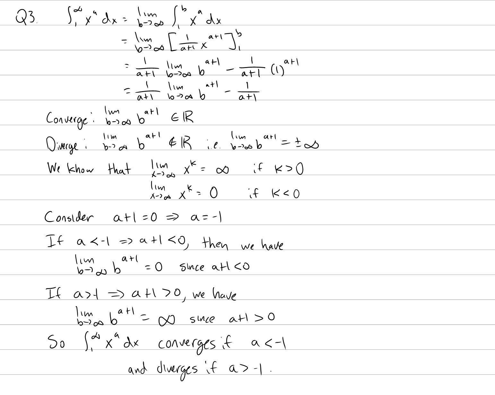

Tutorial Week 8
===============

.. toctree::
   :hidden:
   

.. raw:: html

      

Improper Integrals
------------------

Q1: Evaluate :math:`\int_1^\infty \frac{e^x}{e^{2x} + 3e^x + 2} \; dx`.
~~~~~~~~~~~~~~~~~~~~~~~~~~~~~~~~~~~~~~~~~~~~~~~~~~~~~~~~~~~~~~~~~~~~~~~

.. raw:: html

   

      <button onClick="toggleClicked(this)" class="show-answer-button">Show Solution</button>
      

.. raw:: html

        

    

Q2: Evaluate :math:`\int_{-1}^1 \frac{1}{x^{\frac{2}{3}}} \; dx`.
~~~~~~~~~~~~~~~~~~~~~~~~~~~~~~~~~~~~~~~~~~~~~~~~~~~~~~~~~~~~~~~~~

.. raw:: html

   

      <button onClick="toggleClicked(this)" class="show-answer-button">Show Solution</button>
      

.. image:: ./images/t8/2.jpeg
   :width: 700

.. raw:: html

        

    

Q3: For which values of :math:`a` (if :math:`a \neq -1`) does :math:`\int_1^\infty x^a \; dx` converge or diverge?
~~~~~~~~~~~~~~~~~~~~~~~~~~~~~~~~~~~~~~~~~~~~~~~~~~~~~~~~~~~~~~~~~~~~~~~~~~~~~~~~~~~~~~~~~~~~~~~~~~~~~~~~~~~~~~~~~~

.. raw:: html

   

      <button onClick="toggleClicked(this)" class="show-answer-button">Show Solution</button>
      

.. raw:: html

        

    

Comparison Test
---------------

Q4: Does :math:`\int_{-\infty}^{-1} \frac{\sin\left(x\right)^{2}\cos\left(x\right)^{2}}{x^{2}} \; dx` converge or diverge?
~~~~~~~~~~~~~~~~~~~~~~~~~~~~~~~~~~~~~~~~~~~~~~~~~~~~~~~~~~~~~~~~~~~~~~~~~~~~~~~~~~~~~~~~~~~~~~~~~~~~~~~~~~~~~~~~~~~~~~~~~~

.. raw:: html

   

      <button onClick="toggleClicked(this)" class="show-answer-button">Show Solution</button>
      

.. image:: ./images/t8/4.jpeg
   :width: 700

.. raw:: html

        

    
