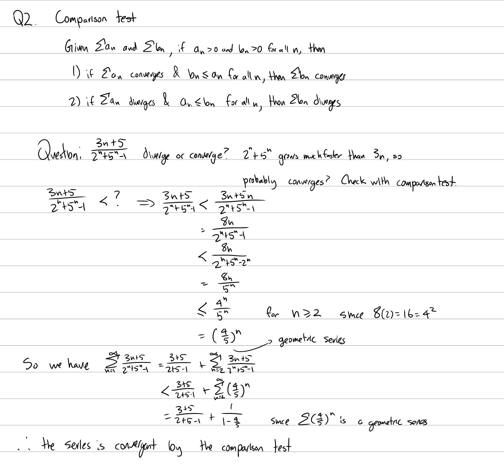
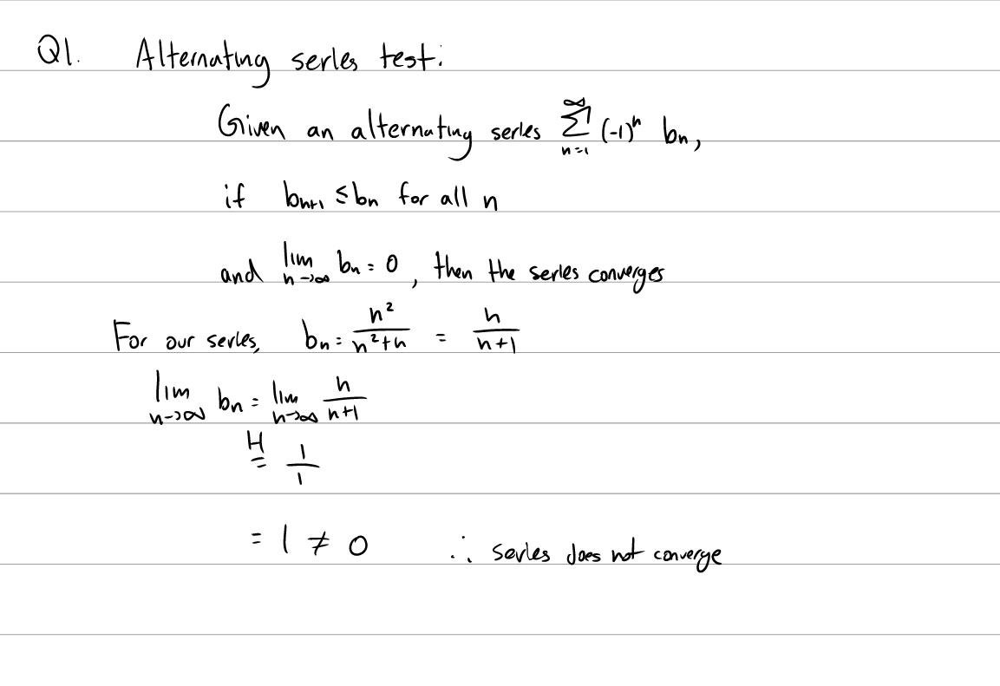
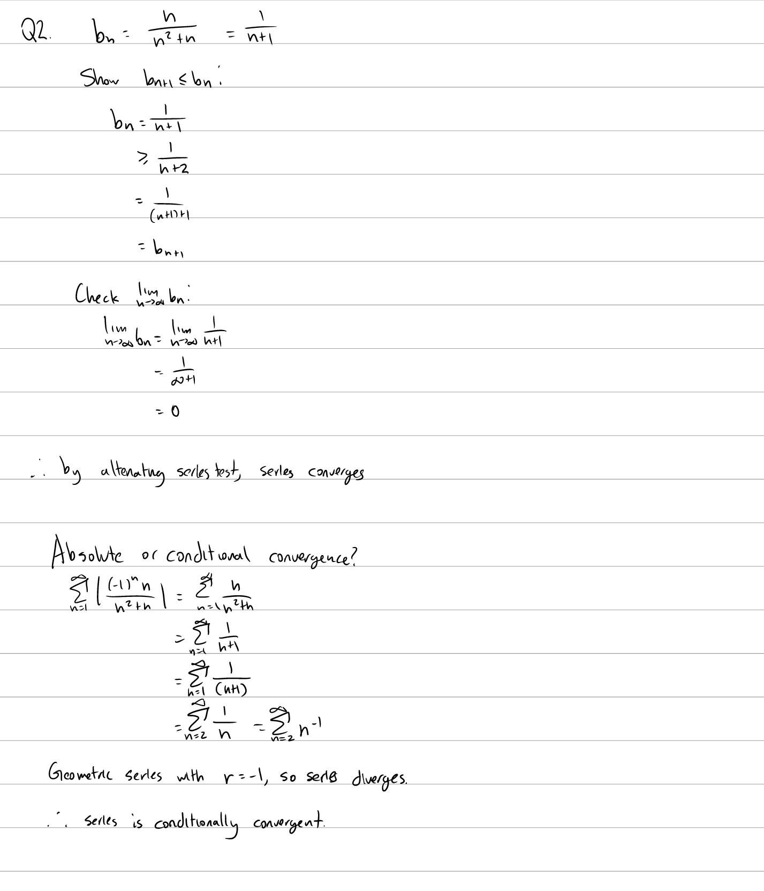

Tutorial Week 11
================

.. toctree::
   :hidden:
   

.. raw:: html

      

Comparison Test
---------------

The comparison test states:

Given series :math:`\sum a_n` and :math:`\sum b_n`, where :math:`a_n \ge 0` and :math:`b_n \ge 0`,

1. If :math:`\sum a_n` converges and :math:`b_n \le a_n`, then :math:`\sum b_n` converges.

2. If :math:`\sum a_n` diverges and :math:`a_n \le b_n`, then :math:`\sum b_n` diverges.

Q1: Use the comparison test to show whether :math:`\sum_{n=1}^\infty \frac{3n + 5}{2^n + 5^n - 1}` converges.
~~~~~~~~~~~~~~~~~~~~~~~~~~~~~~~~~~~~~~~~~~~~~~~~~~~~~~~~~~~~~~~~~~~~~~~~~~~~~~~~~~~~~~~~~~~~~~~~~~~~~~~~~~~~~

.. raw:: html

   

      <button onClick="toggleClicked(this)" class="show-answer-button">Show Solution</button>
      

.. raw:: html

        

    

Alternating Series Test
-----------------------

The alternating series test states:

Given an alternating series in the form of :math:`\sum (-1)^n b_n` where :math:`b_n \gt 0`, if :math:`b_n` forms a decreasing sequence (:math:`b_{n+1} \le b_n`) and :math:`\lim_{n \to \infty} b_n = 0`, then :math:`\sum (-1)^n b_n` converges.

Q2: Does the series :math:`\sum_{n=1}^\infty \frac{(-1)^nn^2}{n^2+n}` converge? If it converges, is it absolutely or conditionally convergent?
~~~~~~~~~~~~~~~~~~~~~~~~~~~~~~~~~~~~~~~~~~~~~~~~~~~~~~~~~~~~~~~~~~~~~~~~~~~~~~~~~~~~~~~~~~~~~~~~~~~~~~~~~~~~~~~~~~~~~~~~~~~~~~~~~~~~~~~~~~~~~~

.. raw:: html

   

      <button onClick="toggleClicked(this)" class="show-answer-button">Show Solution</button>
      

   
.. raw:: html

        

    

Q3: Does the series :math:`\sum_{n=1}^\infty \frac{(-1)^nn}{n^2+n}` converge? If it converges, is it absolutely or conditionally convergent?
~~~~~~~~~~~~~~~~~~~~~~~~~~~~~~~~~~~~~~~~~~~~~~~~~~~~~~~~~~~~~~~~~~~~~~~~~~~~~~~~~~~~~~~~~~~~~~~~~~~~~~~~~~~~~~~~~~~~~~~~~~~~~~~~~~~~~~~~~~~~

.. raw:: html

   

      <button onClick="toggleClicked(this)" class="show-answer-button">Show Solution</button>
      

   
.. raw:: html

        

    
