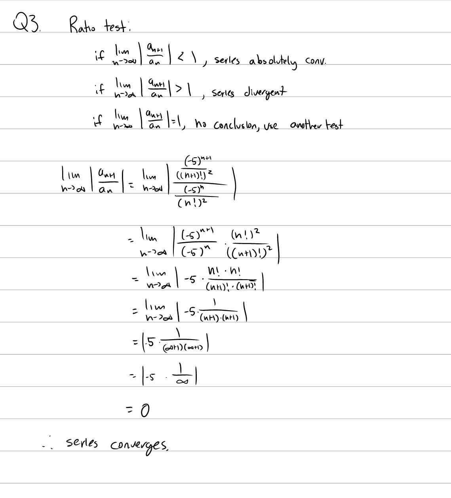
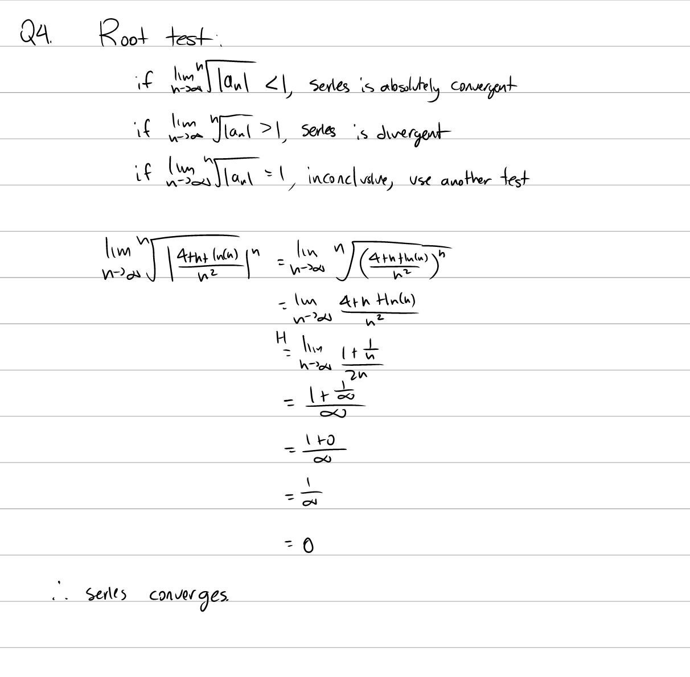

Tutorial Week 12
================

.. toctree::
   :hidden:
   

.. raw:: html

      

Ratio Test
----------

.. raw:: html

   

      <button onClick="toggleClicked(this)" class="show-answer-button">Show Solution</button>
      

   
.. raw:: html

        

    

Root Test
---------

.. raw:: html

   

      <button onClick="toggleClicked(this)" class="show-answer-button">Show Solution</button>
      

   
.. raw:: html

        

    

