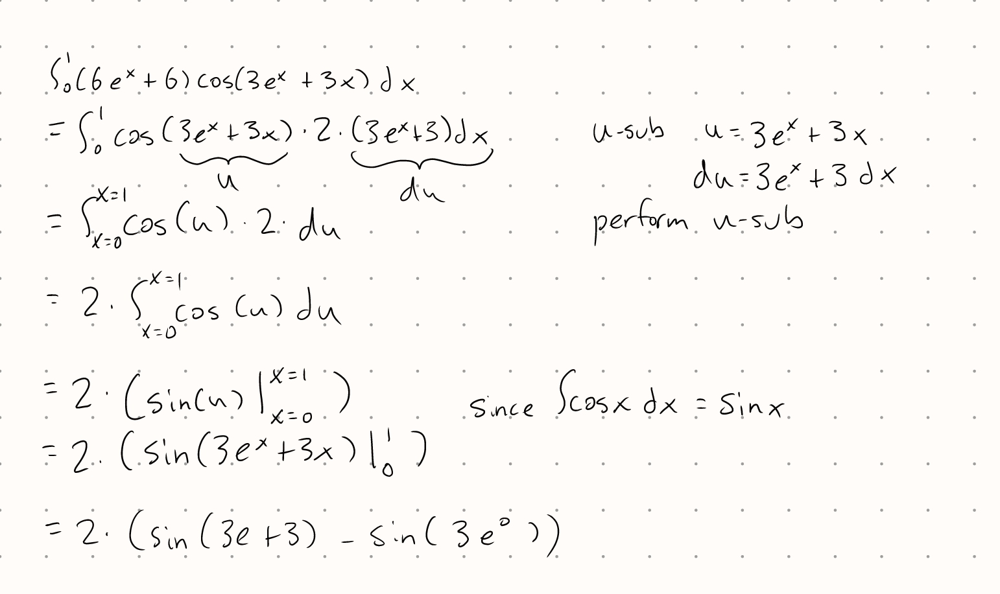
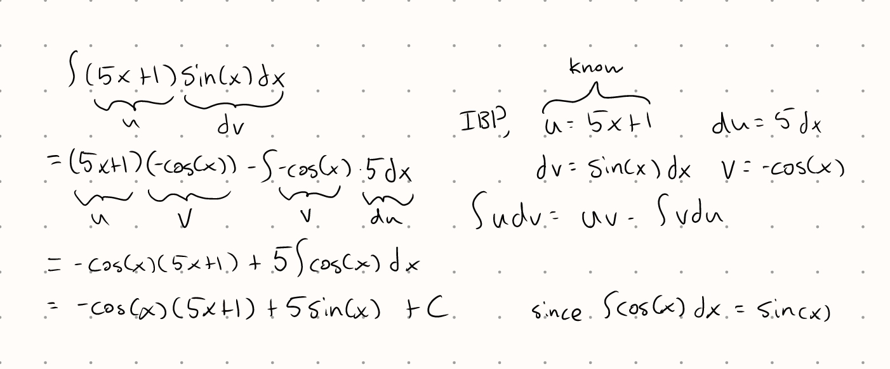

Tutorial Week 2
===============

.. toctree::
   :hidden:
   

.. raw:: html

      

In this tutorial, we'll be going over some introductory integration techniques.

Basic Integration Rules
-----------------------

As a baseline, you should be familiar with the following rules:

- Constant Rule

- Constant Multiple Rule

- Sum/Difference Rule

- Power Rules

- Exponent Rules

- Trig Rules

- Inverse Trig Rules

`Refer to week 1 lecture slides for more information. <https://q.utoronto.ca/courses/336048/pages/week-1-jan-8-12?module_item_id=5360613>`_

Integration Methods
-------------------

In addition to the basic integration rules, we also have three integration methods that we can take advantage of.

U-Substitution
~~~~~~~~~~~~~~

To briefly summarize U-sub, you would:

1. Choose a :math:`u` and find the corresponding :math:`du = u'(x) dx`. Ideally, both :math:`u` and :math:`du` 
values appear in the expression you're integrating.

2. Substitute in your :math:`u` and :math:`du` values into the expression being integrated. You may need to 
rearrange the :math:`du` equation in some cases, but by the end of this step, there should be no :math:`dx` in
your integral.

3. Continue integrating with one of the other integration methods until you're able to simply use the basic
integration rules.

4. Reverse the substitution so that your final expression is in terms of :math:`x` and not :math:`u`.

Note: In some cases, you may need to do more than one U-sub. In this case, just follow the alphabet and use the letters
:math:`v` and/or :math:`w` instead of :math:`u`.

Integration By Parts (and LIATE)
~~~~~~~~~~~~~~~~~~~~~~~~~~~~~~~~

To briefly summarize Integration by Parts (IBP), you would:

1. Choose a :math:`u` and :math:`dv`, where the expression :math:`u \cdot dv` appears in your integral. Your choice of :math:`dv` should be easily integrable.

2. Calculate :math:`du = u'(x)` and :math:`v = \int dv`.

3. Replace your integral :math:`\int u \cdot dv` with :math:`uv - \int v \cdot du`

4. Continue integrating with one of the other integration methods until you're able to simply use the basic
integration rules. There is no need to reverse anything like in U-sub since your new integral should still be defined in terms of x.

As a guideline for which function in your integral to choose as an :math:`u` value in an integration by parts step, we can follow LIATE.

This stands for:

- L - Logs

- I - Inverse trig

- A - Algebraic (:math:`x^2 - 1` etc.)

- T - Trig

- E - Exponential

Practice Questions
------------------

Q1: Integrate :math:`\int_0^1 (6e^x + 6)cos(3e^x + 3x) dx`.
~~~~~~~~~~~~~~~~~~~~~~~~~~~~~~~~~~~~~~~~~~~~~~~~~~~~~~~~~~~

.. raw:: html

   

      <button onClick="toggleClicked(this)" class="show-answer-button">Show Solution</button>
      

.. raw:: html

        

    

Q2: Integrate :math:`\int (5x + 1)sin(x) dx`.
~~~~~~~~~~~~~~~~~~~~~~~~~~~~~~~~~~~~~~~~~~~~~

.. raw:: html

   

      <button onClick="toggleClicked(this)" class="show-answer-button">Show Solution</button>
      

.. raw:: html

        

    

Challenge Questions
-------------------

C1 (60): Integrate :math:`\int \frac{1}{2 + cos(x)} dx`.
~~~~~~~~~~~~~~~~~~~~~~~~~~~~~~~~~~~~~~~~~~~~~~~~~~~~~~~~

C2 (30): Integrate :math:`\int \frac{1}{1 - cos(x)} dx`.
~~~~~~~~~~~~~~~~~~~~~~~~~~~~~~~~~~~~~~~~~~~~~~~~~~~~~~~~

C3 (20): Integrate :math:`\int \tan^{-1}(\frac{1}{x}) dx`.
~~~~~~~~~~~~~~~~~~~~~~~~~~~~~~~~~~~~~~~~~~~~~~~~~~~~~~~~~~

C4 (40): Integrate :math:`\int sin^4(x) dx`.
~~~~~~~~~~~~~~~~~~~~~~~~~~~~~~~~~~~~~~~~~~~~

.. raw:: html

  