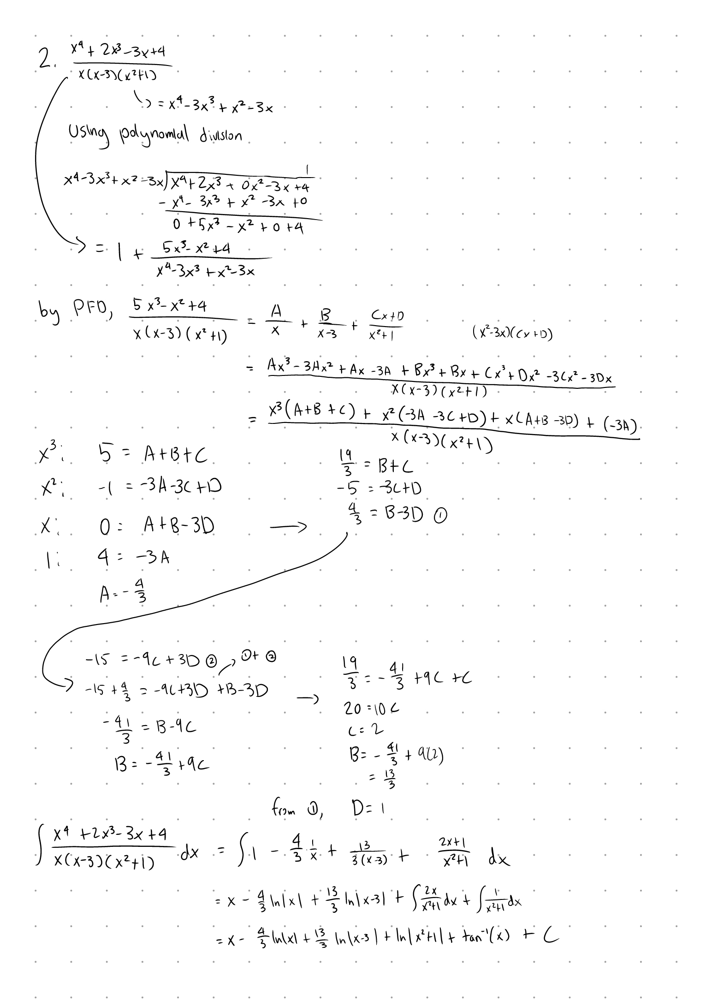

Tutorial Week 4
===============

.. toctree::
   :hidden:
   

.. raw:: html

      

Partial Fraction Decomposition (PFD)
------------------------------------

Partial fraction decomposition is a way to simplify rational integrals into a way that 
is easier to work with by seperating the rational expression into its partial fractions.

Q1: Integrate :math:`\int \frac{x^4+2x^3-3x+4}{x(x-3)(x^2+1)} \; dx`.
~~~~~~~~~~~~~~~~~~~~~~~~~~~~~~~~~~~~~~~~~~~~~~~~~~~~~~~~~~~~~~~~~~~~~

.. raw:: html

   

      <button onClick="toggleClicked(this)" class="show-answer-button">Show Solution</button>
      

.. raw:: html

        

    

Riemann Sums and Sigma Notation
-------------------------------

Sigma Notation
~~~~~~~~~~~~~~

We use sigma (:math:`\Sigma`) notation as a way to express sums of numbers.

With :math:`\Sigma_{n=3}^5n^2`, we sum from :math:`n = 3` to :math:`n = 5` inclusive, giving :math:`\Sigma_{n=3}^5n^2 = 3^2 + 4^2 + 5^2`.

With sums, we also have a few useful formulas, those being:

- :math:`\Sigma_{k = m}^n ca_k = c\Sigma_{k = m}^n a_k`

- :math:`\Sigma_{k = m}^n a_k + b_k = \Sigma_{k = m}^n a_k + \Sigma_{k = m}^n b_k`

- :math:`\Sigma_{k = 1}^n 1 = n`

- :math:`\Sigma_{k = 1}^n n = \frac{n(n+1)}{2}`

- :math:`\Sigma_{k = 1}^n n^2 = \frac{n(n+1)(2n+1)}{6}`

- :math:`\Sigma_{k = 1}^n n^3 = \frac{n^2(n + 1)^2}{4}`

Riemann Sums
~~~~~~~~~~~~

Riemann sums are used to approximate the area under a function by using rectangles.

To define a riemann sum from on the interval [a, b] for f(x), we need:

- :math:`\Delta x = \frac{b - a}{n}`

- :math:`x_k = a + k\Delta x` for :math:`k = 0, 1, 2, ... , n`

- :math:`x^\ast_k` is a point in :math:`[x_{k-1}, x_k]`

The riemann sum is :math:`\Sigma_{k=1}^n f(x_n^\ast)\Delta x`.

We have two common types of riemann sums, those being the left riemann sum and the right riemann sum.

The left riemann sum is defined with :math:`x^\ast_k = x_{k-1}` :math:`L_n = \Sigma_{k=1}^n f(x_{k-1})\Delta x = \Sigma_{k=1}^n f(a + (k-1)\Delta x)\Delta x`

The right riemann sum is defined with :math:`x^\ast_k = x_{k}` :math:`R_n = \Sigma_{k=1}^n f(x_{k})\Delta x = \Sigma_{k=1}^n f(a + k\Delta x)\Delta x`

Q2: Approximate the area under :math:`10 - x^2` for :math:`x \in [0, 1]` using the right Riemann sum over four intervals.
~~~~~~~~~~~~~~~~~~~~~~~~~~~~~~~~~~~~~~~~~~~~~~~~~~~~~~~~~~~~~~~~~~~~~~~~~~~~~~~~~~~~~~~~~~~~~~~~~~~~~~~~~~~~~~~~~~~~~~~~~

.. raw:: html

   

      <button onClick="toggleClicked(this)" class="show-answer-button">Show Solution</button>
      

We first need to find the following: 

- :math:`\Delta x = \frac{b - a}{n} = \frac{1 - 0}{4} = \frac{1}{4}`

- :math:`x_k = a + k\Delta x = 0 + \frac{k}{4}` for :math:`k = 0, 1, 2, ... , n`

- :math:`x^\ast_k = x_{k} = \frac{k}{4}` since we're using the right Riemann sum.

- :math:`\Sigma_{k=1}^n f(x_{k})\Delta x = \Sigma_{k=1}^n f(\frac{k}{4})\Delta x`

Then the right riemann sum is

:math:`R_n = \Sigma_{k=1}^n f(\frac{k}{4})\Delta x = (\frac{1}{4})((10 - (\frac{1}{4})^2) + (10 - (\frac{2}{4})^2) + (10 - (\frac{3}{4})^2) + (10 - 1^2))`

.. raw:: html

        

    

