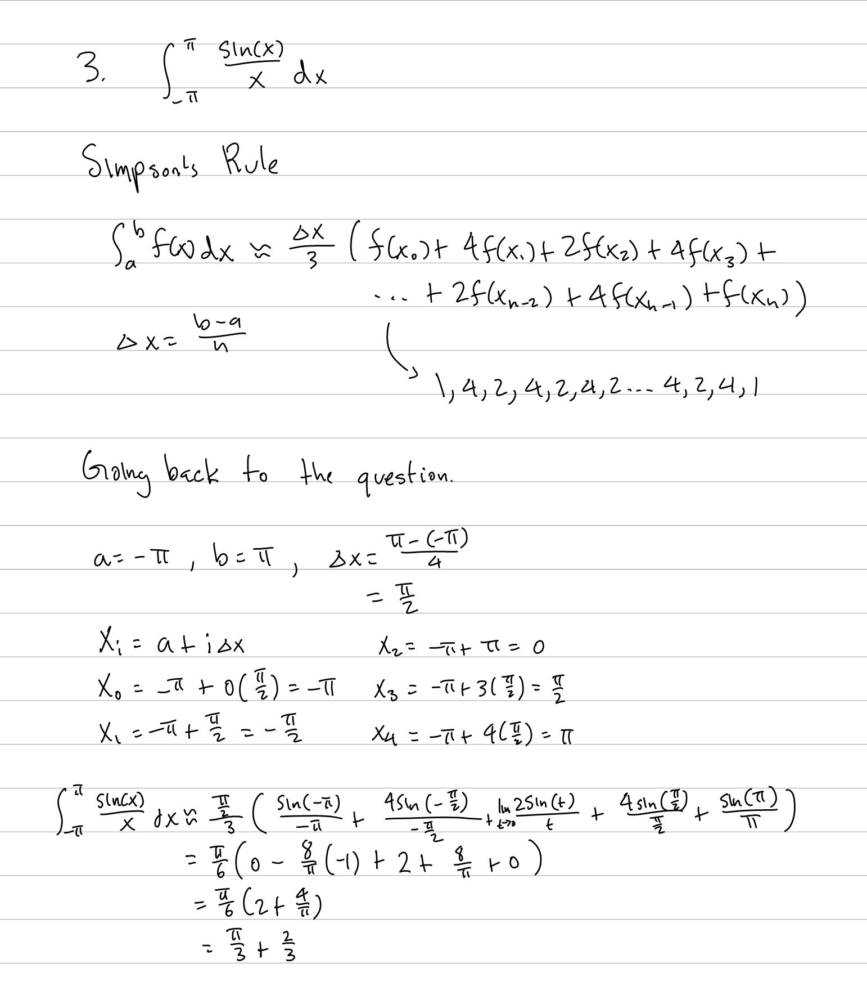
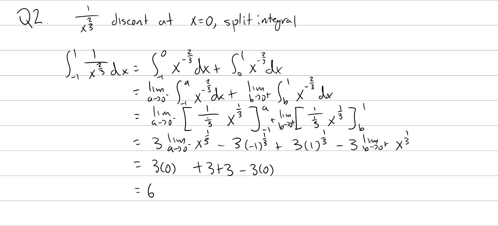
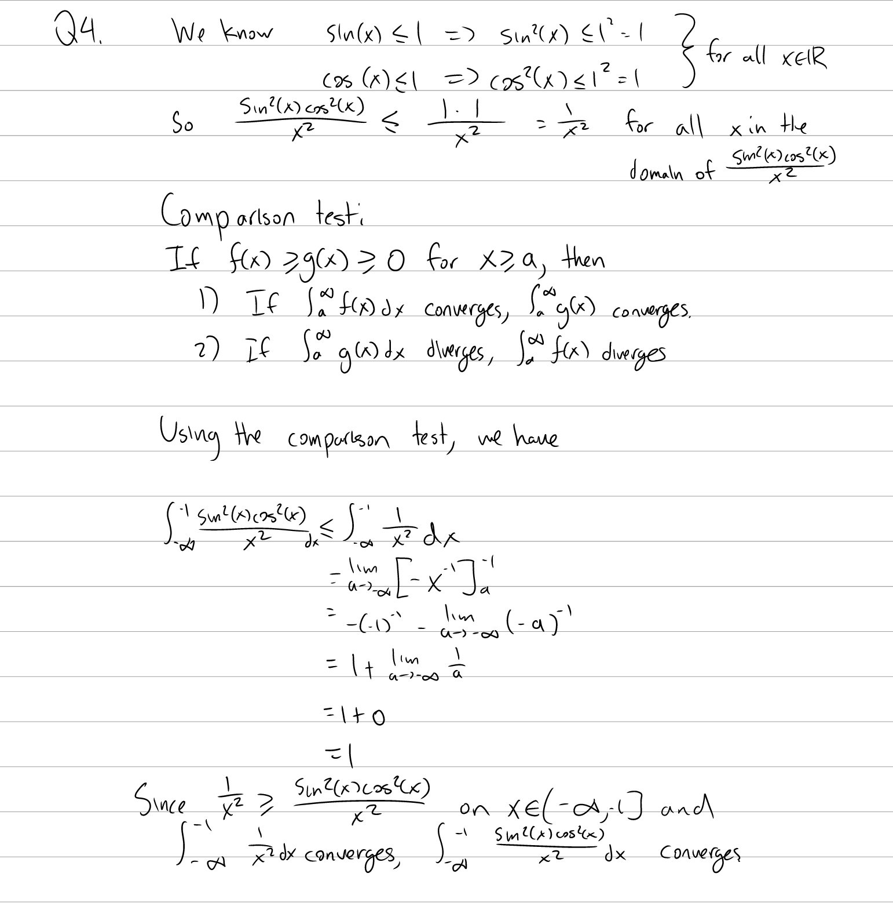

Tutorial Week 5
===============

.. toctree::
   :hidden:
   

.. raw:: html

      

Riemann Sums (Again)
--------------------

Q1: Evaluate :math:`\int_0^4 2x^2 + x \,dx` using Riemann sums.
~~~~~~~~~~~~~~~~~~~~~~~~~~~~~~~~~~~~~~~~~~~~~~~~~~~~~~~~~~~~~~~

.. raw:: html

   

      <button onClick="toggleClicked(this)" class="show-answer-button">Show Solution</button>
      

For simplicity, let's use the right riemann sum.

We have: 

- :math:`\Delta x = \frac{b - a}{n} = \frac{4 - 0}{n} = \frac{4}{n}`

- :math:`x_k = a + k\Delta x = 0 + \frac{4k}{n}` for :math:`k = 0, 1, 2, ... , n`

- :math:`x^\ast_k = x_{k} = \frac{4k}{n}` since we're using the right Riemann sum.

So then 

.. math::
    \begin{aligned}
    \int_1^5 2x^2 + x dx &= \lim_{n \to \infty} \Sigma_{k=1}^n f(x_{k})\Delta x \\
    &= \lim_{n \to \infty} \Sigma_{k=1}^n f(\frac{4k}{n})\Delta x \\
    &=\lim_{n \to \infty} \Sigma_{k=1}^n (2(\frac{4k}{n})^2 + \frac{4k}{n})(\frac{4}{n})
    \end{aligned}

Solving for this gives us 

.. math::
    \begin{aligned}
    &\lim_{n \to \infty} \Sigma_{k=1}^n (2(\frac{4k}{n})^2 + \frac{4k}{n})(\frac{4}{n}) \\ &= \lim_{n \to \infty} \frac{4}{n}\Sigma^n_{k = 1}2(\frac{4k}{n})^2 + \frac{4k}{n} \\
    &= \lim_{n \to \infty} \frac{4}{n}\Sigma^n_{k = 1}\frac{32k^2}{n^2} + \frac{4k}{n} \\
    &= \lim_{n \to \infty} \frac{4}{n} ( \frac{32}{n^2} \Sigma^n_{k = 1} k^2 + \frac{4}{n} \Sigma^n_{k = 1} k) \\
    &= \lim_{n \to \infty} \frac{4}{n} (\frac{32}{n^2} \cdot \frac{n(n+1)(2n+1)}{6} + \frac{4}{n} \cdot \frac{n(n+1)}{2} ) \\
    &= \lim_{n \to \infty} \frac{128(2n^3+3n^2+n)}{6n^3} + \frac{16(n^2 + n)}{2n^2} \\
    &= \text{... skipping a few steps for finding the limit} \\
    &= \frac{128 \cdot 2}{6} + \frac{16}{2} \\
    &= \frac{128}{3} + 8
    \end{aligned}

.. raw:: html

        

    

Numerical Integration
---------------------

Sometimes, a function just isn't integrable. In those cases, to approximate an integral,
we can use Riemann sums to find a good estimate of the integral.

If we have :math:`x_k = a + k\Delta x`, then we can define the following Riemann sums:

Left: :math:`x_k^\star = x_{k-1}`

Right: :math:`x_k^\star = x_k`

Midpoint: :math:`x_k^\star = \frac{x_{k - 1} + x_k}{2}`

We can also use the trapezoid sum to approximate integrals, defined as:

:math:`T_n = \Sigma^n_{k=1} \frac{\Delta x}{2} (f(x_{k-1) + f(x_k))`

There's also Simpson's rule, defined as:

:math:`S_n \ = \frac{\Delta x}{3} (f(x_0) + 4f(x_1) + 2f(x_2) + 4 f(x_3) + 2f(x_4) + \dots + 2f(x_{n-1}) + 4f(x_{n-1}) + f(x_n)`

Q2: Approximate :math:`\int_{-\pi}^{\pi} \frac{sin(x)}{x}dx` using Simpson's Rule with :math:`n=4`.
~~~~~~~~~~~~~~~~~~~~~~~~~~~~~~~~~~~~~~~~~~~~~~~~~~~~~~~~~~~~~~~~~~~~~~~~~~~~~~~~~~~~~~~~~~~~~~~~~~~

.. raw:: html

   

      <button onClick="toggleClicked(this)" class="show-answer-button">Show Solution</button>
      

.. raw:: html

        

    

Improper Integrals
------------------

Up to now, we've only dealt with integrals on the continuous intervals of functions, but what if the function wasn't continuous at
some point or interval was infinite? For improper integrals, we have two cases: 

- The function is discontinuous at some point in the interval of integration

- One of the endpoints is :math:`\pm \infty`

In these cases, we simply use limits against the "illegal" 

Q3: Evaluate :math:`\int_{-1}^1 \frac{1}{x^{\frac{2}{3}}} \; dx`.
~~~~~~~~~~~~~~~~~~~~~~~~~~~~~~~~~~~~~~~~~~~~~~~~~~~~~~~~~~~~~~~~~

.. raw:: html

   

      <button onClick="toggleClicked(this)" class="show-answer-button">Show Solution</button>
      

.. raw:: html

        

    

Sometimes, we're only interested in whether an integral converges or diverges, and not the specific value it converges to.

In these cases, we can use the comparison test to simplify our calculations.

The comparison test states:

- If :math:`f(x) \ge g(x) \ge 0` for all :math:`x \ge a` and :math:`\int_a^\infty f(x) dx ` converges, then :math:`\int_a^\infty g(x) dx` converges.

- If :math:`f(x) \ge g(x) \ge 0` for all :math:`x \ge a` and :math:`\int_a^\infty g(x) dx ` diverges, then :math:`\int_a^\infty f(x) dx` diverges.

Q4: Does :math:`\int_{-\infty}^{-1} \frac{\sin\left(x\right)^{2}\cos\left(x\right)^{2}}{x^{2}} \; dx` converge or diverge?
~~~~~~~~~~~~~~~~~~~~~~~~~~~~~~~~~~~~~~~~~~~~~~~~~~~~~~~~~~~~~~~~~~~~~~~~~~~~~~~~~~~~~~~~~~~~~~~~~~~~~~~~~~~~~~~~~~~~~~~~~~

.. raw:: html

   

      <button onClick="toggleClicked(this)" class="show-answer-button">Show Solution</button>
      

.. raw:: html

        

    
