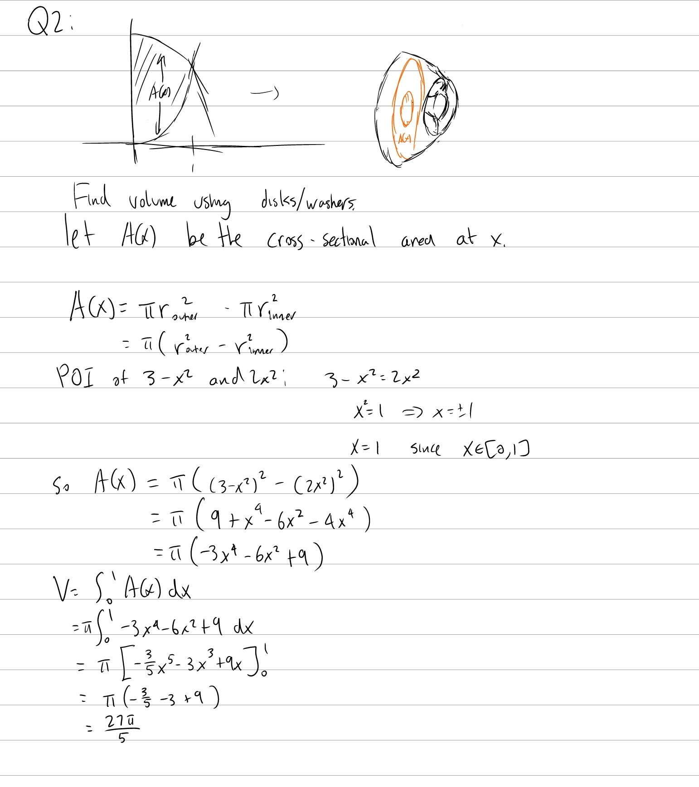
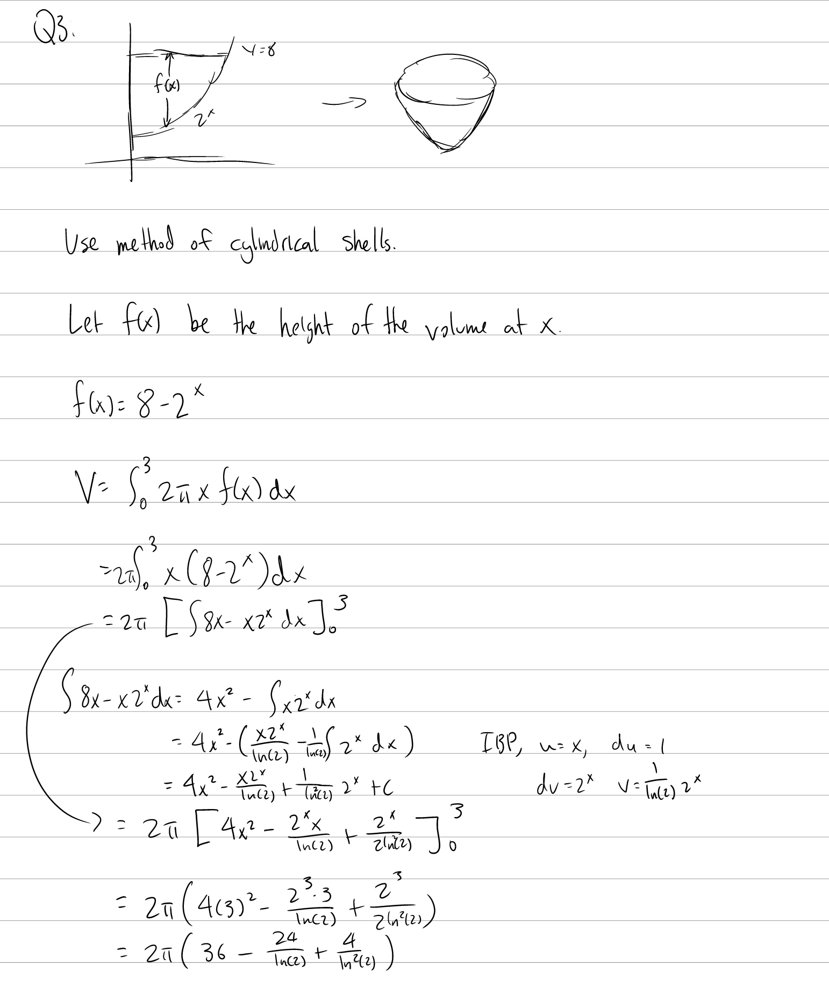

Tutorial Week 6
===============

.. toctree::
   :hidden:
   

.. raw:: html

      

Volumes of Revolution
---------------------

The volume of a solid generated by revolving a function :math:`f(x)` around the x axis on the interval :math:`[a, b]` is given by :math:`\int_a^b \pi f(x)^2 dx`.

Q1: Find the volume created by rotating the region bounded between :math:`y =3-x^{2}` and :math:`y =2x^{2}` on the interval :math:`x\in[0, 1]` about the x-axis.
~~~~~~~~~~~~~~~~~~~~~~~~~~~~~~~~~~~~~~~~~~~~~~~~~~~~~~~~~~~~~~~~~~~~~~~~~~~~~~~~~~~~~~~~~~~~~~~~~~~~~~~~~~~~~~~~~~~~~~~~~~~~~~~~~~~~~~~~~~~~~~~~~~~~~~~~~~~~~~~~

.. raw:: html

   

      <button onClick="toggleClicked(this)" class="show-answer-button">Show Solution</button>
      

.. raw:: html

        

    

Volumes by Cylindrical Shells
-----------------------------

The volume of a solid generated by revolving a function :math:`f(x)` around the y axis on the interval :math:`[a, b]` is given by :math:`\int_a^b 2x\pi f(x) dx`.

Q2: Find the volume created by rotating the region bounded below by :math:`y = 2^x` and bounded above by :math:`y = 8` on :math:`x \in [0, 3]` about the y-axis.
~~~~~~~~~~~~~~~~~~~~~~~~~~~~~~~~~~~~~~~~~~~~~~~~~~~~~~~~~~~~~~~~~~~~~~~~~~~~~~~~~~~~~~~~~~~~~~~~~~~~~~~~~~~~~~~~~~~~~~~~~~~~~~~~~~~~~~~~~~~~~~~~~~~~~~~~~~~~~~~~

.. raw:: html

   

      <button onClick="toggleClicked(this)" class="show-answer-button">Show Solution</button>
      

.. raw:: html

        

    
