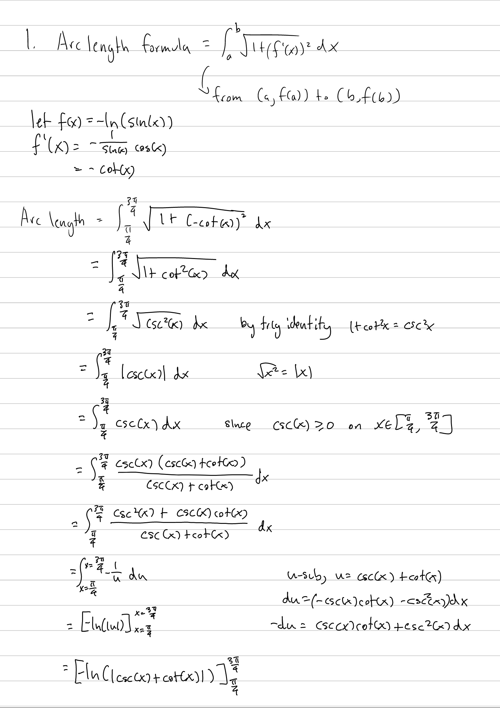
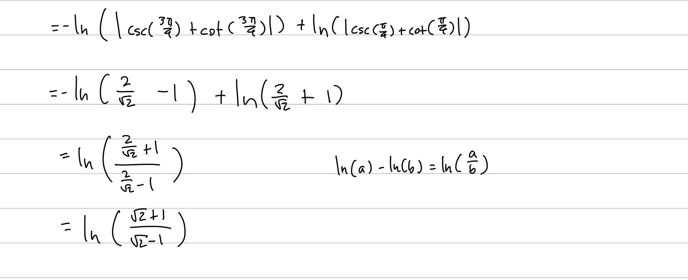

Tutorial Week 7
===============

.. toctree::
   :hidden:
   

.. raw:: html

      

Arc Length
----------

The formula to find the arc length of a function is :math:`\int_a^b \sqrt{a + (f'(x))^2} \; dx`.

Q1: Find the length of the curve :math:`y = -ln(sin(x))` on :math:`x \in [\frac{\pi}{4}, \frac{3\pi}{4}]`.
~~~~~~~~~~~~~~~~~~~~~~~~~~~~~~~~~~~~~~~~~~~~~~~~~~~~~~~~~~~~~~~~~~~~~~~~~~~~~~~~~~~~~~~~~~~~~~~~~~~~~~~~~~

.. raw:: html

   

      <button onClick="toggleClicked(this)" class="show-answer-button">Show Solution</button>
      

.. raw:: html

        

    

Complex Numbers
---------------

Complex numbers gives us a way of working with the roots of negative numbers.

The key concepts are:

- :math:`i = \sqrt{-1}`

- Standard form is :math:`z = a + ib`, where a and b are real numbers

- Polar form is represented as :math:`z = re^{i\theta}`, where r and :math:`\theta` are real numbers

- Euler's Formula gives us :math:`e^{i\theta} = cos\theta + isin\theta`

Q2: Write :math:`(1 + \frac{2i}{1 - i})^{25}` in standard form.
~~~~~~~~~~~~~~~~~~~~~~~~~~~~~~~~~~~~~~~~~~~~~~~~~~~~~~~~~~~~~~~

.. raw:: html

   

      <button onClick="toggleClicked(this)" class="show-answer-button">Show Solution</button>
      

.. math::
   \begin{aligned}
   1 + \frac{2i}{1-i} &= 1 + \frac{2i(i+1)}{(i-1)(i+1)} \\
   &= 1 + \frac{2i^2 + 2i}{1 - i^2} \\
   &= 1 + \frac{2i - 2}{1 - (-1)} \\
   &= 1 + \frac{2i - 2}{2} \\
   &= 1 + -1 + i \\
   &= i
   \end{aligned}

.. math::
   \begin{aligned}
   (i)^25 &= i(i^2)^23 \\
   &= i(-1)^23 \\
   &= i(-1) \\
   &= -i
   \end{aligned}

.. raw:: html

        

    

Q3: Write :math:`z = 2\sqrt{3}e^{\frac{\pi i}{3}}` in standard form.
~~~~~~~~~~~~~~~~~~~~~~~~~~~~~~~~~~~~~~~~~~~~~~~~~~~~~~~~~~~~~~~~~~~~

.. raw:: html

   

      <button onClick="toggleClicked(this)" class="show-answer-button">Show Solution</button>
      

We're given the polar form of a complex number, that is, in the form of :math:`z = re^{i\theta}`.

So :math:`r = 2\sqrt{3}` and :math:`\theta = -\frac{\pi}{3}`.

Euler's formula gives us :math:`e^{i\theta} = cos\theta + isin\theta`.

It follows that:

.. math::
   \begin{aligned}
   z &= re^{i\theta} \\
   &= 2\sqrt{3}e^{i\frac{-\pi}{3}} \\
   &= 2\sqrt{3}(cos(-\frac{\pi}{3}) + isin(-\frac{\pi}{3})) \\
   &= 2\sqrt{3}(\frac{1}{2} + i(-\frac{\sqrt{3}}{2})) \\
   &= \sqrt{3} - 3i
   \end{aligned}

.. raw:: html

        

    
