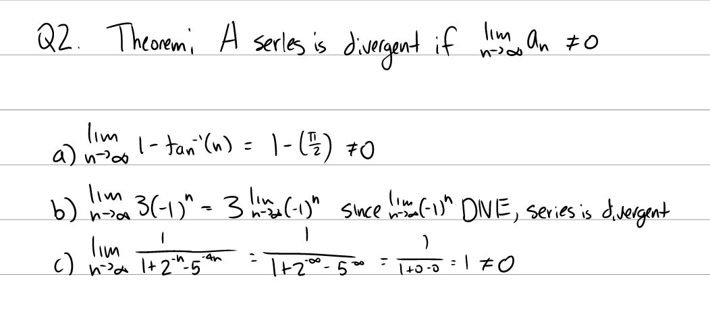
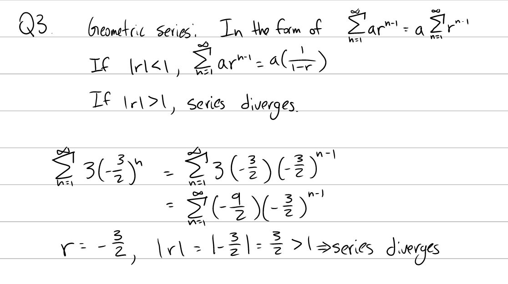
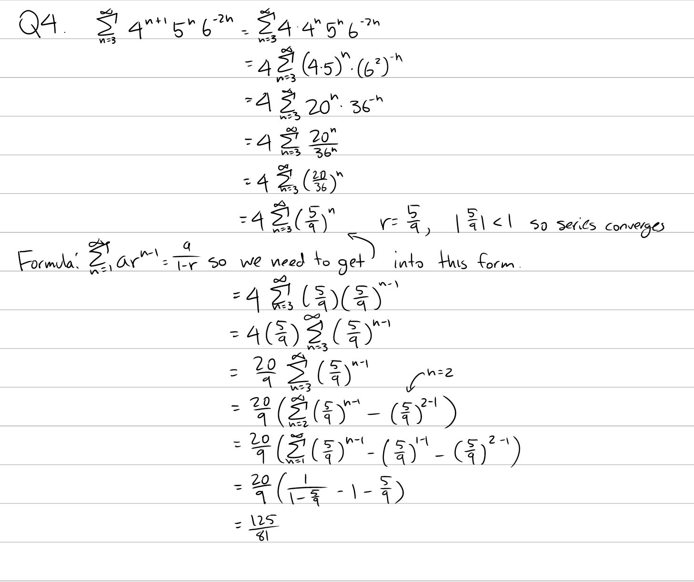
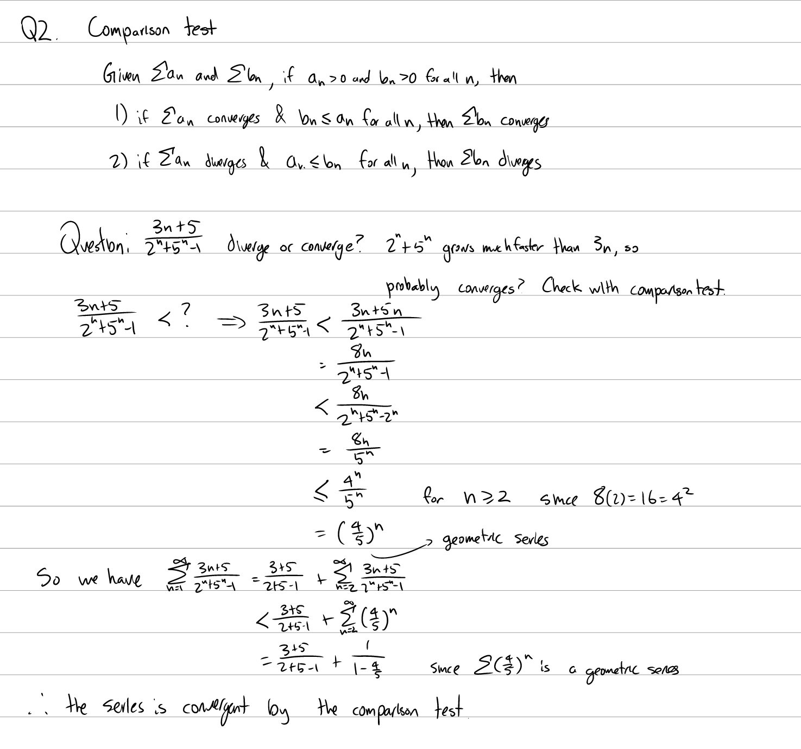
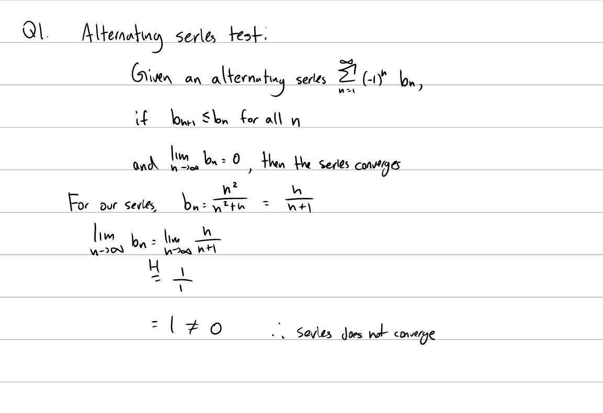
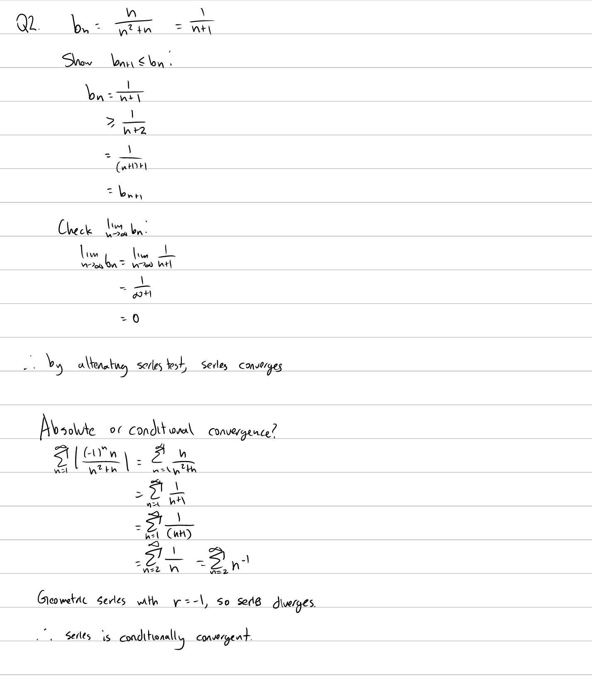

Tutorial Week 11
================

.. toctree::
   :hidden:
   

.. raw:: html

      

Series Definitions
------------------

A series is a sum written in the form :math:`\sum_{k=1}^\infty a_k`.

A series converges if :math:`\sum_{k=1}^\infty a_k = L` for some constant L.

If no such :math:`L` exists, then the series diverges.

The divergence test states that if :math:`\lim_{k \to \infty} a_k \ne 0`, then a series diverges.

Geometric Series
----------------

A geometric series is a series in the form of :math:`\sum_{k=0}^\infty ar^k`.

If :math:`|r| \lt 1`, then the series converges to :math:`\frac{a}{1-r}`.

If :math:`|r| \ge 1`, the series diverges.

Q1: Does :math:`\sum_1^\infty 1 - \arctan(n)` converge? If so, find its sum.
~~~~~~~~~~~~~~~~~~~~~~~~~~~~~~~~~~~~~~~~~~~~~~~~~~~~~~~~~~~~~~~~~~~~~~~~~~~~

.. raw:: html

   

      <button onClick="toggleClicked(this)" class="show-answer-button">Show Solution</button>
      

.. raw:: html

        

    

Q2: Does :math:`\sum_{n=1}^\infty 3(-\frac{3}{2})^n` converge? If so, find its sum.
~~~~~~~~~~~~~~~~~~~~~~~~~~~~~~~~~~~~~~~~~~~~~~~~~~~~~~~~~~~~~~~~~~~~~~~~~~~~~~~~~~~

.. raw:: html

   

      <button onClick="toggleClicked(this)" class="show-answer-button">Show Solution</button>
      

.. raw:: html

        

    

Q3: Does :math:`\sum_{n=3}^\infty 4^{n+1}5^n6^{-2n}` converge? If so, find its sum.
~~~~~~~~~~~~~~~~~~~~~~~~~~~~~~~~~~~~~~~~~~~~~~~~~~~~~~~~~~~~~~~~~~~~~~~~~~~~~~~~~~~

.. raw:: html

   

      <button onClick="toggleClicked(this)" class="show-answer-button">Show Solution</button>
      

.. raw:: html

        

    

Comparison Test
---------------

The comparison test states:

Given series :math:`\sum a_n` and :math:`\sum b_n`, where :math:`a_n \ge 0` and :math:`b_n \ge 0`,

1. If :math:`\sum a_n` converges and :math:`b_n \le a_n`, then :math:`\sum b_n` converges.

2. If :math:`\sum a_n` diverges and :math:`a_n \le b_n`, then :math:`\sum b_n` diverges.

Q4: Use the comparison test to show whether :math:`\sum_{n=1}^\infty \frac{3n + 5}{2^n + 5^n - 1}` converges.
~~~~~~~~~~~~~~~~~~~~~~~~~~~~~~~~~~~~~~~~~~~~~~~~~~~~~~~~~~~~~~~~~~~~~~~~~~~~~~~~~~~~~~~~~~~~~~~~~~~~~~~~~~~~~

.. raw:: html

   

      <button onClick="toggleClicked(this)" class="show-answer-button">Show Solution</button>
      

.. raw:: html

        

    

Alternating Series Test
-----------------------

The alternating series test states:

Given an alternating series in the form of :math:`\sum (-1)^n b_n` where :math:`b_n \gt 0`, if :math:`b_n` forms a decreasing sequence (:math:`b_{n+1} \le b_n`) and :math:`\lim_{n \to \infty} b_n = 0`, then :math:`\sum (-1)^n b_n` converges.

Q5: Does the series :math:`\sum_{n=1}^\infty \frac{(-1)^nn^2}{n^2+n}` converge? If it converges, is it absolutely or conditionally convergent?
~~~~~~~~~~~~~~~~~~~~~~~~~~~~~~~~~~~~~~~~~~~~~~~~~~~~~~~~~~~~~~~~~~~~~~~~~~~~~~~~~~~~~~~~~~~~~~~~~~~~~~~~~~~~~~~~~~~~~~~~~~~~~~~~~~~~~~~~~~~~~~

.. raw:: html

   

      <button onClick="toggleClicked(this)" class="show-answer-button">Show Solution</button>
      

   
.. raw:: html

        

    

Q6: Does the series :math:`\sum_{n=1}^\infty \frac{(-1)^nn}{n^2+n}` converge? If it converges, is it absolutely or conditionally convergent?
~~~~~~~~~~~~~~~~~~~~~~~~~~~~~~~~~~~~~~~~~~~~~~~~~~~~~~~~~~~~~~~~~~~~~~~~~~~~~~~~~~~~~~~~~~~~~~~~~~~~~~~~~~~~~~~~~~~~~~~~~~~~~~~~~~~~~~~~~~~~

.. raw:: html

   

      <button onClick="toggleClicked(this)" class="show-answer-button">Show Solution</button>
      

   
.. raw:: html

        

    
