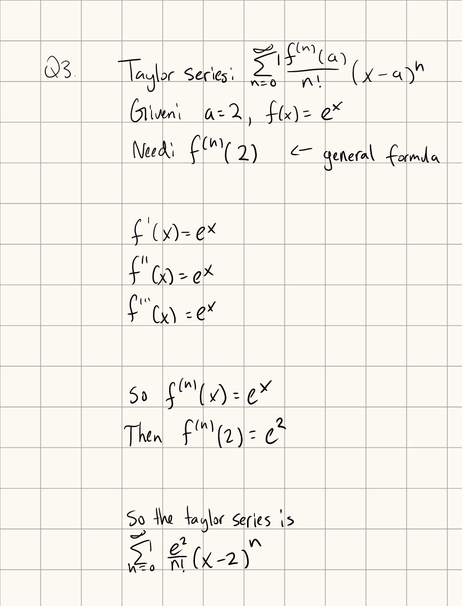
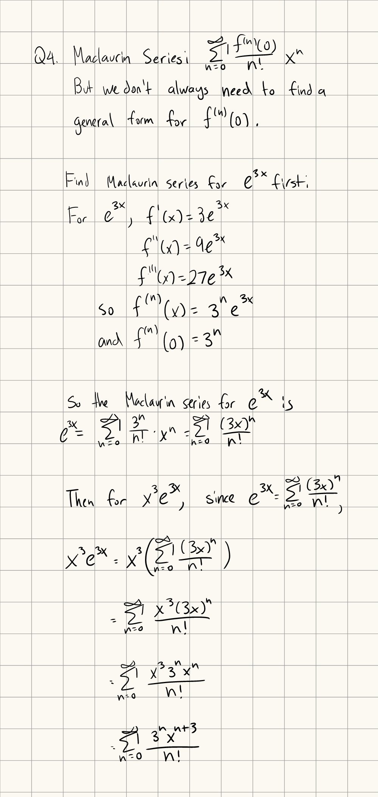

Tutorial Week 12
================

.. toctree::
   :hidden:
   

.. raw:: html

      

Absolute Convergence
--------------------

A series :math:`\sum a_n` is absolutely convergent if the series :math:`\sum | a_n |` converges.

Ratio Test
----------

Given a series :math:`\sum a_n`,

- If :math:`\lim_{n \to \infty} | \frac{a_{n+1}}{a_n} | \lt 1`, the series is absolutely convergent

- If :math:`\lim_{n \to \infty} | \frac{a_{n+1}}{a_n} | \gt 1`, the series diverges

- If :math:`\lim_{n \to \infty} | \frac{a_{n+1}}{a_n} | = 1`, the ratio test is inconclusive (use another test).

Q1: Use the ratio test to check if :math:`\sum_{n=1}^\infty \frac{(-5)^n}{(n!)^2}` converges.
~~~~~~~~~~~~~~~~~~~~~~~~~~~~~~~~~~~~~~~~~~~~~~~~~~~~~~~~~~~~~~~~~~~~~~~~~~~~~~~~~~~~~~~~~~~~~

.. raw:: html

   

      <button onClick="toggleClicked(this)" class="show-answer-button">Show Solution</button>
      

.. image:: ../../2023/mata36_winter/images/t12/3.jpeg
   :width: 700
   
.. raw:: html

        

    

Root Test
---------

Given a series :math:`\sum a_n`,

- If :math:`\lim_{n \to \infty} \sqrt[n]{|a_n|} \lt 1`, the series is absolutely convergent

- If :math:`\lim_{n \to \infty} \sqrt[n]{|a_n|} \gt 1`, the series diverges

- If :math:`\lim_{n \to \infty} \sqrt[n]{|a_n|} = 1`, the ratio test is inconclusive (use another test).

Q2: Use the root test to check if :math:`\sum_{n=1}^\infty (\frac{4 + n + ln(n)}{n^2})^n` converges.
~~~~~~~~~~~~~~~~~~~~~~~~~~~~~~~~~~~~~~~~~~~~~~~~~~~~~~~~~~~~~~~~~~~~~~~~~~~~~~~~~~~~~~~~~~~~~~~~~~~~

.. raw:: html

   

      <button onClick="toggleClicked(this)" class="show-answer-button">Show Solution</button>
      

.. image:: ../../2023/mata36_winter/images/t12/4.jpeg
   :width: 700
   
.. raw:: html

        

    

Taylor Series
-------------

The Taylor series provides an approximation of a function around some x value in the form of an infinite sum.

The Taylor series of a function :math:`f(x)` around :math:`x = a` given by the formula :math:`f(x) = \sum_{n=0}^\infty \frac{f^{(n)}(a)}{n!}(x-a)^n`.

The Maclaurin Series is a Taylor series around the point :math:`x = 0`.

Q3: Find the Taylor series for :math:`f(x) = e^x` at :math:`x = 2`.
~~~~~~~~~~~~~~~~~~~~~~~~~~~~~~~~~~~~~~~~~~~~~~~~~~~~~~~~~~~~~~~~~~~

.. raw:: html

   

      <button onClick="toggleClicked(this)" class="show-answer-button">Show Solution</button>
      

.. raw:: html

        

    

Q4: Find the Maclaurin series for :math:`f(x) = x^3e^{3x}`.
~~~~~~~~~~~~~~~~~~~~~~~~~~~~~~~~~~~~~~~~~~~~~~~~~~~~~~~~~~~

.. raw:: html

   

      <button onClick="toggleClicked(this)" class="show-answer-button">Show Solution</button>
      

.. raw:: html

        

    

