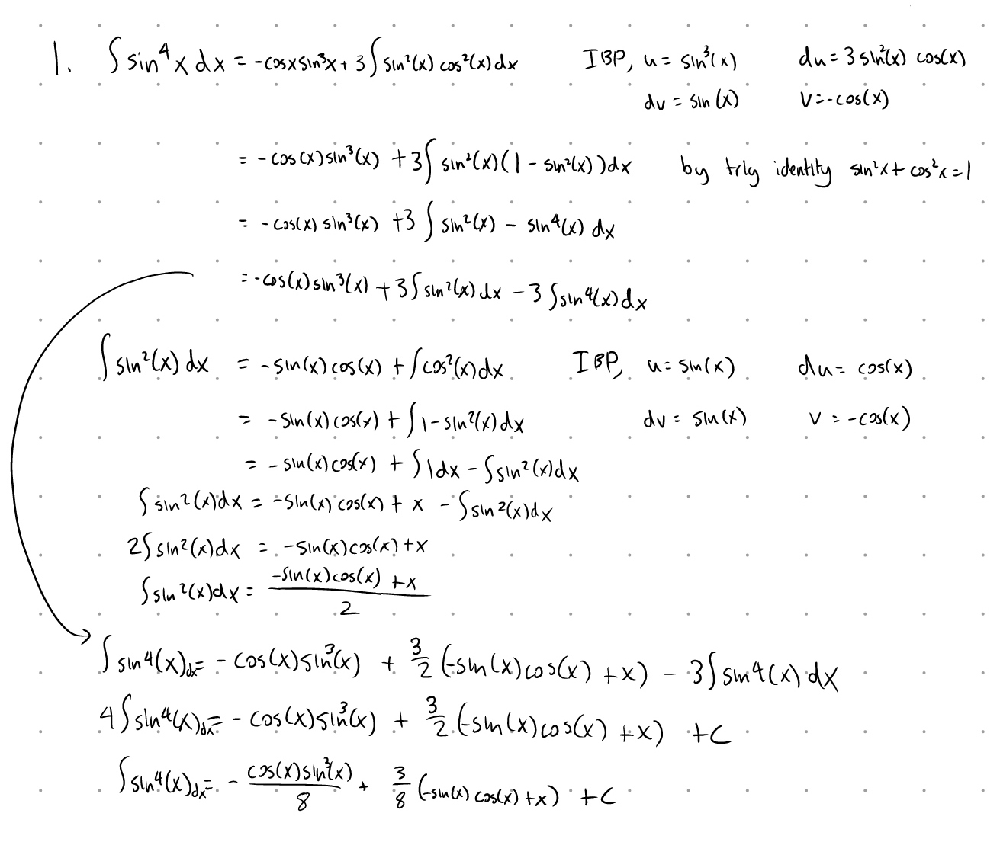
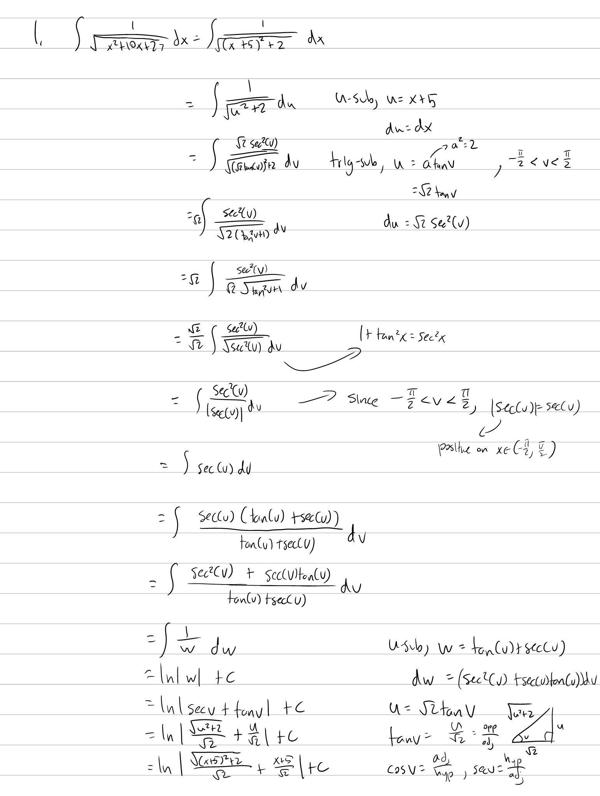
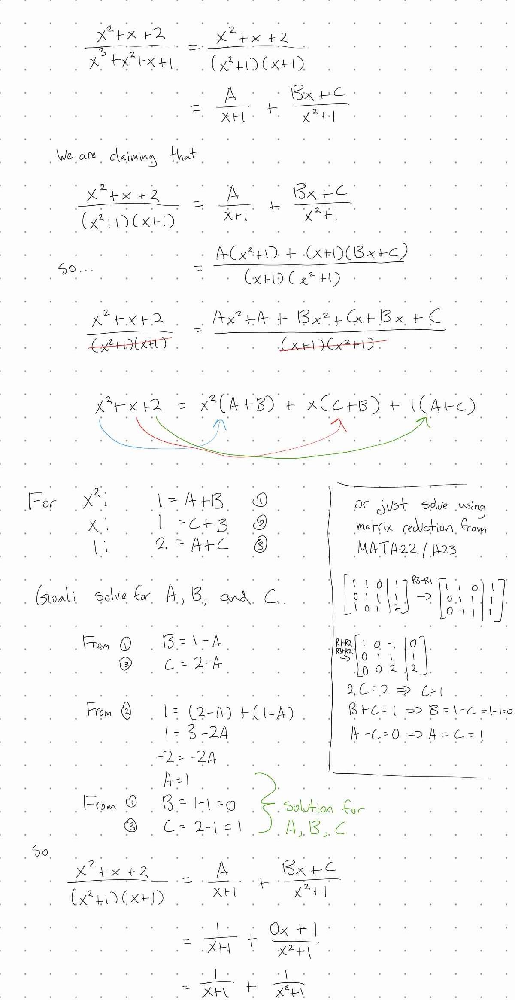

Tutorial Week 3
===============

.. toctree::
   :hidden:
   

.. raw:: html

      

Integration Methods Review
--------------------------

Q1: Integrate :math:`\int sin^4(x) dx`.
~~~~~~~~~~~~~~~~~~~~~~~~~~~~~~~~~~~~~~~

.. raw:: html

   

      <button onClick="toggleClicked(this)" class="show-answer-button">Show Solution</button>
      

.. raw:: html

        

    

Trigonometric Substitution (Trig Sub)
-------------------------------------

The method of Trig sub takes advantage of your trig identities to simplify integrals and in a way, it's
just fancy and strategic U-sub. Refer to the following table for which substitution to use:

.. list-table:: 

    * - Expression
      - :math:`\sqrt{a^2-x^2}`
      - :math:`\sqrt{a^2+x^2}`
      - :math:`\sqrt{x^2-a^2}`
    * - Substitution
      - :math:`x=a\sin \theta`
      - :math:`x=a\tan \theta`
      - :math:`x=a\sec \theta`
    * - Domain
      - :math:`\theta \in [-\frac{\pi}{2}, \frac{\pi}{2}]`
      - :math:`\theta \in (-\frac{\pi}{2}, \frac{\pi}{2})`
      - :math:`\theta \in [0, -\frac{\pi}{2}) \cup (\frac{\pi}{2}, \pi]`

Q2: Integrate :math:`\int \frac{1}{\sqrt{x^2 + 10x + 27}} dx`.
~~~~~~~~~~~~~~~~~~~~~~~~~~~~~~~~~~~~~~~~~~~~~~~~~~~~~~~~~~~~~~

.. raw:: html

   

      <button onClick="toggleClicked(this)" class="show-answer-button">Show Solution</button>
      

.. raw:: html

        

    

.. raw:: html

  

Partial Fraction Decomposition (PFD)
------------------------------------

Partial fraction decomposition is a general algebraic method of rewriting a fraction as a sum of simpler fractions.

There are 2 steps to finding PFDs:

1. Fully factor the denominator and write the partial factors
2. Solve for the variables in the partial factors

For the first step, the partial factors for each demoniator factor follows the pattern of:

.. list-table:: 

    * - Form of Denominator Factor
      - Partial Factor
    * - :math:`\frac{1}{ax + b}`
      - :math:`\frac{A}{ax+b}`
    * - :math:`\frac{1}{(ax + b)^2}`
      - :math:`\frac{A}{ax+b} + \frac{B}{(ax+b)^2}`
    * - :math:`\frac{1}{ax^2 + bx + c}`
      - :math:`\frac{Ax+B}{ax^2+bx+c}`
    * - :math:`\frac{1}{(ax^2 + bx + c)^2}`
      - :math:`\frac{Ax+B}{ax^2+bx+c} + \frac{Cx+D}{(ax^2+bx+c)^2}`

The complete partial factors for a fraction will be a sum of each of the individual partial factors for each denominator factor.

Q3: Find the PFD of :math:`\frac{x^{2}+x+2}{x^{3}+x^{2}+x+1}`.
~~~~~~~~~~~~~~~~~~~~~~~~~~~~~~~~~~~~~~~~~~~~~~~~~~~~~~~~~~~~~~

.. raw:: html

   

      <button onClick="toggleClicked(this)" class="show-answer-button">Show Solution</button>
      

.. raw:: html

        

    

.. raw:: html

  