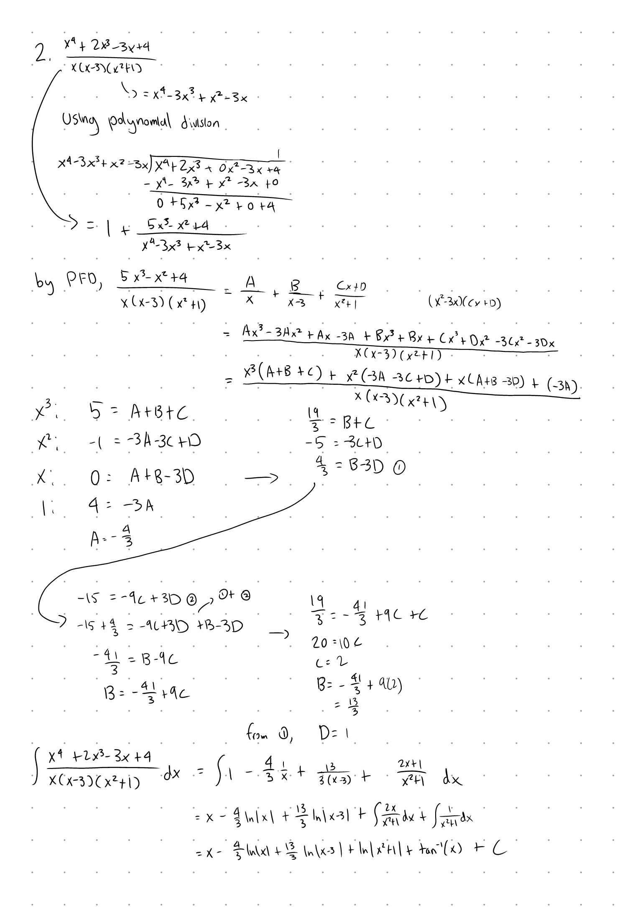

Tutorial Week 4
===============

.. toctree::
   :hidden:
   

.. raw:: html

      

Partial Fraction Decomposition (PFD)
------------------------------------

Partial fraction decomposition is a way to simplify rational integrals into a way that 
is easier to work with by seperating the rational expression into its partial fractions.

Q1: Integrate :math:`\int \frac{x^4+2x^3-3x+4}{x(x-3)(x^2+1)} \; dx`.
~~~~~~~~~~~~~~~~~~~~~~~~~~~~~~~~~~~~~~~~~~~~~~~~~~~~~~~~~~~~~~~~~~~~~

.. raw:: html

   

      <button onClick="toggleClicked(this)" class="show-answer-button">Show Solution</button>
      

.. raw:: html

        

    

Riemann Sums and Sigma Notation
-------------------------------

Sigma Notation
~~~~~~~~~~~~~~

We use sigma (:math:`\Sigma`) notation as a way to express sums of numbers.

With :math:`\Sigma_{n=3}^5n^2`, we sum from :math:`n = 3` to :math:`n = 5` inclusive, giving :math:`\Sigma_{n=3}^5n^2 = 3^2 + 4^2 + 5^2`.

With sums, we also have a few useful formulas, those being:

- :math:`\Sigma_{k = m}^n ca_k = c\Sigma_{k = m}^n a_k`

- :math:`\Sigma_{k = m}^n a_k + b_k = \Sigma_{k = m}^n a_k + \Sigma_{k = m}^n b_k`

- :math:`\Sigma_{k = 1}^n 1 = n`

- :math:`\Sigma_{k = 1}^n n = \frac{n(n+1)}{2}`

- :math:`\Sigma_{k = 1}^n n^2 = \frac{n(n+1)(2n+1)}{6}`

- :math:`\Sigma_{k = 1}^n n^3 = \frac{n^2(n + 1)^2}{4}`

Riemann Sums
~~~~~~~~~~~~

Riemann sums are used to approximate the area under a function by using rectangles.

To define a riemann sum from on the interval [a, b] for f(x), we need:

- :math:`\Delta x = \frac{b - a}{n}`

- :math:`x_k = a + k\Delta x` for :math:`k = 0, 1, 2, ... , n`

- :math:`x^\ast_k` is a point in :math:`[x_{k-1}, x_k]`

The riemann sum is :math:`\Sigma_{k=1}^n f(x_n^\ast)\Delta x`.

We have two common types of riemann sums, those being the left riemann sum and the right riemann sum.

The left riemann sum is defined with :math:`x^\ast_k = x_{k-1}` so that :math:`L_n = \Sigma_{k=1}^n f(x_{k-1})\Delta x = \Sigma_{k=1}^n f(a + (k-1)\Delta x)\Delta x`.

The right riemann sum is defined with :math:`x^\ast_k = x_{k}` so that  :math:`R_n = \Sigma_{k=1}^n f(x_{k})\Delta x = \Sigma_{k=1}^n f(a + k\Delta x)\Delta x`.

The midpoint sum is defined with :math:`x^\ast_k = x_{k} = \frac{x_{k-1} + x_k}{2}` so that :math:`M_n = \Sigma_{k=1}^n f(\frac{x_{k-1} + x_k}{2}) \Delta x`.

Q2: Approximate the area under :math:`10 - x^2` for :math:`x \in [0, 1]` using the midpoint sum over four intervals.
~~~~~~~~~~~~~~~~~~~~~~~~~~~~~~~~~~~~~~~~~~~~~~~~~~~~~~~~~~~~~~~~~~~~~~~~~~~~~~~~~~~~~~~~~~~~~~~~~~~~~~~~~~~~~~~~~~~~

.. raw:: html

   

      <button onClick="toggleClicked(this)" class="show-answer-button">Show Solution</button>
      

Directing plugging this into the riemann sum formula gives us

:math:`\sum_{k=1}^4 f(x_k^\ast)\Delta x = \Delta x \sum_{k=1}^4 f(x_k^\ast)`

:math:`= \Delta x (f(x_1^\ast) + f(x_2^\ast) + f(x_3^\ast) + f(x_4^\ast))`

Remember that :math:`x_k = a + k\Delta x` for :math:`k = 0, 1, 2, ... , n`

so using :math:`a = 0` and :math:`\Delta x = \frac{1}{4}` from the interval of :math:`x` we want to approximate the area for,
we have

:math:`x_0 = 0, x_1 = \frac{1}{4}, x_2 = \frac{1}{2}, x_3 = \frac{3}{4}, x_4 = 1`.

Since :math:`x^\ast_k = x_{k} = \frac{x_{k-1} + x_k}{2}`, 

:math:`x^\ast_1 = \frac{0 + \frac{1}{4}}{2}, x^\ast_2 = \frac{\frac{1}{4} + \frac{1}{2}}{2}, \dots` and so on.

We end up with 

:math:`x^\ast_1 = \frac{1}{8}, x^\ast_2 = \frac{3}{8}, x^\ast_3 = \frac{5}{8}, x^\ast_4 = \frac{7}{8}`.

Using these points, the midpoint sum is 

.. math::
  \begin{aligned}
    &\Delta x (f(x_1^\ast) + f(x_2^\ast) + f(x_3^\ast) + f(x_4^\ast)) \\
    &= \frac{1}{4} (f(\frac{1}{8}) + f(\frac{3}{8}) + f(\frac{5}{8}) + f(\frac{7}{8})) \\
    &= \frac{1}{4} (10 - (\frac{1}{8})^2 + 10 - (\frac{3}{8})^2+ 10 - (\frac{5}{8})^2+ 10 - (\frac{7}{8})^2)
  \end{aligned}

.. raw:: html

        

    

Q3: Evaluate :math:`\int_0^4 2x^2 + x \,dx` using Riemann sums.
~~~~~~~~~~~~~~~~~~~~~~~~~~~~~~~~~~~~~~~~~~~~~~~~~~~~~~~~~~~~~~~

.. raw:: html

   

      <button onClick="toggleClicked(this)" class="show-answer-button">Show Solution</button>
      

For simplicity, let's use the right riemann sum.

We have: 

- :math:`\Delta x = \frac{b - a}{n} = \frac{4 - 0}{n} = \frac{4}{n}`

- :math:`x_k = a + k\Delta x = 0 + \frac{4k}{n}` for :math:`k = 0, 1, 2, ... , n`

- :math:`x^\ast_k = x_{k} = \frac{4k}{n}` since we're using the right Riemann sum.

So then 

.. math::
    \begin{aligned}
    \int_1^5 2x^2 + x dx &= \lim_{n \to \infty} \Sigma_{k=1}^n f(x_{k})\Delta x \\
    &= \lim_{n \to \infty} \Sigma_{k=1}^n f(\frac{4k}{n})\Delta x \\
    &=\lim_{n \to \infty} \Sigma_{k=1}^n (2(\frac{4k}{n})^2 + \frac{4k}{n})(\frac{4}{n})
    \end{aligned}

Solving for this gives us 

.. math::
    \begin{aligned}
    &\lim_{n \to \infty} \Sigma_{k=1}^n (2(\frac{4k}{n})^2 + \frac{4k}{n})(\frac{4}{n}) \\ &= \lim_{n \to \infty} \frac{4}{n}\Sigma^n_{k = 1}2(\frac{4k}{n})^2 + \frac{4k}{n} \\
    &= \lim_{n \to \infty} \frac{4}{n}\Sigma^n_{k = 1}\frac{32k^2}{n^2} + \frac{4k}{n} \\
    &= \lim_{n \to \infty} \frac{4}{n} ( \frac{32}{n^2} \Sigma^n_{k = 1} k^2 + \frac{4}{n} \Sigma^n_{k = 1} k) \\
    &= \lim_{n \to \infty} \frac{4}{n} (\frac{32}{n^2} \cdot \frac{n(n+1)(2n+1)}{6} + \frac{4}{n} \cdot \frac{n(n+1)}{2} ) \\
    &= \lim_{n \to \infty} \frac{128(2n^3+3n^2+n)}{6n^3} + \frac{16(n^2 + n)}{2n^2} \\
    &= \text{... skipping a few steps for finding the limit} \\
    &= \frac{128 \cdot 2}{6} + \frac{16}{2} \\
    &= \frac{128}{3} + 8
    \end{aligned}

.. raw:: html

        

    
