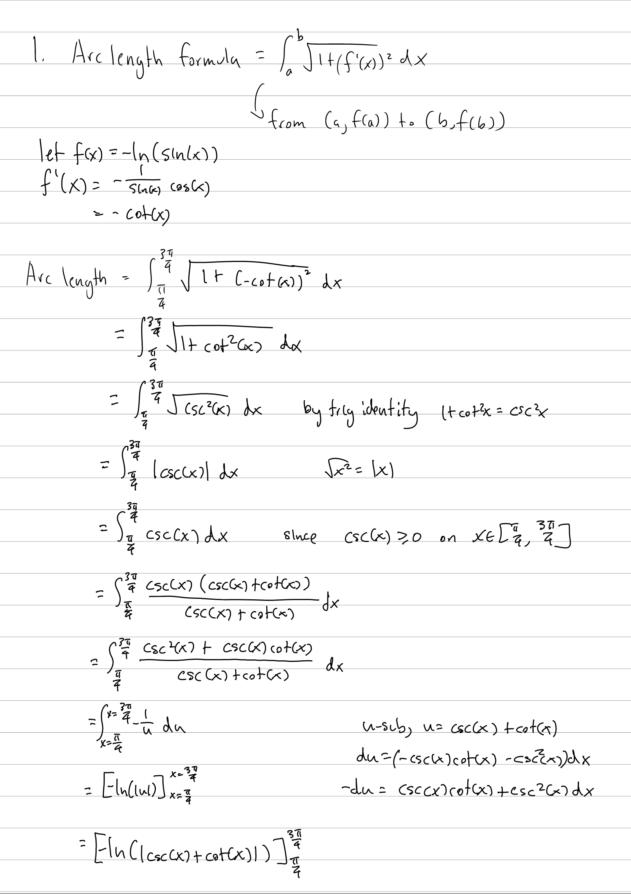
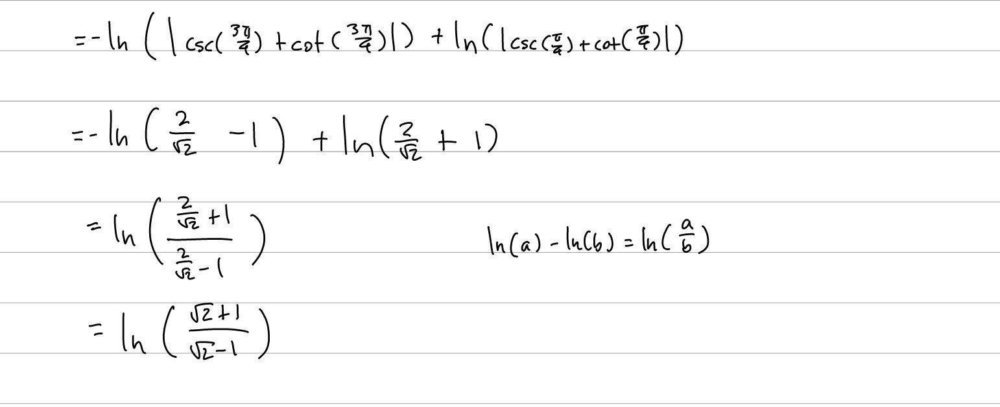
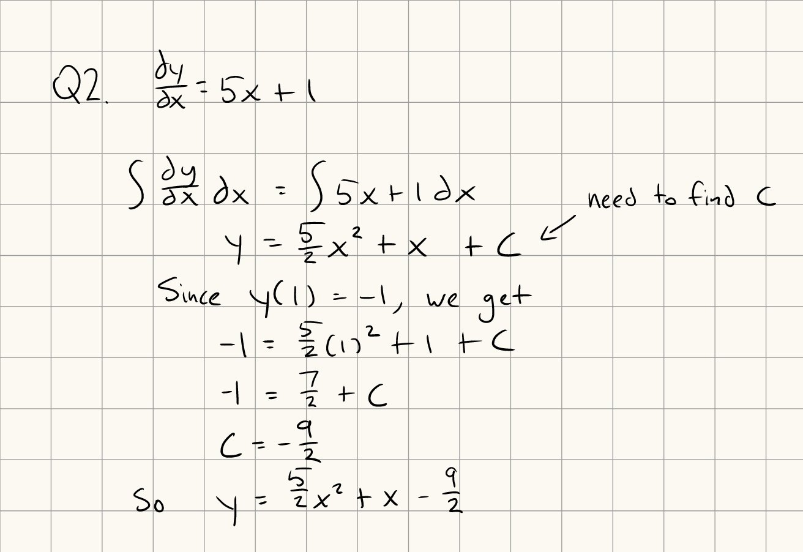
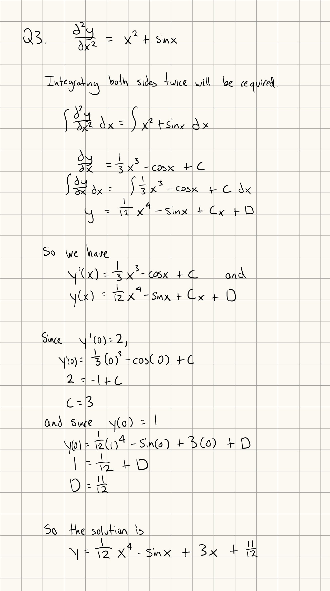
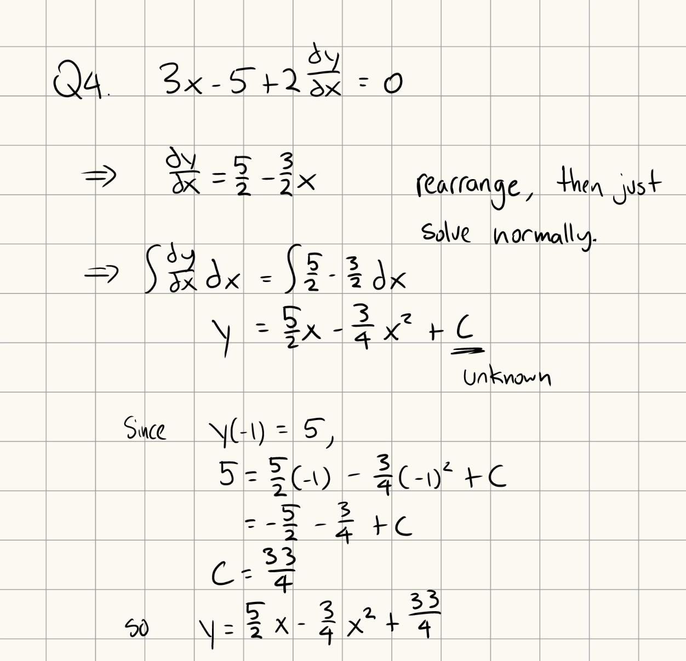

Tutorial Week 7
===============

.. toctree::
   :hidden:
   

.. raw:: html

      

Arc Length
----------

The formula to find the arc length of a function is :math:`\int_a^b \sqrt{1 + (f'(x))^2} \; dx`.

Q1: Find the length of the curve :math:`y = -ln(sin(x))` on :math:`x \in [\frac{\pi}{4}, \frac{3\pi}{4}]`.
~~~~~~~~~~~~~~~~~~~~~~~~~~~~~~~~~~~~~~~~~~~~~~~~~~~~~~~~~~~~~~~~~~~~~~~~~~~~~~~~~~~~~~~~~~~~~~~~~~~~~~~~~~

.. raw:: html

   

      <button onClick="toggleClicked(this)" class="show-answer-button">Show Solution</button>
      

.. raw:: html

        

    

Initial Value Problems (Differential Equations)
-----------------------------------------------

Differential equations are equations derivatives of a function, such as :math:`\frac{dy}{dx} + 2\frac{dy^3}{dx^3} = 1`.

With initial value problems, you're given a set of initial conditions (i.e. :math:`y(a) = k`, :math:`y'(a) = m`).

Q2: Solve the initial value problem with :math:`\frac{dy}{dx} = 5x + 1`, with :math:`y(1) = -1`.
~~~~~~~~~~~~~~~~~~~~~~~~~~~~~~~~~~~~~~~~~~~~~~~~~~~~~~~~~~~~~~~~~~~~~~~~~~~~~~~~~~~~~~~~~~~~~~~~

.. raw:: html

   

      <button onClick="toggleClicked(this)" class="show-answer-button">Show Solution</button>
      

.. raw:: html

        

    

Q3: Solve the initial value problem with :math:`\frac{d^2y}{dx^2} = x^2 + \sin x`, with :math:`y(0) = 1` and :math:`y'(0) = 2`.
~~~~~~~~~~~~~~~~~~~~~~~~~~~~~~~~~~~~~~~~~~~~~~~~~~~~~~~~~~~~~~~~~~~~~~~~~~~~~~~~~~~~~~~~~~~~~~~~~~~~~~~~~~~~~~~~~~~~~~~~~~~~~~~

.. raw:: html

   

      <button onClick="toggleClicked(this)" class="show-answer-button">Show Solution</button>
      

.. raw:: html

        

    

Q4: Solve the initial value problem with :math:`3x - 5 + 2\frac{dy}{dx}= 0`, with :math:`y(-1) = 5`.
~~~~~~~~~~~~~~~~~~~~~~~~~~~~~~~~~~~~~~~~~~~~~~~~~~~~~~~~~~~~~~~~~~~~~~~~~~~~~~~~~~~~~~~~~~~~~~~~~~~~

.. raw:: html

   

      <button onClick="toggleClicked(this)" class="show-answer-button">Show Solution</button>
      

.. raw:: html

        

    

