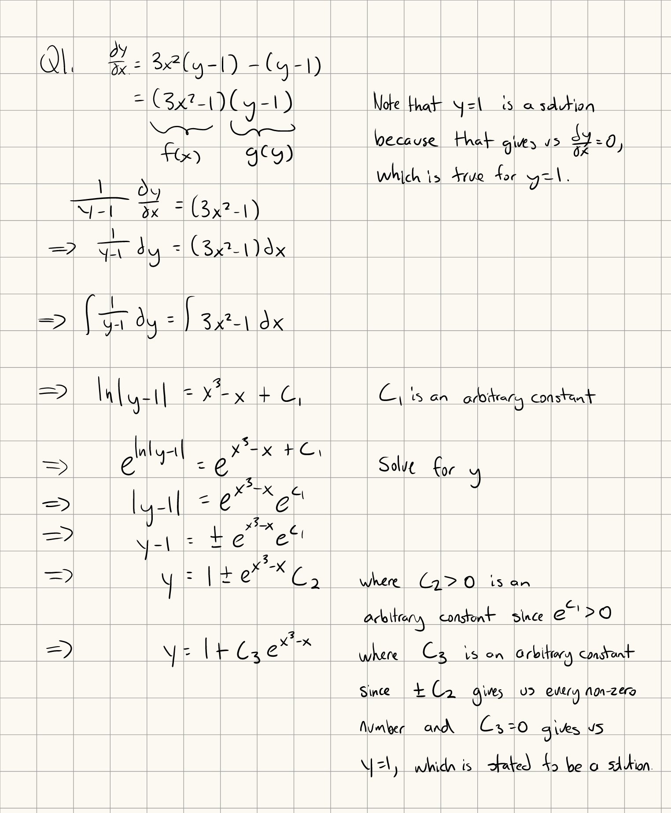
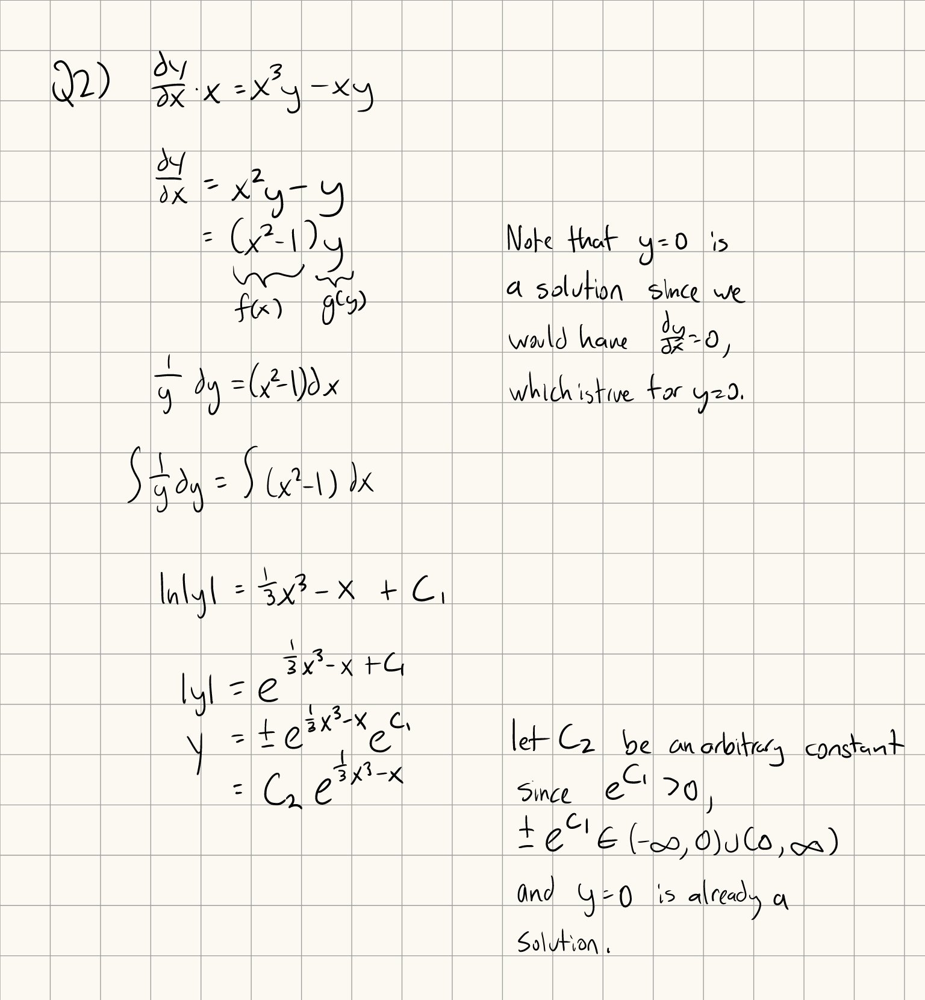
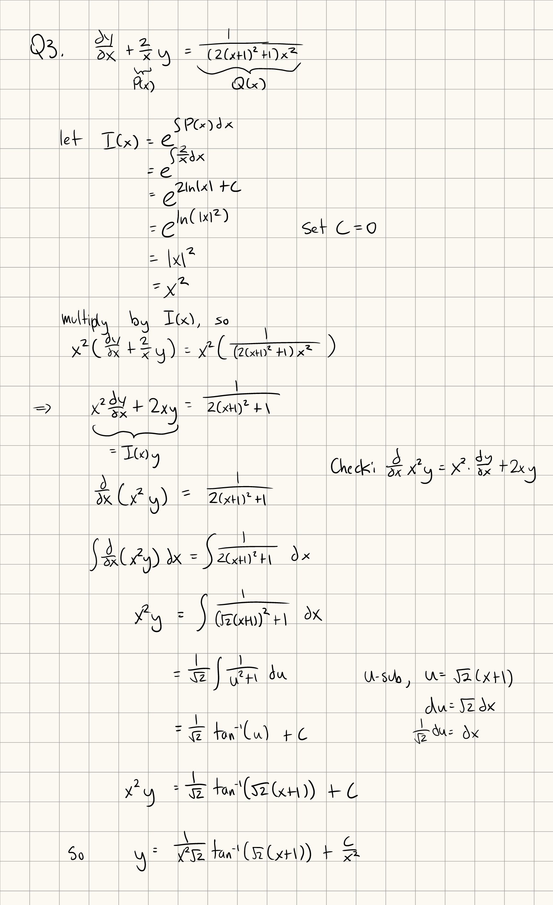
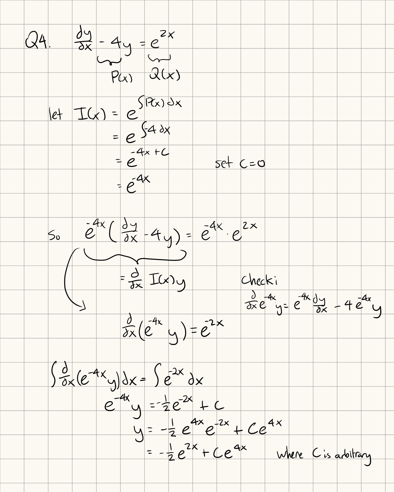

Tutorial Week 8
===============

.. toctree::
   :hidden:
   

.. raw:: html

      

Separable Differential Equations
--------------------------------

Separable differential equations are in the form of :math:`\frac{dy}{dx} = f(x) \cdot g(y)`, where f is a function in terms of x and g is a function in terms of y.

This differential equation can then be rewritten as :math:`\frac{1}{g(y)} dy = f(x) dx`, and then be integrated on both sides, :math:`\int \frac{1}{g(y)} dy = \int f(x) dx`.

After computing this integral, you'll just need to solve for the variable y.

Q1: Solve the differential equation :math:`\frac{dy}{dx} = 3x^2y - 3x^2 - y + 1`.
~~~~~~~~~~~~~~~~~~~~~~~~~~~~~~~~~~~~~~~~~~~~~~~~~~~~~~~~~~~~~~~~~~~~~~~~~~~~~~~~~

.. raw:: html

   

      <button onClick="toggleClicked(this)" class="show-answer-button">Show Solution</button>
      

.. raw:: html

        

    

Q2: Solve the differential equation :math:`\frac{dy}{dx}x = x^3y - xy`.
~~~~~~~~~~~~~~~~~~~~~~~~~~~~~~~~~~~~~~~~~~~~~~~~~~~~~~~~~~~~~~~~~~~~~~~~~~

.. raw:: html

   

      <button onClick="toggleClicked(this)" class="show-answer-button">Show Solution</button>
      

.. raw:: html

        

    

Linear Differential Equations
-----------------------------

A first-order linear differential equation the standard form is given by :math:`\frac{dy}{dx} + P(x)y = Q(x)`.

To solve a first-order linear differential equation, we define the integrating factor as :math:`I(x) = e^{\int P(x) dx}`, and then multiply both sides of :math:`\frac{dy}{dx} + P(x)y = Q(x)` by :math:`I(x)` to get :math:`I(x)(\frac{dy}{dx} + P(x)y) = I(x)(Q(x))`.

With the choice of :math:`I(x)`, :math:`I(x)(\frac{dy}{dx} + P(x)y) = I(x)(Q(x))` simplifies to :math:`\frac{d}{dx}(I(x)y) = I(x)Q(x)`.

We then integrate both sides (:math:`\int \frac{d}{dx} (I(x)y) dx = \int I(x)Q(x) dx`), which simplifies to :math:`I(x)y = \int I(x)Q(x) dx`, which we can use to solve for y.

Q3: Solve the differential equation :math:`\frac{dy}{dx} + \frac{2y}{x} = \frac{1}{2x^4 + 4x^3 + 3x^2}`.
~~~~~~~~~~~~~~~~~~~~~~~~~~~~~~~~~~~~~~~~~~~~~~~~~~~~~~~~~~~~~~~~~~~~~~~~~~~~~~~~~~~~~~~~~~~~~~~~~~~~~~~~

.. raw:: html

   

      <button onClick="toggleClicked(this)" class="show-answer-button">Show Solution</button>
      

.. raw:: html

        

    

Q4: Solve the differential equation :math:`\frac{dy}{dx} - 4y = e^{2x}`.
~~~~~~~~~~~~~~~~~~~~~~~~~~~~~~~~~~~~~~~~~~~~~~~~~~~~~~~~~~~~~~~~~~~~~~~~

.. raw:: html

   

      <button onClick="toggleClicked(this)" class="show-answer-button">Show Solution</button>
      

.. raw:: html

        

    
